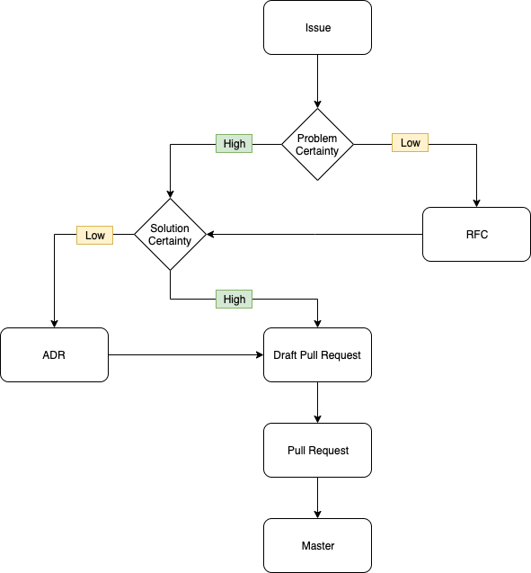

# Contributing

Thank you for your interest in contributing to Tendermint! Before
contributing, it may be helpful to understand the goal of the project. The goal
of Tendermint is to develop a BFT consensus engine robust enough to
support permissionless value-carrying networks. While all contributions are
welcome, contributors should bear this goal in mind in deciding if they should
target the main Tendermint project or a potential fork. When targeting the
main Tendermint project, the following process leads to the best chance of
landing changes in master.

All work on the code base should be motivated by a [Github
Issue](https://github.com/tendermint/tendermint/issues).
[Search](https://github.com/tendermint/tendermint/issues?q=is%3Aopen+is%3Aissue+label%3A%22help+wanted%22)
is a good place start when looking for places to contribute. If you
would like to work on an issue which already exists, please indicate so
by leaving a comment.

All new contributions should start with a [Github
Issue](https://github.com/tendermint/tendermint/issues/new/choose). The
issue helps capture the problem you're trying to solve and allows for
early feedback. Once the issue is created the process can proceed in different
directions depending on how well defined the problem and potential
solution are. If the change is simple and well understood, maintainers
will indicate their support with a heartfelt emoji.

If the issue would benefit from thorough discussion, maintainers may
request that you create a [Request For
Comment](https://github.com/tendermint/spec/tree/master/rfc). Discussion
at the RFC stage will build collective understanding of the dimensions
of the problems and help structure conversations around trade-offs.

When the problem is well understood but the solution leads to large structural
changes to the code base, these changes should be proposed in the form of an
[Architectural Decision Record (ADR)](./docs/architecture/). The ADR will help
build consensus on an overall strategy to ensure the code base maintains
coherence in the larger context. If you are not comfortable with writing an
ADR, you can open a less-formal issue and the maintainers will help you turn it
into an ADR.

> How to pick a number for the ADR?

Find the largest existing ADR number and bump it by 1.

When the problem as well as proposed solution are well understood,
changes should start with a [draft
pull request](https://github.blog/2019-02-14-introducing-draft-pull-requests/)
against master. The draft signals that work is underway. When the work
is ready for feedback, hitting "Ready for Review" will signal to the
maintainers to take a look.



Each stage of the process is aimed at creating feedback cycles which align contributors and maintainers to make sure:

- Contributors don’t waste their time implementing/proposing features which won’t land in master.
- Maintainers have the necessary context in order to support and review contributions.

## Forking

Please note that Go requires code to live under absolute paths, which complicates forking.
While my fork lives at `https://github.com/ebuchman/tendermint`,
the code should never exist at `$GOPATH/src/github.com/ebuchman/tendermint`.
Instead, we use `git remote` to add the fork as a new remote for the original repo,
`$GOPATH/src/github.com/tendermint/tendermint`, and do all the work there.

For instance, to create a fork and work on a branch of it, I would:

- Create the fork on GitHub, using the fork button.
- Go to the original repo checked out locally (i.e. `$GOPATH/src/github.com/tendermint/tendermint`)
- `git remote rename origin upstream`
- `git remote add origin git@github.com:ebuchman/basecoin.git`

Now `origin` refers to my fork and `upstream` refers to the Tendermint version.
So I can `git push -u origin master` to update my fork, and make pull requests to tendermint from there.
Of course, replace `ebuchman` with your git handle.

To pull in updates from the origin repo, run

- `git fetch upstream`
- `git rebase upstream/master` (or whatever branch you want)

## Dependencies

We use [go modules](https://github.com/golang/go/wiki/Modules) to manage dependencies.

That said, the master branch of every Tendermint repository should just build
with `go get`, which means they should be kept up-to-date with their
dependencies so we can get away with telling people they can just `go get` our
software.

Since some dependencies are not under our control, a third party may break our
build, in which case we can fall back on `go mod tidy`. Even for dependencies under our control, go helps us to
keep multiple repos in sync as they evolve. Anything with an executable, such
as apps, tools, and the core, should use dep.

Run `go list -u -m all` to get a list of dependencies that may not be
up-to-date.

When updating dependencies, please only update the particular dependencies you
need. Instead of running `go get -u=patch`, which will update anything,
specify exactly the dependency you want to update, eg.
`GO111MODULE=on go get -u github.com/tendermint/go-amino@master`.

## Protobuf

We use [Protocol Buffers](https://developers.google.com/protocol-buffers) along with [gogoproto](https://github.com/gogo/protobuf) to generate code for use across Tendermint Core.

For linting and checking breaking changes, we use [buf](https://buf.build/). If you would like to run linting and check if the changes you have made are breaking then you will need to have docker running locally. Then the linting cmd will be `make proto-lint` and the breaking changes check will be `make proto-check-breaking`.

We use [Docker](https://www.docker.com/) to generate the protobuf stubs. To generate the stubs yourself, make sure docker is running then run `make proto-gen`.

## Vagrant

If you are a [Vagrant](https://www.vagrantup.com/) user, you can get started
hacking Tendermint with the commands below.

NOTE: In case you installed Vagrant in 2017, you might need to run
`vagrant box update` to upgrade to the latest `ubuntu/xenial64`.

```sh
vagrant up
vagrant ssh
make test
```

## Changelog

Every fix, improvement, feature, or breaking change should be made in a
pull-request that includes an update to the `CHANGELOG_PENDING.md` file.

Changelog entries should be formatted as follows:

```md
- [module] \#xxx Some description about the change (@contributor)
```

Here, `module` is the part of the code that changed (typically a
top-level Go package), `xxx` is the pull-request number, and `contributor`
is the author/s of the change.

It's also acceptable for `xxx` to refer to the relevant issue number, but pull-request
numbers are preferred.
Note this means pull-requests should be opened first so the changelog can then
be updated with the pull-request's number.
There is no need to include the full link, as this will be added
automatically during release. But please include the backslash and pound, eg. `\#2313`.

Changelog entries should be ordered alphabetically according to the
`module`, and numerically according to the pull-request number.

Changes with multiple classifications should be doubly included (eg. a bug fix
that is also a breaking change should be recorded under both).

Breaking changes are further subdivided according to the APIs/users they impact.
Any change that effects multiple APIs/users should be recorded multiply - for
instance, a change to the `Blockchain Protocol` that removes a field from the
header should also be recorded under `CLI/RPC/Config` since the field will be
removed from the header in RPC responses as well.

## Branching Model and Release

The main development branch is master.

Every release is maintained in a release branch named `vX.Y.Z`.

Pending minor releases have long-lived release candidate ("RC") branches. Minor release changes should be merged to these long-lived RC branches at the same time that the changes are merged to master.

Note all pull requests should be squash merged except for merging to a release branch (named `vX.Y`). This keeps the commit history clean and makes it
easy to reference the pull request where a change was introduced.

### Development Procedure

The latest state of development is on `master`, which must never fail `make test`. _Never_ force push `master`, unless fixing broken git history (which we rarely do anyways).

To begin contributing, create a development branch either on `github.com/tendermint/tendermint`, or your fork (using `git remote add origin`).

Make changes, and before submitting a pull request, update the `CHANGELOG_PENDING.md` to record your change. Also, run either `git rebase` or `git merge` on top of the latest `master`. (Since pull requests are squash-merged, either is fine!)

Update the `UPGRADING.md` if the change you've made is breaking and the
instructions should be in place for a user on how he/she can upgrade it's
software (ABCI application, Tendermint-based blockchain, light client, wallet).

Once you have submitted a pull request label the pull request with either `R:minor`, if the change should be included in the next minor release, or `R:major`, if the change is meant for a major release.

Sometimes (often!) pull requests get out-of-date with master, as other people merge different pull requests to master. It is our convention that pull request authors are responsible for updating their branches with master. (This also means that you shouldn't update someone else's branch for them; even if it seems like you're doing them a favor, you may be interfering with their git flow in some way!)

#### Merging Pull Requests

It is also our convention that authors merge their own pull requests, when possible. External contributors may not have the necessary permissions to do this, in which case, a member of the core team will merge the pull request once it's been approved.

Before merging a pull request:

- Ensure pull branch is up-to-date with a recent `master` (GitHub won't let you merge without this!)
- Run `make test` to ensure that all tests pass
- [Squash](https://stackoverflow.com/questions/5189560/squash-my-last-x-commits-together-using-git) merge pull request

#### Pull Requests for Minor Releases

If your change should be included in a minor release, please also open a PR against the long-lived minor release candidate branch (e.g., `rc1/v0.33.5`) _immediately after your change has been merged to master_.

You can do this by cherry-picking your commit off master:

```sh
$ git checkout rc1/v0.33.5
$ git checkout -b {new branch name}
$ git cherry-pick {commit SHA from master}
# may need to fix conflicts, and then use git add and git cherry-pick --continue
$ git push origin {new branch name}
```

After this, you can open a PR. Please note in the PR body if there were merge conflicts so that reviewers can be sure to take a thorough look.

### Git Commit Style

We follow the [Go style guide on commit messages](https://tip.golang.org/doc/contribute.html#commit_messages). Write concise commits that start with the package name and have a description that finishes the sentence "This change modifies Tendermint to...". For example,

```sh
cmd/debug: execute p.Signal only when p is not nil

[potentially longer description in the body]

Fixes #nnnn
```

Each PR should have one commit once it lands on `master`; this can be accomplished by using the "squash and merge" button on Github. Be sure to edit your commit message, though!

### Release Procedure

#### Major Release

1. Start on `master`
2. Run integration tests (see `test_integrations` in Makefile)
3. Prepare release in a pull request against `master` (to be squash merged):
   - Copy `CHANGELOG_PENDING.md` to top of `CHANGELOG.md`; if this release
      had release candidates, squash all the RC updates into one
   - Run `python ./scripts/linkify_changelog.py CHANGELOG.md` to add links for
     all issues
   - run `bash ./scripts/authors.sh` to get a list of authors since the latest
     release, and add the github aliases of external contributors to the top of
     the changelog. To lookup an alias from an email, try `bash ./scripts/authors.sh <email>`
   - Reset the `CHANGELOG_PENDING.md`
   - Bump P2P and block protocol versions in  `version.go`, if necessary
   - Bump ABCI protocol version in `version.go`, if necessary
   - Make sure all significant breaking changes are covered in `UPGRADING.md`
   - Add any release notes you would like to be added to the body of the release to `release_notes.md`.
4. Push a tag with prepared release details (this will trigger the release `vX.X.0`)
   - `git tag -a vX.X.x -m 'Release vX.X.x'`
   - `git push origin vX.X.x`
5. Update the changelog.md file on master with the releases changelog.
6. Delete any RC branches and tags for this release (if applicable)

#### Minor Release

Minor releases are done differently from major releases: They are built off of long-lived release candidate branches, rather than from master.

1. Checkout the long-lived release candidate branch: `git checkout rcX/vX.X.X`
2. Run integration tests: `make test_integrations`
3. Prepare the release:
   - copy `CHANGELOG_PENDING.md` to top of `CHANGELOG.md`
   - run `python ./scripts/linkify_changelog.py CHANGELOG.md` to add links for all issues
   - run `bash ./scripts/authors.sh` to get a list of authors since the latest release, and add the GitHub aliases of external contributors to the top of the CHANGELOG. To lookup an alias from an email, try `bash ./scripts/authors.sh <email>`
   - reset the `CHANGELOG_PENDING.md`
   - bump P2P and block protocol versions in  `version.go`, if necessary
   - bump ABCI protocol version in `version.go`, if necessary
   - make sure all significant breaking changes are covered in `UPGRADING.md`
   - Add any release notes you would like to be added to the body of the release to `release_notes.md`.
4. Create a release branch `release/vX.X.x` off the release candidate branch:
   - `git checkout -b release/vX.X.x`
   - `git push -u origin release/vX.X.x`
   - Note that all branches prefixed with `release` are protected once pushed. You will need admin help to make any changes to the branch.
5. Once the release branch has been approved, make sure to pull it locally, then push a tag.
   - `git tag -a vX.X.x -m 'Release vX.X.x'`
   - `git push origin vX.X.x`
6. Create a pull request back to master with the CHANGELOG & version changes from the latest release.
   - Remove all `R:minor` labels from the pull requests that were included in the release.
   - Do not merge the release branch into master.
7. Delete the former long lived release candidate branch once the release has been made.
8. Create a new release candidate branch to be used for the next release.

#### Backport Release

1. start from the existing release branch you want to backport changes to (e.g. v0.30)
   Branch to a release/vX.X.X branch locally (e.g. release/v0.30.7)
2. Cherry pick the commit(s) that contain the changes you want to backport (usually these commits are from squash-merged PRs which were already reviewed)
3. Follow steps 2 and 3 from [Major Release](#major-release)
4. Push changes to release/vX.X.X branch
5. Open a PR against the existing vX.X branch

#### Release Candidates

Before creating an official release, especially a major release, we may want to create a
release candidate (RC) for our friends and partners to test out. We use git tags to
create RCs, and we build them off of RC branches. RC branches typically have names formatted
like `RCX/vX.X.X` (or, concretely, `RC0/v0.34.0`), while the tags themselves follow
the "standard" release naming conventions, with `-rcX` at the end (`vX.X.X-rcX`).

(Note that branches and tags _cannot_ have the same names, so it's important that these branches
have distinct names from the tags/release names.)

1. Start from the RC branch (e.g. `RC0/v0.34.0`).
2. Create the new tag, specifying a name and a tag "message":  
   `git tag -a v0.34.0-rc0 -m "Release Candidate v0.34.0-rc0` 
3. Push the tag back up to origin:  
   `git push origin v0.34.0-rc4`  
   Now the tag should be available on the repo's releases page. 
4. Create a new release candidate branch for any possible updates to the RC:  
   `git checkout -b RC1/v0.34.0; git push origin RC1/v0.34.0`

## Testing

### Unit tests

Unit tests are located in `_test.go` files as directed by [the Go testing
package](https://golang.org/pkg/testing/). If you're adding or removing a
function, please check there's a `TestType_Method` test for it.

Run: `make test`

### Integration tests

Integration tests are also located in `_test.go` files. What differentiates
them is a more complicated setup, which usually involves setting up two or more
components.

Run: `make test_integrations`

### End-to-end tests

End-to-end tests are used to verify a fully integrated Tendermint network.

See [README](./test/e2e/README.md) for details.

Run:

```sh
cd test/e2e && \
  make && \
  ./build/runner -f networks/ci.toml
```

### Maverick

**If you're changing the code in `consensus` package, please make sure to
replicate all the changes in `./test/maverick/consensus`**. Maverick is a
byzantine node used to assert that the validator gets punished for malicious
behavior.

See [README](./test/maverick/README.md) for details.

### Model-based tests (ADVANCED)

*NOTE: if you're just submitting your first PR, you won't need to touch these
most probably (99.9%)*.

For components, that have been [formally
verified](https://en.wikipedia.org/wiki/Formal_verification) using
[TLA+](https://en.wikipedia.org/wiki/TLA%2B), it may be possible to generate
tests using a combination of the [Apalache Model
Checker](https://apalache.informal.systems/) and [tendermint-rs testgen
util](https://github.com/informalsystems/tendermint-rs/tree/master/testgen).

Now, I know there's a lot to take in. If you want to learn more, check out [
this video](https://www.youtube.com/watch?v=aveoIMphzW8) by Andrey Kupriyanov
& Igor Konnov.

At the moment, we have model-based tests for the light client, located in the
`./light/mbt` directory.

Run: `cd light/mbt && go test`

### Fuzz tests (ADVANCED)

*NOTE: if you're just submitting your first PR, you won't need to touch these
most probably (99.9%)*.

[Fuzz tests](https://en.wikipedia.org/wiki/Fuzzing) can be found inside the
`./test/fuzz` directory. See [README.md](./test/fuzz/README.md) for details.

Run: `cd test/fuzz && make fuzz-{PACKAGE-COMPONENT}`

### Jepsen tests (ADVANCED)

*NOTE: if you're just submitting your first PR, you won't need to touch these
most probably (99.9%)*.

[Jepsen](http://jepsen.io/) tests are used to verify the
[linearizability](https://jepsen.io/consistency/models/linearizable) property
of the Tendermint consensus. They are located in a separate repository
-> <https://github.com/tendermint/jepsen>. Please refer to its README for more
information.

### RPC Testing

If you contribute to the RPC endpoints it's important to document your changes in the [Openapi file](./rpc/openapi/openapi.yaml)
To test your changes you should install `nodejs` and run:

```bash
npm i -g dredd
make build-linux build-contract-tests-hooks
make contract-tests
```

**WARNING: these are currently broken due to <https://github.com/apiaryio/dredd>
not supporting complete OpenAPI 3**.

This command will popup a network and check every endpoint against what has
been documented.
