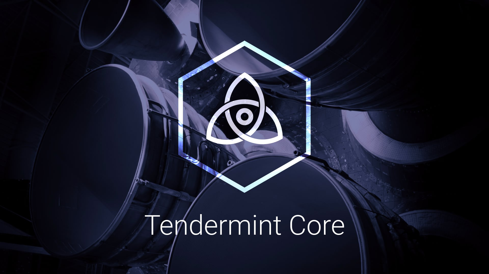

# Tendermint

[Byzantine-Fault Tolerant](https://en.wikipedia.org/wiki/Byzantine_fault_tolerance)
[State Machines](https://en.wikipedia.org/wiki/State_machine_replication).
Or [Blockchain](<https://en.wikipedia.org/wiki/Blockchain_(database)>), for short.

| Branch | Tests                                                                                                                                                                                                                                                  | Coverage                                                                                                                             | Linting                                                                    |
| ------ | ------------------------------------------------------------------------------------------------------------------------------------------------------------------------------------------------------------------------------------------------------ | ------------------------------------------------------------------------------------------------------------------------------------ | -------------------------------------------------------------------------- |
| master |     |  |  |

Tendermint Core is Byzantine Fault Tolerant (BFT) middleware that takes a state transition machine - written in any programming language -
and securely replicates it on many machines.

For protocol details, see [the specification](https://github.com/tendermint/spec).

For detailed analysis of the consensus protocol, including safety and liveness proofs,
see our recent paper, "[The latest gossip on BFT consensus](https://arxiv.org/abs/1807.04938)".

## Releases

Please do not depend on master as your production branch. Use [releases](https://github.com/tendermint/tendermint/releases) instead.

Tendermint is being used in production in both private and public environments,
most notably the blockchains of the [Cosmos Network](https://cosmos.network/).
However, we are still making breaking changes to the protocol and the APIs and have not yet released v1.0.
See below for more details about [versioning](#versioning).

In any case, if you intend to run Tendermint in production, we're happy to help. You can
contact us [over email](mailto:hello@interchain.berlin) or [join the chat](https://discord.gg/AzefAFd).

## Security

To report a security vulnerability, see our [bug bounty
program](https://hackerone.com/tendermint). 
For examples of the kinds of bugs we're looking for, see [our security policy](SECURITY.md)

We also maintain a dedicated mailing list for security updates. We will only ever use this mailing list
to notify you of vulnerabilities and fixes in Tendermint Core. You can subscribe [here](http://eepurl.com/gZ5hQD).

## Minimum requirements

| Requirement | Notes            |
| ----------- | ---------------- |
| Go version  | Go1.15 or higher |

## Documentation

Complete documentation can be found on the [website](https://docs.tendermint.com/master/).

### Install

See the [install instructions](/docs/introduction/install.md).

### Quick Start

- [Single node](/docs/introduction/quick-start.md)
- [Local cluster using docker-compose](/docs/networks/docker-compose.md)
- [Remote cluster using Terraform and Ansible](/docs/networks/terraform-and-ansible.md)
- [Join the Cosmos testnet](https://cosmos.network/testnet)

## Contributing

Please abide by the [Code of Conduct](CODE_OF_CONDUCT.md) in all interactions.

Before contributing to the project, please take a look at the [contributing guidelines](CONTRIBUTING.md)
and the [style guide](STYLE_GUIDE.md). You may also find it helpful to read the
[specifications](https://github.com/tendermint/spec), watch the [Developer Sessions](/docs/DEV_SESSIONS.md), 
and familiarize yourself with our
[Architectural Decision Records](https://github.com/tendermint/tendermint/tree/master/docs/architecture).

## Versioning

### Semantic Versioning

Tendermint uses [Semantic Versioning](http://semver.org/) to determine when and how the version changes.
According to SemVer, anything in the public API can change at any time before version 1.0.0

To provide some stability to Tendermint users in these 0.X.X days, the MINOR version is used
to signal breaking changes across a subset of the total public API. This subset includes all
interfaces exposed to other processes (cli, rpc, p2p, etc.), but does not
include the Go APIs.

That said, breaking changes in the following packages will be documented in the
CHANGELOG even if they don't lead to MINOR version bumps:

- crypto
- config
- libs
    - bech32
    - bits
    - bytes
    - json
    - log
    - math
    - net
    - os
    - protoio
    - rand
    - sync
    - strings
    - service
- node
- rpc/client
- types

### Upgrades

In an effort to avoid accumulating technical debt prior to 1.0.0,
we do not guarantee that breaking changes (ie. bumps in the MINOR version)
will work with existing Tendermint blockchains. In these cases you will
have to start a new blockchain, or write something custom to get the old
data into the new chain. However, any bump in the PATCH version should be 
compatible with existing blockchain histories.

For more information on upgrading, see [UPGRADING.md](./UPGRADING.md).

### Supported Versions

Because we are a small core team, we only ship patch updates, including security updates,
to the most recent minor release and the second-most recent minor release. Consequently,
we strongly recommend keeping Tendermint up-to-date. Upgrading instructions can be found
in [UPGRADING.md](./UPGRADING.md).

## Resources

### Tendermint Core

For details about the blockchain data structures and the p2p protocols, see the
[Tendermint specification](https://docs.tendermint.com/master/spec/).

For details on using the software, see the [documentation](/docs/) which is also
hosted at: <https://docs.tendermint.com/master/>

### Tools

Benchmarking is provided by [`tm-load-test`](https://github.com/informalsystems/tm-load-test).
Additional tooling can be found in [/docs/tools](/docs/tools).

### Applications

- [Cosmos SDK](http://github.com/cosmos/cosmos-sdk); a cryptocurrency application framework
- [Ethermint](http://github.com/cosmos/ethermint); Ethereum on Tendermint
- [Many more](https://tendermint.com/ecosystem)

### Research

- [The latest gossip on BFT consensus](https://arxiv.org/abs/1807.04938)
- [Master's Thesis on Tendermint](https://atrium.lib.uoguelph.ca/xmlui/handle/10214/9769)
- [Original Whitepaper: "Tendermint: Consensus Without Mining"](https://tendermint.com/static/docs/tendermint.pdf)
- [Blog](https://blog.cosmos.network/tendermint/home)
