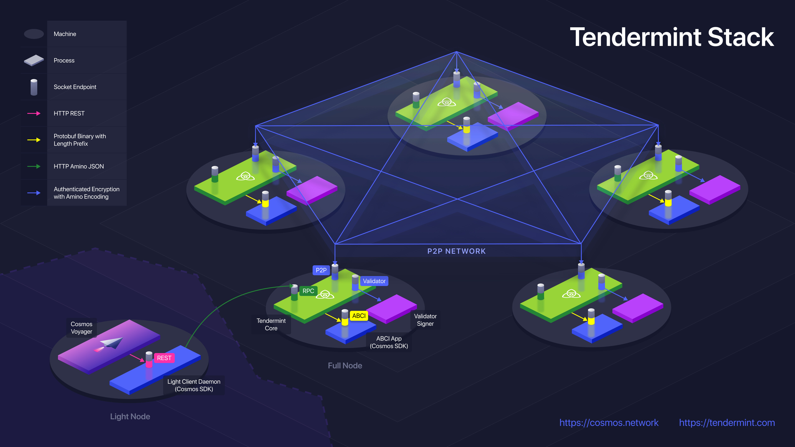

# Application Architecture Guide

Here we provide a brief guide on the recommended architecture of a
Tendermint blockchain application.

The following diagram provides a superb example:

The end-user application here is the Cosmos Voyager, at the bottom left.
Voyager communicates with a REST API exposed by a local Light-Client
Daemon. The Light-Client Daemon is an application specific program that
communicates with Tendermint nodes and verifies Tendermint light-client
proofs through the Tendermint Core RPC. The Tendermint Core process
communicates with a local ABCI application, where the user query or
transaction is actually processed.

The ABCI application must be a deterministic result of the Tendermint
consensus - any external influence on the application state that didn't
come through Tendermint could cause a consensus failure. Thus _nothing_
should communicate with the application except Tendermint via ABCI.

If the application is written in Go, it can be compiled into the
Tendermint binary. Otherwise, it should use a unix socket to communicate
with Tendermint. If it's necessary to use TCP, extra care must be taken
to encrypt and authenticate the connection.

All reads from the app happen through the Tendermint `/abci_query`
endpoint. All writes to the app happen through the Tendermint
`/broadcast_tx_*` endpoints.

The Light-Client Daemon is what provides light clients (end users) with
nearly all the security of a full node. It formats and broadcasts
transactions, and verifies proofs of queries and transaction results.
Note that it need not be a daemon - the Light-Client logic could instead
be implemented in the same process as the end-user application.

Note for those ABCI applications with weaker security requirements, the
functionality of the Light-Client Daemon can be moved into the ABCI
application process itself. That said, exposing the application process
to anything besides Tendermint over ABCI requires extreme caution, as
all transactions, and possibly all queries, should still pass through
Tendermint.

See the following for more extensive documentation:

- [Interchain Standard for the Light-Client REST API](https://github.com/cosmos/cosmos-sdk/pull/1028)
- [Tendermint RPC Docs](https://tendermint.com/rpc/)
- [Tendermint in Production](../tendermint-core/running-in-production.md)
- [ABCI spec](./abci-spec.md)
