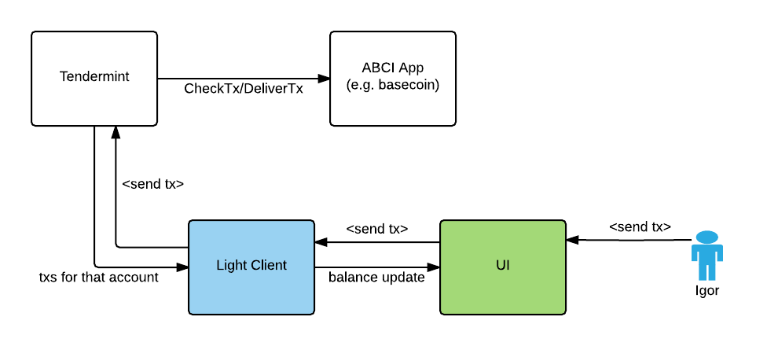

# ADR 2: Event Subscription

## Context

In the light client (or any other client), the user may want to **subscribe to
a subset of transactions** (rather than all of them) using `/subscribe?event=X`. For
example, I want to subscribe for all transactions associated with a particular
account. Same for fetching. The user may want to **fetch transactions based on
some filter** (rather than fetching all the blocks). For example, I want to get
all transactions for a particular account in the last two weeks (`tx's block time >= '2017-06-05'`).

Now you can't even subscribe to "all txs" in Tendermint.

The goal is a simple and easy to use API for doing that.



## Decision

ABCI app return tags with a `DeliverTx` response inside the `data` field (_for
now, later we may create a separate field_). Tags is a list of key-value pairs,
protobuf encoded.

Example data:

```json
{
  "abci.account.name": "Igor",
  "abci.account.address": "0xdeadbeef",
  "tx.gas": 7
}
```

### Subscribing for transactions events

If the user wants to receive only a subset of transactions, ABCI-app must
return a list of tags with a `DeliverTx` response. These tags will be parsed and
matched with the current queries (subscribers). If the query matches the tags,
subscriber will get the transaction event.

```
/subscribe?query="tm.event = Tx AND tx.hash = AB0023433CF0334223212243BDD AND abci.account.invoice.number = 22"
```

A new package must be developed to replace the current `events` package. It
will allow clients to subscribe to a different types of events in the future:

```
/subscribe?query="abci.account.invoice.number = 22"
/subscribe?query="abci.account.invoice.owner CONTAINS Igor"
```

### Fetching transactions

This is a bit tricky because a) we want to support a number of indexers, all of
which have a different API b) we don't know whenever tags will be sufficient
for the most apps (I guess we'll see).

```
/txs/search?query="tx.hash = AB0023433CF0334223212243BDD AND abci.account.owner CONTAINS Igor"
/txs/search?query="abci.account.owner = Igor"
```

For historic queries we will need a indexing storage (Postgres, SQLite, ...).

### Issues

- https://github.com/tendermint/basecoin/issues/91
- https://github.com/tendermint/tendermint/issues/376
- https://github.com/tendermint/tendermint/issues/287
- https://github.com/tendermint/tendermint/issues/525 (related)

## Status

proposed

## Consequences

### Positive

- same format for event notifications and search APIs
- powerful enough query

### Negative

- performance of the `match` function (where we have too many queries / subscribers)
- there is an issue where there are too many txs in the DB

### Neutral
