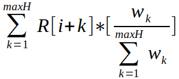
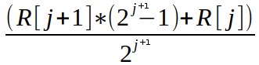

# ADR 006: Trust Metric Design

## Context

The proposed trust metric will allow Tendermint to maintain local trust rankings for peers it has directly interacted with, which can then be used to implement soft security controls. The calculations were obtained from the [TrustGuard](https://dl.acm.org/citation.cfm?id=1060808) project.

### Background

The Tendermint Core project developers would like to improve Tendermint security and reliability by keeping track of the level of trustworthiness peers have demonstrated within the peer-to-peer network. This way, undesirable outcomes from peers will not immediately result in them being dropped from the network (potentially causing drastic changes to take place). Instead, peers behavior can be monitored with appropriate metrics and be removed from the network once Tendermint Core is certain the peer is a threat. For example, when the PEXReactor makes a request for peers network addresses from a already known peer, and the returned network addresses are unreachable, this untrustworthy behavior should be tracked. Returning a few bad network addresses probably shouldn’t cause a peer to be dropped, while excessive amounts of this behavior does qualify the peer being dropped.

Trust metrics can be circumvented by malicious nodes through the use of strategic oscillation techniques, which adapts the malicious node’s behavior pattern in order to maximize its goals. For instance, if the malicious node learns that the time interval of the Tendermint trust metric is _X_ hours, then it could wait _X_ hours in-between malicious activities. We could try to combat this issue by increasing the interval length, yet this will make the system less adaptive to recent events.

Instead, having shorter intervals, but keeping a history of interval values, will give our metric the flexibility needed in order to keep the network stable, while also making it resilient against a strategic malicious node in the Tendermint peer-to-peer network. Also, the metric can access trust data over a rather long period of time while not greatly increasing its history size by aggregating older history values over a larger number of intervals, and at the same time, maintain great precision for the recent intervals. This approach is referred to as fading memories, and closely resembles the way human beings remember their experiences. The trade-off to using history data is that the interval values should be preserved in-between executions of the node.

### References

S. Mudhakar, L. Xiong, and L. Liu, “TrustGuard: Countering Vulnerabilities in Reputation Management for Decentralized Overlay Networks,” in _Proceedings of the 14th international conference on World Wide Web, pp. 422-431_, May 2005.

## Decision

The proposed trust metric will allow a developer to inform the trust metric store of all good and bad events relevant to a peer's behavior, and at any time, the metric can be queried for a peer's current trust ranking.

The three subsections below will cover the process being considered for calculating the trust ranking, the concept of the trust metric store, and the interface for the trust metric.

### Proposed Process

The proposed trust metric will count good and bad events relevant to the object, and calculate the percent of counters that are good over an interval with a predefined duration. This is the procedure that will continue for the life of the trust metric. When the trust metric is queried for the current **trust value**, a resilient equation will be utilized to perform the calculation.

The equation being proposed resembles a Proportional-Integral-Derivative (PID) controller used in control systems. The proportional component allows us to be sensitive to the value of the most recent interval, while the integral component allows us to incorporate trust values stored in the history data, and the derivative component allows us to give weight to sudden changes in the behavior of a peer. We compute the trust value of a peer in interval i based on its current trust ranking, its trust rating history prior to interval _i_ (over the past _maxH_ number of intervals) and its trust ranking fluctuation. We will break up the equation into the three components.

```math
(1) Proportional Value = a * R[i]
```

where _R_[*i*] denotes the raw trust value at time interval _i_ (where _i_ == 0 being current time) and _a_ is the weight applied to the contribution of the current reports. The next component of our equation uses a weighted sum over the last _maxH_ intervals to calculate the history value for time _i_:

`H[i] =` 

The weights can be chosen either optimistically or pessimistically. An optimistic weight creates larger weights for newer history data values, while the the pessimistic weight creates larger weights for time intervals with lower scores. The default weights used during the calculation of the history value are optimistic and calculated as _Wk_ = 0.8^_k_, for time interval _k_. With the history value available, we can now finish calculating the integral value:

```math
(2) Integral Value = b * H[i]
```

Where _H_[*i*] denotes the history value at time interval _i_ and _b_ is the weight applied to the contribution of past performance for the object being measured. The derivative component will be calculated as follows:

```math
D[i] = R[i] – H[i]

(3) Derivative Value = c(D[i]) * D[i]
```

Where the value of _c_ is selected based on the _D_[*i*] value relative to zero. The default selection process makes _c_ equal to 0 unless _D_[*i*] is a negative value, in which case c is equal to 1. The result is that the maximum penalty is applied when current behavior is lower than previously experienced behavior. If the current behavior is better than the previously experienced behavior, then the Derivative Value has no impact on the trust value. With the three components brought together, our trust value equation is calculated as follows:

```math
TrustValue[i] = a * R[i] + b * H[i] + c(D[i]) * D[i]
```

As a performance optimization that will keep the amount of raw interval data being saved to a reasonable size of _m_, while allowing us to represent 2^_m_ - 1 history intervals, we can employ the fading memories technique that will trade space and time complexity for the precision of the history data values by summarizing larger quantities of less recent values. While our equation above attempts to access up to _maxH_ (which can be 2^_m_ - 1), we will map those requests down to _m_ values using equation 4 below:

```math
(4) j = index, where index > 0
```

Where _j_ is one of _(0, 1, 2, … , m – 1)_ indices used to access history interval data. Now we can access the raw intervals using the following calculations:

```math
R[0] = raw data for current time interval
```

`R[j] =` 

### Trust Metric Store

Similar to the P2P subsystem AddrBook, the trust metric store will maintain information relevant to Tendermint peers. Additionally, the trust metric store will ensure that trust metrics will only be active for peers that a node is currently and directly engaged with.

Reactors will provide a peer key to the trust metric store in order to retrieve the associated trust metric. The trust metric can then record new positive and negative events experienced by the reactor, as well as provided the current trust score calculated by the metric.

When the node is shutting down, the trust metric store will save history data for trust metrics associated with all known peers. This saved information allows experiences with a peer to be preserved across node executions, which can span a tracking windows of days or weeks. The trust history data is loaded automatically during OnStart.

### Interface Detailed Design

Each trust metric allows for the recording of positive/negative events, querying the current trust value/score, and the stopping/pausing of tracking over time intervals. This can be seen below:

```go
// TrustMetric - keeps track of peer reliability
type TrustMetric struct {
    // Private elements.
}

// Pause tells the metric to pause recording data over time intervals.
// All method calls that indicate events will unpause the metric
func (tm *TrustMetric) Pause() {}

// Stop tells the metric to stop recording data over time intervals
func (tm *TrustMetric) Stop() {}

// BadEvents indicates that an undesirable event(s) took place
func (tm *TrustMetric) BadEvents(num int) {}

// GoodEvents indicates that a desirable event(s) took place
func (tm *TrustMetric) GoodEvents(num int) {}

// TrustValue gets the dependable trust value; always between 0 and 1
func (tm *TrustMetric) TrustValue() float64 {}

// TrustScore gets a score based on the trust value always between 0 and 100
func (tm *TrustMetric) TrustScore() int {}

// NewMetric returns a trust metric with the default configuration
func NewMetric() *TrustMetric {}

//------------------------------------------------------------------------------------------------
// For example

tm := NewMetric()

tm.BadEvents(1)
score := tm.TrustScore()

tm.Stop()
```

Some of the trust metric parameters can be configured. The weight values should probably be left alone in more cases, yet the time durations for the tracking window and individual time interval should be considered.

```go
// TrustMetricConfig - Configures the weight functions and time intervals for the metric
type TrustMetricConfig struct {
    // Determines the percentage given to current behavior
    ProportionalWeight float64

    // Determines the percentage given to prior behavior
    IntegralWeight float64

    // The window of time that the trust metric will track events across.
    // This can be set to cover many days without issue
    TrackingWindow time.Duration

    // Each interval should be short for adapability.
    // Less than 30 seconds is too sensitive,
    // and greater than 5 minutes will make the metric numb
    IntervalLength time.Duration
}

// DefaultConfig returns a config with values that have been tested and produce desirable results
func DefaultConfig() TrustMetricConfig {}

// NewMetricWithConfig returns a trust metric with a custom configuration
func NewMetricWithConfig(tmc TrustMetricConfig) *TrustMetric {}

//------------------------------------------------------------------------------------------------
// For example

config := TrustMetricConfig{
    TrackingWindow: time.Minute * 60 * 24, // one day
    IntervalLength:    time.Minute * 2,
}

tm := NewMetricWithConfig(config)

tm.BadEvents(10)
tm.Pause()
tm.GoodEvents(1) // becomes active again
```

A trust metric store should be created with a DB that has persistent storage so it can save history data across node executions. All trust metrics instantiated by the store will be created with the provided TrustMetricConfig configuration.

When you attempt to fetch the trust metric for a peer, and an entry does not exist in the trust metric store, a new metric is automatically created and the entry made within the store.

In additional to the fetching method, GetPeerTrustMetric, the trust metric store provides a method to call when a peer has disconnected from the node. This is so the metric can be paused (history data will not be saved) for periods of time when the node is not having direct experiences with the peer.

```go
// TrustMetricStore - Manages all trust metrics for peers
type TrustMetricStore struct {
    cmn.BaseService

    // Private elements
}

// OnStart implements Service
func (tms *TrustMetricStore) OnStart(context.Context) error { return nil }

// OnStop implements Service
func (tms *TrustMetricStore) OnStop() {}

// NewTrustMetricStore returns a store that saves data to the DB
// and uses the config when creating new trust metrics
func NewTrustMetricStore(db dbm.DB, tmc TrustMetricConfig) *TrustMetricStore {}

// Size returns the number of entries in the trust metric store
func (tms *TrustMetricStore) Size() int {}

// GetPeerTrustMetric returns a trust metric by peer key
func (tms *TrustMetricStore) GetPeerTrustMetric(key string) *TrustMetric {}

// PeerDisconnected pauses the trust metric associated with the peer identified by the key
func (tms *TrustMetricStore) PeerDisconnected(key string) {}

//------------------------------------------------------------------------------------------------
// For example

db := dbm.NewDB("trusthistory", "goleveldb", dirPathStr)
tms := NewTrustMetricStore(db, DefaultConfig())

tm := tms.GetPeerTrustMetric(key)
tm.BadEvents(1)

tms.PeerDisconnected(key)
```

## Status

Approved.

## Consequences

### Positive

- The trust metric will allow Tendermint to make non-binary security and reliability decisions
- Will help Tendermint implement deterrents that provide soft security controls, yet avoids disruption on the network
- Will provide useful profiling information when analyzing performance over time related to peer interaction

### Negative

- Requires saving the trust metric history data across node executions

### Neutral

- Keep in mind that, good events need to be recorded just as bad events do using this implementation
