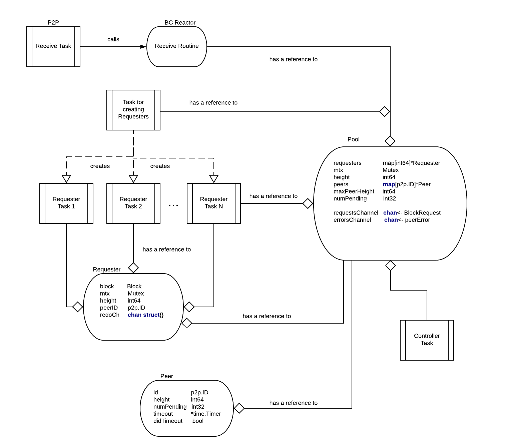
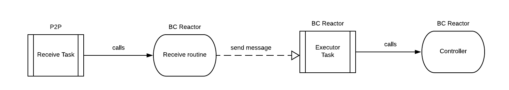

# ADR 040: Blockchain Reactor Refactor

## Changelog

19-03-2019: Initial draft

## Context

The Blockchain Reactor's high level responsibility is to enable peers who are far behind the current state of the
blockchain to quickly catch up by downloading many blocks in parallel from its peers, verifying block correctness, and
executing them against the ABCI application. We call the protocol executed by the Blockchain Reactor `fast-sync`.
The current architecture diagram of the blockchain reactor can be found here:



The current architecture consists of dozens of routines and it is tightly depending on the `Switch`, making writing
unit tests almost impossible. Current tests require setting up complex dependency graphs and dealing with concurrency.
Note that having dozens of routines is in this case overkill as most of the time routines sits idle waiting for
something to happen (message to arrive or timeout to expire). Due to dependency on the `Switch`, testing relatively
complex network scenarios and failures (for example adding and removing peers) is very complex tasks and frequently lead
to complex tests with not deterministic behavior ([#3400]). Impossibility to write proper tests makes confidence in
the code low and this resulted in several issues (some are fixed in the meantime and some are still open):
[#3400], [#2897], [#2896], [#2699], [#2888], [#2457], [#2622], [#2026].

## Decision

To remedy these issues we plan a major refactor of the blockchain reactor. The proposed architecture is largely inspired
by ADR-30 and is presented on the following diagram:


We suggest a concurrency architecture where the core algorithm (we call it `Controller`) is extracted into a finite
state machine. The active routine of the reactor is called `Executor` and is responsible for receiving and sending
messages from/to peers and triggering timeouts. What messages should be sent and timeouts triggered is determined mostly
by the `Controller`. The exception is `Peer Heartbeat` mechanism which is `Executor` responsibility. The heartbeat
mechanism is used to remove slow and unresponsive peers from the peer list. Writing of unit tests is simpler with
this architecture as most of the critical logic is part of the `Controller` function. We expect that simpler concurrency
architecture will not have significant negative effect on the performance of this reactor (to be confirmed by
experimental evaluation).


### Implementation changes

We assume the following system model for "fast sync" protocol:

* a node is connected to a random subset of all nodes that represents its peer set. Some nodes are correct and some
  might be faulty. We don't make assumptions about ratio of faulty nodes, i.e., it is possible that all nodes in some
	peer set are faulty.
* we assume that communication between correct nodes is synchronous, i.e., if a correct node `p` sends a message `m` to
  a correct node `q` at time `t`, then `q` will receive message the latest at time `t+Delta` where `Delta` is a system
	parameter that is known by network participants. `Delta` is normally chosen to be an order of magnitude higher than
	the real communication delay (maximum) between correct nodes. Therefore if a correct node `p` sends a request message
	to a correct node `q` at time `t` and there is no the corresponding reply at time `t + 2*Delta`, then `p` can assume
	that `q` is faulty. Note that the network assumptions for the consensus reactor are different (we assume partially
	synchronous model there).

The requirements for the "fast sync" protocol are formally specified as follows:

- `Correctness`: If a correct node `p` is connected to a correct node `q` for a long enough period of time, then `p`
- will eventually download all requested blocks from `q`.
- `Termination`: If a set of peers of a correct node `p` is stable (no new nodes are added to the peer set of `p`) for
- a long enough period of time, then protocol eventually terminates.
- `Fairness`: A correct node `p` sends requests for blocks to all peers from its peer set.

As explained above, the `Executor` is responsible for sending and receiving messages that are part of the `fast-sync`
protocol. The following messages are exchanged as part of `fast-sync` protocol:

``` go
type Message int
const (
  MessageUnknown Message = iota
  MessageStatusRequest
  MessageStatusResponse
  MessageBlockRequest
  MessageBlockResponse
)
```
`MessageStatusRequest` is sent periodically to all peers as a request for a peer to provide its current height. It is
part of the `Peer Heartbeat` mechanism and a failure to respond timely to this message results in a peer being removed
from the peer set. Note that the `Peer Heartbeat` mechanism is used only while a peer is in `fast-sync` mode. We assume
here existence of a mechanism that gives node a possibility to inform its peers that it is in the `fast-sync` mode.

``` go
type MessageStatusRequest struct {
  SeqNum int64     // sequence number of the request
}
```
`MessageStatusResponse` is sent as a response to `MessageStatusRequest` to inform requester about the peer current
height.

``` go
type MessageStatusResponse struct {
  SeqNum int64     // sequence number of the corresponding request
  Height int64     // current peer height
}
```

`MessageBlockRequest` is used to make a request for a block and the corresponding commit certificate at a given height.

``` go
type MessageBlockRequest struct {
  Height int64
}
```

`MessageBlockResponse` is a response for the corresponding block request. In addition to providing the block and the
corresponding commit certificate, it contains also a current peer height.

``` go
type MessageBlockResponse struct {
  Height         int64
  Block          Block
  Commit         Commit
  PeerHeight     int64
}
```

In addition to sending and receiving messages, and `HeartBeat` mechanism, controller is also managing timeouts
that are triggered upon `Controller` request. `Controller` is then informed once a timeout expires.

``` go
type TimeoutTrigger int
const (
  TimeoutUnknown TimeoutTrigger = iota
  TimeoutResponseTrigger
  TimeoutTerminationTrigger
)
```

The `Controller` can be modelled as a function with clearly defined inputs:

* `State` - current state of the node. Contains data about connected peers and its behavior, pending requests,
* received blocks, etc.
* `Event` - significant events in the network.

producing clear outputs:

* `State` - updated state of the node,
* `MessageToSend` - signal what message to send and to which peer
* `TimeoutTrigger` - signal that timeout should be triggered.


We consider the following `Event` types:

``` go
type Event int
const (
  EventUnknown Event = iota
  EventStatusReport
  EventBlockRequest
  EventBlockResponse
  EventRemovePeer
  EventTimeoutResponse
  EventTimeoutTermination
)
```

`EventStatusResponse` event is generated once `MessageStatusResponse` is received by the `Executor`.

``` go
type EventStatusReport struct {
  PeerID ID
  Height int64
}
```

`EventBlockRequest` event is generated once `MessageBlockRequest` is received by the `Executor`.

``` go
type EventBlockRequest struct {
  Height int64
  PeerID p2p.ID
}
```
`EventBlockResponse` event is generated upon reception of `MessageBlockResponse` message by the `Executor`.

``` go
type EventBlockResponse struct {
  Height             int64
  Block              Block
  Commit             Commit
  PeerID             ID
  PeerHeight         int64
}
```
`EventRemovePeer` is generated by `Executor` to signal that the connection to a peer is closed due to peer misbehavior.

``` go
type EventRemovePeer struct {
  PeerID ID
}
```
`EventTimeoutResponse` is generated by `Executor` to signal that a timeout triggered by `TimeoutResponseTrigger` has
expired.

``` go
type EventTimeoutResponse struct {
  PeerID ID
  Height int64
}
```
`EventTimeoutTermination` is generated by `Executor` to signal that a timeout triggered by `TimeoutTerminationTrigger`
has expired.

``` go
type EventTimeoutTermination struct {
  Height int64
}
```

`MessageToSend` is just a wrapper around `Message` type that contains id of the peer to which message should be sent.

``` go
type MessageToSend struct {
  PeerID  ID
  Message Message
}
```

The Controller state machine can be in two modes: `ModeFastSync` when
a node is trying to catch up with the network by downloading committed blocks,
and `ModeConsensus` in which it executes Tendermint consensus protocol. We
consider that `fast sync` mode terminates once the Controller switch to
`ModeConsensus`.

``` go
type Mode int
const (
  ModeUnknown Mode = iota
  ModeFastSync
  ModeConsensus
)
```
`Controller` is managing the following state:

``` go
type ControllerState struct {
  Height             int64            // the first block that is not committed
  Mode               Mode             // mode of operation
  PeerMap            map[ID]PeerStats // map of peer IDs to peer statistics
  MaxRequestPending  int64            // maximum height of the pending requests
  FailedRequests     []int64          // list of failed block requests
  PendingRequestsNum int              // total number of pending requests
  Store              []BlockInfo      // contains list of downloaded blocks
  Executor           BlockExecutor    // store, verify and executes blocks
}
```

`PeerStats` data structure keeps for every peer its current height and a list of pending requests for blocks.

``` go
type PeerStats struct {
  Height             int64
  PendingRequest     int64             // a request sent to this peer
}
```

`BlockInfo` data structure is used to store information (as part of block store) about downloaded blocks: from what peer
 a block and the corresponding commit certificate are received.
``` go
type BlockInfo struct {
  Block  Block
  Commit Commit
  PeerID ID                // a peer from which we received the corresponding Block and Commit
}
```

The `Controller` is initialized by providing an initial height (`startHeight`) from which it will start downloading
blocks from peers and the current state of the `BlockExecutor`.

``` go
func NewControllerState(startHeight int64, executor BlockExecutor) ControllerState {
  state = ControllerState {}
  state.Height = startHeight
  state.Mode = ModeFastSync
  state.MaxRequestPending = startHeight - 1
  state.PendingRequestsNum = 0
  state.Executor = executor
  initialize state.PeerMap, state.FailedRequests and state.Store to empty data structures
  return state
}
```

The core protocol logic is given with the following function:

``` go
func handleEvent(state ControllerState, event Event) (ControllerState, Message, TimeoutTrigger, Error) {
  msg = nil
  timeout = nil
  error = nil

  switch state.Mode {
  case ModeConsensus:
    switch event := event.(type) {
    case EventBlockRequest:
      msg = createBlockResponseMessage(state, event)
      return state, msg, timeout, error
    default:
      error = "Only respond to BlockRequests while in ModeConsensus!"
      return state, msg, timeout, error
    }

  case ModeFastSync:
    switch event := event.(type) {
    case EventBlockRequest:
      msg = createBlockResponseMessage(state, event)
      return state, msg, timeout, error

    case EventStatusResponse:
      return handleEventStatusResponse(event, state)

    case EventRemovePeer:
      return handleEventRemovePeer(event, state)

    case EventBlockResponse:
      return handleEventBlockResponse(event, state)

    case EventResponseTimeout:
      return handleEventResponseTimeout(event, state)

    case EventTerminationTimeout:
      // Termination timeout is triggered in case of empty peer set and in case there are no pending requests.
      // If this timeout expires and in the meantime no new peers are added or new pending requests are made
      // then `fast-sync` mode terminates by switching to `ModeConsensus`.
      // Note that termination timeout should be higher than the response timeout.
      if state.Height == event.Height && state.PendingRequestsNum == 0 { state.State = ConsensusMode }
      return state, msg, timeout, error

    default:
      error = "Received unknown event type!"
      return state, msg, timeout, error
    }
  }
}
```

``` go
func createBlockResponseMessage(state ControllerState, event BlockRequest) MessageToSend {
  msgToSend = nil
  if _, ok := state.PeerMap[event.PeerID]; !ok { peerStats = PeerStats{-1, -1} }
  if state.Executor.ContainsBlockWithHeight(event.Height) && event.Height > peerStats.Height {
    peerStats = event.Height
    msg = BlockResponseMessage{
     Height:        event.Height,
     Block:         state.Executor.getBlock(eventHeight),
     Commit:        state.Executor.getCommit(eventHeight),
     PeerID:        event.PeerID,
     CurrentHeight: state.Height - 1,
    }
    msgToSend = MessageToSend { event.PeerID, msg }
  }
  state.PeerMap[event.PeerID] = peerStats
  return msgToSend
}
```

``` go
func handleEventStatusResponse(event EventStatusResponse, state ControllerState) (ControllerState, MessageToSend, TimeoutTrigger, Error) {
  if _, ok := state.PeerMap[event.PeerID]; !ok {
    peerStats = PeerStats{ -1, -1 }
  } else {
    peerStats = state.PeerMap[event.PeerID]
  }

  if event.Height > peerStats.Height { peerStats.Height = event.Height }
  // if there are no pending requests for this peer, try to send him a request for block
  if peerStats.PendingRequest == -1 {
    msg = createBlockRequestMessages(state, event.PeerID, peerStats.Height)
    // msg is nil if no request for block can be made to a peer at this point in time
    if msg != nil {
      peerStats.PendingRequests = msg.Height
      state.PendingRequestsNum++
      // when a request for a block is sent to a peer, a response timeout is triggered. If no corresponding block is sent by the peer
      // during response timeout period, then the peer is considered faulty and is removed from the peer set.
      timeout = ResponseTimeoutTrigger{ msg.PeerID, msg.Height, PeerTimeout }
    } else if state.PendingRequestsNum == 0 {
      // if there are no pending requests and no new request can be placed to the peer, termination timeout is triggered.
      // If termination timeout expires and we are still at the same height and there are no pending requests, the "fast-sync"
      // mode is finished and we switch to `ModeConsensus`.
      timeout = TerminationTimeoutTrigger{ state.Height, TerminationTimeout }
    }
  }
  state.PeerMap[event.PeerID] = peerStats
  return state, msg, timeout, error
}
```

``` go
func handleEventRemovePeer(event EventRemovePeer, state ControllerState) (ControllerState, MessageToSend, TimeoutTrigger, Error) {
  if _, ok := state.PeerMap[event.PeerID]; ok {
    pendingRequest = state.PeerMap[event.PeerID].PendingRequest
    // if a peer is removed from the peer set, its pending request is declared failed and added to the `FailedRequests` list
    // so it can be retried.
    if pendingRequest != -1 {
      add(state.FailedRequests, pendingRequest)
    }
    state.PendingRequestsNum--
    delete(state.PeerMap, event.PeerID)
    // if the peer set is empty after removal of this peer then termination timeout is triggered.
    if state.PeerMap.isEmpty() {
      timeout = TerminationTimeoutTrigger{ state.Height, TerminationTimeout }
    }
  } else { error = "Removing unknown peer!" }
  return state, msg, timeout, error
```

``` go
func handleEventBlockResponse(event EventBlockResponse, state ControllerState) (ControllerState, MessageToSend, TimeoutTrigger, Error)
  if state.PeerMap[event.PeerID] {
    peerStats = state.PeerMap[event.PeerID]
    // when expected block arrives from a peer, it is added to the store so it can be verified and if correct executed after.
    if peerStats.PendingRequest == event.Height {
      peerStats.PendingRequest = -1
      state.PendingRequestsNum--
      if event.PeerHeight > peerStats.Height { peerStats.Height = event.PeerHeight }
      state.Store[event.Height] = BlockInfo{ event.Block, event.Commit, event.PeerID }
      // blocks are verified sequentially so adding a block to the store does not mean that it will be immediately verified
      // as some of the previous blocks might be missing.
      state = verifyBlocks(state) // it can lead to event.PeerID being removed from peer list
      if _, ok := state.PeerMap[event.PeerID]; ok {
        // we try to identify new request for a block that can be asked to the peer
        msg = createBlockRequestMessage(state, event.PeerID, peerStats.Height)
        if msg != nil {
          peerStats.PendingRequests = msg.Height
          state.PendingRequestsNum++
          // if request for block is made, response timeout is triggered
          timeout = ResponseTimeoutTrigger{ msg.PeerID, msg.Height, PeerTimeout }
        } else if state.PeerMap.isEmpty() || state.PendingRequestsNum == 0 {
          // if the peer map is empty (the peer can be removed as block verification failed) or there are no pending requests
          // termination timeout is triggered.
           timeout = TerminationTimeoutTrigger{ state.Height, TerminationTimeout }
        }
      }
    } else { error = "Received Block from wrong peer!" }
  } else { error = "Received Block from unknown peer!" }

  state.PeerMap[event.PeerID] = peerStats
  return state, msg, timeout, error
}
```

``` go
func handleEventResponseTimeout(event, state) {
  if _, ok := state.PeerMap[event.PeerID]; ok {
    peerStats = state.PeerMap[event.PeerID]
    // if a response timeout expires and the peer hasn't delivered the block, the peer is removed from the peer list and
    // the request is added to the `FailedRequests` so the block can be downloaded from other peer
  if peerStats.PendingRequest == event.Height {
    add(state.FailedRequests, pendingRequest)
    delete(state.PeerMap, event.PeerID)
    state.PendingRequestsNum--
    // if peer set is empty, then termination timeout is triggered
    if state.PeerMap.isEmpty() {
      timeout = TimeoutTrigger{ state.Height, TerminationTimeout }
    }
  }
  }
  return state, msg, timeout, error
}
```

``` go
func createBlockRequestMessage(state ControllerState, peerID ID, peerHeight int64) MessageToSend {
  msg = nil
  blockHeight = -1
  r = find request in state.FailedRequests such that r <= peerHeight // returns `nil` if there are no such request
  // if there is a height in failed requests that can be downloaded from the peer send request to it
  if r != nil {
    blockNumber = r
    delete(state.FailedRequests, r)
  } else if state.MaxRequestPending < peerHeight {
  // if height of the maximum pending request is smaller than peer height, then ask peer for next block
    state.MaxRequestPending++
    blockHeight = state.MaxRequestPending // increment state.MaxRequestPending and then return the new value
  }

  if blockHeight > -1 { msg = MessageToSend { peerID, MessageBlockRequest { blockHeight } }
  return msg
}
```

``` go
func verifyBlocks(state State) State {
  done = false
  for !done {
    block = state.Store[height]
    if block != nil {
      verified = verify block.Block using block.Commit // return `true` is verification succeed, 'false` otherwise

      if verified {
        block.Execute()   // executing block is costly operation so it might make sense executing asynchronously
        state.Height++
      } else {
        // if block verification failed, then it is added to `FailedRequests` and the peer is removed from the peer set
        add(state.FailedRequests, height)
        state.Store[height] = nil
        if _, ok := state.PeerMap[block.PeerID]; ok {
          pendingRequest = state.PeerMap[block.PeerID].PendingRequest
          // if there is a pending request sent to the peer that is just to be removed from the peer set, add it to `FailedRequests`
          if pendingRequest != -1 {
            add(state.FailedRequests, pendingRequest)
            state.PendingRequestsNum--
          }
          delete(state.PeerMap, event.PeerID)
        }
        done = true
      }
    } else { done = true }
  }
  return state
}
```

In the proposed architecture `Controller` is not active task, i.e., it is being called by the `Executor`. Depending on
the return values returned by `Controller`,`Executor` will send a message to some peer (`msg` != nil), trigger a
timeout (`timeout` != nil) or deal with errors (`error` != nil).
In case a timeout is triggered, it will provide as an input to `Controller` the corresponding timeout event once
timeout expires.


## Status

Draft.

## Consequences

### Positive

- isolated implementation of the algorithm
- improved testability - simpler to prove correctness
- clearer separation of concerns - easier to reason

### Negative

### Neutral
