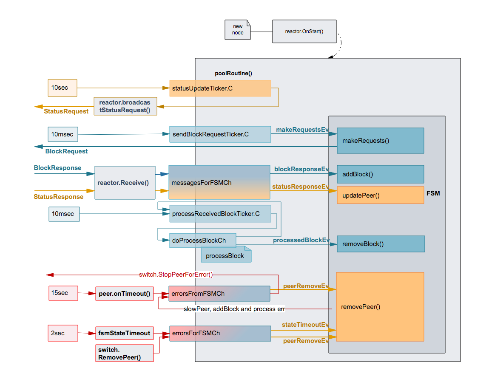

# ADR 042: Blockchain Reactor Design

Author: @ancaz

## Changelog

## Context
This ADR describes a partial, initial implementation of adr-040-blockchain-reactor-refactor.md

## Proposed Design

### Data Structures
The data structures used are illustrated below.


#### BlockchainReactor
- is a p2p.BaseReactor.
- has a BlockStore for persistence.
- executes blocks using an sm.BlockExecutor.
- starts the FSM and the poolRoutine().
- relays the fast-sync and switch messages to the FSM.
- handles errors from the FSM and when necessarily reports them to the switch.
- registers all the concrete types and interfaces for serialisation.

```go
type BlockchainReactor struct {
	p2p.BaseReactor

	// immutable
	initialState sm.State
	state        sm.State

	blockExec *sm.BlockExecutor
	store     *BlockStore

	fastSync bool

	fsm          *bReactorFSM
	blocksSynced int

	// Receive goroutine forwards messages to this channel to be processed in the context of the poolRoutine.
	messagesForFSMCh chan bcReactorMessage

	// Switch goroutine may send RemovePeer to the blockchain reactor. This is an error message that is relayed
	// to this channel to be processed in the context of the poolRoutine.
	errorsForFSMCh chan bcReactorMessage

	// This channel is used by the FSM and indirectly the block pool to report errors to the blockchain reactor and
	// the switch.
	eventsFromFSMCh chan bcFsmMessage
}
```

#### bReactorFSM
- implements a simple finite state machine.
- maintains a state and a state timer.
- has a blockPool to keep track of block requests sent to peers and blocks received from peers.
- uses an interface to send status requests, block requests and reporting errors. The interface is implemented by the BlockchainReactor and tests.

```go
type bReactorFSM struct {
	logger    log.Logger
	startTime time.Time

	state      *bReactorFSMState
	stateTimer *time.Timer
	pool       *blockPool

	// interface used to call the Blockchain reactor to send StatusRequest, BlockRequest, reporting errors, etc.
	toBcR bcRMessageInterface
}
```

#### blockPool
- maintains a peer set, implemented as a map of peer ID to bpPeer.
- maintains a set of requests made to peers, implemented as a map of block request heights to peer IDs.
- maintains a list of future block requests needed to advance the fast-sync. This is a list of block heights. 
- keeps track of the number of pending requests.
- keeps track of the maximum height of the peers in the set.
- uses an interface to send requests and report errors to the reactor (via FSM).

```go
type blockPool struct {
	logger log.Logger
	peers  map[p2p.ID]*bpPeer
	blocks map[int64]p2p.ID

	requests          map[int64]bool // list of blocks to be assigned peers for blockRequest
	nextRequestHeight int64          // next height to be added to requests

	height        int64 // processing height
	maxPeerHeight int64 // maximum height of all peers
	numPending    int32 // total numPending across peers
	toBcR         bcRMessageInterface
}
```
Some reasons for the blockPool data structure content:
1. If a peer is removed by the switch we need fast access to the peer and the block requests made to that peer in order to redo them.
2. When block verification fails we need fast access from the block height to the peer and the block requests made to that peer in order to redo them.
3. The BlockchainReactor main routine decides when the block pool is running low and asks the blockPool (via FSM) to make more requests. The blockPool creates a list of requests and triggers the sending of the Block requests (via the interface). The reason it maintains a list of requests is the redo operations that may occur during error handling. These will also be effectively redone when the BlockchainReactor requires more blocks.

#### bpPeer
- keeps track of a single peer, with height bigger than the initial height.
- maintains the block requests made to the peer and the blocks received from the peer until they are executed.
- monitors the peer speed if there are pending requests.
- with pending requests it starts a timer and reports error on timeout.

```go
type bpPeer struct {
	logger log.Logger
	id     p2p.ID

	height      int64                  // the peer reported height
	numPending  int32                  // number of requests still waiting for block responses
	blocks      map[int64]*types.Block // blocks received or expected to be received from this peer
	timeout     *time.Timer
	didTimeout  bool
	recvMonitor *flow.Monitor

	errFunc func(err error, peerID p2p.ID) // function to call on error
}
```

### Concurrency Model


#### Receive()
Fast-sync messages from peers are received by this goroutine. It performs basic validation and:
- in helper mode (i.e. for request message) it replies immediately. This is different than the proposal in adr-040 which suggests having the FSM handling these.
- for response messages, they are forwarded to the poolRoutine().

#### poolRoutine()
(named kept as in the previous reactor). 
It starts the FSM and then waits in a loop for events. These are received from a number of channels:
- sendBlockRequestTicker.C - runs every 10msec and asks FSM to make more block requests up to a maximum. Note: currently this value is constant but could be changed based on low/ high watermark thresholds for the number of blocks received and waiting to be processed, the number of blockResponse messages waiting in messagesForFSMCh, etc.
- statusUpdateTicker.C - runs every 10 seconds and broadcast status requests to peers. While adr-040 proposes this to run within the FSM, at this point this functionality is kept in the reactor.
- processReceivedBlockTicker.C - runs every 10msec and performs block processing by sending a signal over doProcessBlockCh channel
- doProcessBlockCh - triggered by the processReceivedBlockTicker (above), it looks for blocks to process. 
- messagesForFSMCh - receives messages from the Receive() goroutine. Calls FSM to handle them.
- bcR.errorsForFSMCh - these are peer related errors detected by the pool for unresponsive or slow peers. Handled by the FSM.
- eventsFromFSMCh - there are two type of events sent over this channel:
    - syncFinishedEv - triggered when FSM enters `finished` state and calls the switchToConsensus interface
    - peerErrorEv - peer timer expiry goroutine sends this event over the channel for processing from poolRoutine() context.
    
### FSM


#### init state (aka unknown)
The FSM is created in `unknown` state. When started, by the reactor (`startFSMEv`), it broadcasts Status requests and transitions to `waitForPeer` state.

#### waitForPeer state
In this state, the FSM waits for a Status responses from a "tall" peer. A timer is running in this state to allow the FSM to finish if there are no useful peers.

If the timer expires, it moves to `finished` state and calls the reactor to switch to consensus.
If a Status response is received from a peer within the timeout, the FSM transitions to `waitForBlock` state.

#### waitForBlock state
In this state the FSM makes Block requests (triggered by a ticker in reactor) and waits for Block responses. There is a timer running in this state to penalize the peer that is not sending the block at current processing height. If the timer expires, the FSM removes the peer where the request was sent and all requests made to that peer are redone.

As blocks are received they are stored by the pool. Block execution is independently performed by the reactor and the result reported to the FSM:
- if there are no errors, the FSM increases the pool height and resets the state timer.
- if there are errors, the peers that delivered the two blocks (at height and height+1) are removed and the requests redone.

In this state the FSM may receive peer remove events if any of the following scenarios occurs: 
- the switch is removing a peer
- a peer is penalized because it has not responded to some block requests for a long time
- a peer is penalized for being slow

When processing of the last block (the one with height equal to the highest peer height minus one) is successful, the FSM transitions to `finished` state.
If after a peer update or removal the pool height is same as maxPeerHeight, the FSM transitions to `finished` state.

#### finished state
When entering this state, the FSM calls the reactor to switch to consensus and performs cleanup.

### Examples of Scenarios and Termination Handling
A few scenarios are covered in this section together with the current/ proposed handling.
In general, the scenarios involving faulty peers are made worse by the fact that they may quickly be re-added.

#### 1. No Tall Peers

S: In this scenario a node is started and while there are Status responses received, none of the peers are at a height higher than this node.

H: The FSM times out in `waitForPeer` state, moves to `finished` state where it calls the reactor to switch to consensus.

#### 2. Typical Fast Sync

S: A node fast syncs blocks from honest peers and eventually downloads and executes the penultimate block.

H: The FSM in `waitForBlock` state will receive the processedBlockEv from the reactor and detect that the termination height is achieved.

#### 3. Peer Claims Big Height but no Blocks

S: In this scenario a faulty peer claims a big height (for which there are no blocks).

H: The requests for the non-existing block will timeout, the peer removed and the pool's maxPeerHeight updated. FSM checks if the termination height is achieved when peers are removed.

#### 4. Highest Peer Removed or Updated to Short

S: The fast sync node is caught up with all peers except one tall peer. The tall peer is removed or it sends Status response with low height.

H: FSM checks termination condition on peer removal and updates.

#### 5. Block At Current Height Delayed

S: A peer can block the progress of fast sync by delaying indefinitely the block response for the current processing height (h1).

H: Currently, given h1 < h2, there is no enforcement at peer level that the response for h1 should be received before h2. So a peer will timeout only after delivering all blocks except h1. However the `waitForBlock` state timer fires (much earlier) if the block for current processing height is not received within a timeout. The peer is removed and the requests to that peer (including the one for current height) redone.

## Decision

## Status
Draft

## Consequences

### Positive
- easier to test most of the fast sync functionality (>90% coverage)
- easier to simulate error conditions and timeouts

### Negative
- requests are sent in a "storm", up to 40 per peer. There is no pacing/ throttling (yet).
- there is no smart mapping of requests to peers (yet).
- the reactor does not adapt to congestion or low load conditions (e.g. queues or channels close to full capacity or empty).
- there is no "memory" of bad peers that have misbehaved. While they are removed, they can reconnect pretty fast.
- it is tedious to write/ read the unit tests for the FSM.
- test of the poolRoutine is not yet done (waiting for the PeerBehaviour implementation to be able to disconnect from the switch)

### Neutral
