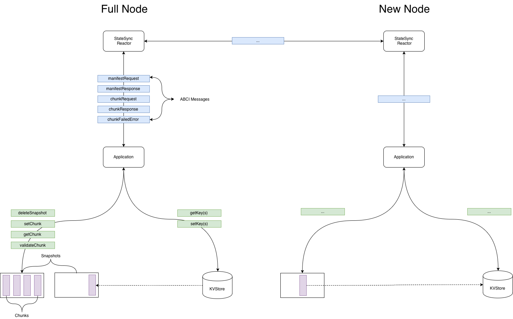

# ADR 042: State Sync Design

## Changelog

2019-06-27: Init by EB
2019-07-04: Follow up by brapse

## Context
StateSync is a feature which would allow a new node to receive a
snapshot of the application state without downloading blocks or going
through consensus. Once downloaded, the node could switch to FastSync
and eventually participate in consensus. The goal of StateSync is to
facilitate setting up a new node as quickly as possible.

## Considerations
Because Tendermint doesn't know anything about the application state,
StateSync will broker messages between nodes and through
the ABCI to an opaque applicaton. The implementation will have multiple
touch points on both the tendermint code base and ABCI application.

* A StateSync reactor to facilitate peer communication - Tendermint
* A Set of ABCI messages to transmit application state to the reactor - Tendermint
* A Set of MultiStore APIs for exposing snapshot data to the ABCI - ABCI application
* A Storage format with validation and performance considerations - ABCI application

### Implementation Properties
Beyond the approach, any implementation of StateSync can be evaluated
across different criteria:

* Speed: Expected throughput of producing and consuming snapshots
* Safety: Cost of pushing invalid snapshots to a node
* Liveness: Cost of preventing a node from receiving/constructing a snapshot
* Effort: How much effort does an implementation require

### Implementation Question
* What is the format of a snapshot
    * Complete snapshot
    * Ordered IAVL key ranges
    * Compressed individually chunks which can be validated
* How is data validated
    * Trust a peer with it's data blindly
    * Trust a majority of peers
    * Use light client validation to validate each chunk against consensus
      produced merkle tree root
* What are the performance characteristics
    * Random vs sequential reads
    * How parallelizeable is the scheduling algorithm

### Proposals
Broadly speaking there are two approaches to this problem which have had
varying degrees of discussion and progress. These approach can be
summarized as:

**Lazy:** Where snapshots are produced dynamically at request time. This
solution would use the existing data structure.
**Eager:** Where snapshots are produced periodically and served from disk at
request time. This solution would create an auxiliary data structure
optimized for batch read/writes.

Additionally the propsosals tend to vary on how they provide safety
properties.

**LightClient** Where a client can aquire the merkle root from the block
headers synchronized from a trusted validator set. Subsets of the application state,
called chunks can therefore be validated on receipt to ensure each chunk
is part of the merkle root.

**Majority of Peers** Where manifests of chunks along with checksums are
downloaded and compared against versions provided by a majority of
peers.

#### Lazy StateSync
An initial specification was published by Alexis Sellier.
In this design, the state has a given `size` of primitive elements (like
keys or nodes), each element is assigned a number from 0 to `size-1`,
and chunks consists of a range of such elements.  Ackratos raised
[some concerns](https://docs.google.com/document/d/1npGTAa1qxe8EQZ1wG0a0Sip9t5oX2vYZNUDwr_LVRR4/edit)
about this design, somewhat specific to the IAVL tree, and mainly concerning
performance of random reads and of iterating through the tree to determine element numbers
(ie. elements aren't indexed by the element number).

An alternative design was suggested by Jae Kwon in
[#3639](https://github.com/tendermint/tendermint/issues/3639) where chunking
happens lazily and in a dynamic way: nodes request key ranges from their peers,
and peers respond with some subset of the
requested range and with notes on how to request the rest in parallel from other
peers. Unlike chunk numbers, keys can be verified directly. And if some keys in the
range are ommitted, proofs for the range will fail to verify.
This way a node can start by requesting the entire tree from one peer,
and that peer can respond with say the first few keys, and the ranges to request
from other peers.

Additionally, per chunk validation tends to come more naturally to the
Lazy approach since it tends to use the existing structure of the tree
(ie. keys or nodes) rather than state-sync specific chunks. Such a
design for tendermint was originally tracked in
[#828](https://github.com/tendermint/tendermint/issues/828).

#### Eager StateSync
Warp Sync as implemented in OpenEthereum to rapidly
download both blocks and state snapshots from peers. Data is carved into ~4MB
chunks and snappy compressed. Hashes of snappy compressed chunks are stored in a
manifest file which co-ordinates the state-sync. Obtaining a correct manifest
file seems to require an honest majority of peers. This means you may not find
out the state is incorrect until you download the whole thing and compare it
with a verified block header.

A similar solution was implemented by Binance in
[#3594](https://github.com/tendermint/tendermint/pull/3594)
based on their initial implementation in
[PR #3243](https://github.com/tendermint/tendermint/pull/3243)
and [some learnings](https://docs.google.com/document/d/1npGTAa1qxe8EQZ1wG0a0Sip9t5oX2vYZNUDwr_LVRR4/edit).
Note this still requires the honest majority peer assumption.

As an eager protocol, warp-sync can efficiently compress larger, more
predicatable chunks once per snapshot and service many new peers. By
comparison lazy chunkers would have to compress each chunk at request
time.

### Analysis of Lazy vs Eager
Lazy vs Eager have more in common than they differ. They all require
reactors on the tendermint side, a set of ABCI messages and a method for
serializing/deserializing snapshots facilitated by a SnapshotFormat.

The biggest difference between Lazy and Eager proposals is in the
read/write patterns necessitated by serving a snapshot chunk.
Specifically, Lazy State Sync performs random reads to the underlying data
structure while Eager can optimize for sequential reads.

This distinctin between approaches was demonstrated by Binance's
[ackratos](https://github.com/ackratos) in their implementation of [Lazy
State sync](https://github.com/tendermint/tendermint/pull/3243), The
[analysis](https://docs.google.com/document/d/1npGTAa1qxe8EQZ1wG0a0Sip9t5oX2vYZNUDwr_LVRR4/)
of the performance, and follow up implementation of [Warp
Sync](http://github.com/tendermint/tendermint/pull/3594).

#### Compairing Security Models
There are several different security models which have been
discussed/proposed in the past but generally fall into two categories.

Light client validation: In which the node receiving data is expected to
first perform a light client sync and have all the nessesary block
headers. Within the trusted block header (trusted in terms of from a
validator set subject to [weak
subjectivity](https://github.com/tendermint/tendermint/pull/3795)) and
can compare any subset of keys called a chunk against the merkle root.
The advantage of light client validation is that the block headers are
signed by validators which have something to lose for malicious
behavior. If a validator were to provide an invalid proof, they can be
slashed.

Majority of peer validation: A manifest file containing a list of chunks
along with checksums of each chunk is downloaded from a
trusted source. That source can be a community resource similar to
[sum.golang.org](https://sum.golang.org) or downloaded from the majority
of peers. One disadantage of the majority of peer security model is the
vuliberability to eclipse attacks in which a malicious users looks to
saturate a target node's peer list and produce a manufactured picture of
majority.

A third option would be to include snapshot related data in the
block header. This could include the manifest with related checksums and be
secured through consensus. One challenge of this approach is to
ensure that creating snapshots does not put undo burden on block
propsers by synchronizing snapshot creation and block creation. One
approach to minimizing the burden is for snapshots for height
`H` to be included in block `H+n` where `n` is some `n` block away,
giving the block propser enough time to complete the snapshot
asynchronousy.

## Proposal: Eager StateSync With Per Chunk Light Client Validation
The conclusion after some concideration of the advantages/disadvances of
eager/lazy and different security models is to produce a state sync
which eagerly produces snapshots and uses light client validation. This
approach has the performance advantages of pre-computing efficient
snapshots which can streamed to new nodes on demand using sequential IO.
Secondly, by using light client validation we cna validate each chunk on
receipt and avoid the potential eclipse attack of majority of peer based
security.

### Implementation
Tendermint is responsible for downloading and verifying chunks of
AppState from peers. ABCI Application is responsible for taking
AppStateChunk objects from TM and constructing a valid state tree whose
root corresponds with the AppHash of syncing block. In particular we
will need implement:

* Build new StateSync reactor brokers message transmission between the peers
  and the ABCI application
* A set of ABCI Messages
* Design SnapshotFormat as an interface which can:
    * validate chunks
    * read/write chunks from file
    * read/write chunks to/from application state store
    * convert manifests into chunkRequest ABCI messages
* Implement SnapshotFormat for cosmos-hub with concrete implementation for:
    * read/write chunks in a way which can be:
        * parallelized across peers
        * validated on receipt
    * read/write to/from IAVL+ tree

## Implementation Path
* Create StateSync reactor based on  [#3753](https://github.com/tendermint/tendermint/pull/3753)
* Design SnapshotFormat with an eye towards cosmos-hub implementation
* ABCI message to send/receive SnapshotFormat
* IAVL+ changes to support SnapshotFormat
* Deliver Warp sync (no chunk validation)
* light client implementation for weak subjectivity
* Deliver StateSync with chunk validation

## Status

Proposed

## Concequences

### Neutral

### Positive
* Safe & performant state sync design substantiated with real world implementation experience
* General interfaces allowing application specific innovation
* Parallizable implementation trajectory with reasonable engineering effort

### Negative
* Static Scheduling lacks opportunity for real time chunk availability optimizations

## References
[sync: Sync current state without full replay for Applications](https://github.com/tendermint/tendermint/issues/828) - original issue
[tendermint state sync proposal 2](https://docs.google.com/document/d/1npGTAa1qxe8EQZ1wG0a0Sip9t5oX2vYZNUDwr_LVRR4/edit) - ackratos proposal
[proposal 2 implementation](https://github.com/tendermint/tendermint/pull/3243)  - ackratos implementation
[WIP General/Lazy State-Sync pseudo-spec](https://github.com/tendermint/tendermint/issues/3639) - Jae Proposal
[Warp Sync Implementation](https://github.com/tendermint/tendermint/pull/3594) - ackratos
[Chunk Proposal](https://github.com/tendermint/tendermint/pull/3799) - Bucky proposed
