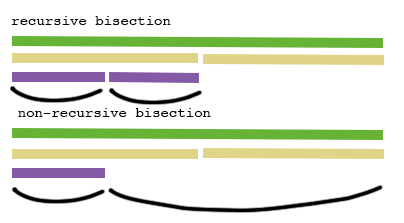

# ADR 046: Lite Client Implementation

## Changelog
* 13-02-2020: Initial draft
* 26-02-2020: Cross-checking the first header
* 28-02-2020: Bisection algorithm details
* 31-03-2020: Verify signature got changed

## Context

A `Client` struct represents a light client, connected to a single blockchain.

The user has an option to verify headers using `VerifyHeader` or
`VerifyHeaderAtHeight` or `Update` methods. The latter method downloads the
latest header from primary and compares it with the currently trusted one.

```go
type Client interface {
	// verify new headers
	VerifyHeaderAtHeight(height int64, now time.Time) (*types.SignedHeader, error)
	VerifyHeader(newHeader *types.SignedHeader, newVals *types.ValidatorSet, now time.Time) error
	Update(now time.Time) (*types.SignedHeader, error)

	// get trusted headers & validators
	TrustedHeader(height int64) (*types.SignedHeader, error)
	TrustedValidatorSet(height int64) (valSet *types.ValidatorSet, heightUsed int64, err error)
	LastTrustedHeight() (int64, error)
	FirstTrustedHeight() (int64, error)

	// query configuration options
	ChainID() string
	Primary() provider.Provider
	Witnesses() []provider.Provider

	Cleanup() error
}
```

A new light client can either be created from scratch (via `NewClient`) or
using the trusted store (via `NewClientFromTrustedStore`). When there's some
data in the trusted store and `NewClient` is called, the light client will a)
check if stored header is more recent b) optionally ask the user whenever it
should rollback (no confirmation required by default).

```go
func NewClient(
	chainID string,
	trustOptions TrustOptions,
	primary provider.Provider,
	witnesses []provider.Provider,
	trustedStore store.Store,
	options ...Option) (*Client, error) {
```

`witnesses` as argument (as opposite to `Option`) is an intentional choice,
made to increase security by default. At least one witness is required,
although, right now, the light client does not check that primary != witness.
When cross-checking a new header with witnesses, minimum number of witnesses
required to respond: 1. Note the very first header (`TrustOptions.Hash`) is
also cross-checked with witnesses for additional security.

Due to bisection algorithm nature, some headers might be skipped. If the light
client does not have a header for height `X` and `VerifyHeaderAtHeight(X)` or
`VerifyHeader(H#X)` methods are called, these will perform either a) backwards
verification from the latest header back to the header at height `X` or b)
bisection verification from the first stored header to the header at height `X`.

`TrustedHeader`, `TrustedValidatorSet` only communicate with the trusted store.
If some header is not there, an error will be returned indicating that
verification is required.

```go
type Provider interface {
	ChainID() string

	SignedHeader(height int64) (*types.SignedHeader, error)
	ValidatorSet(height int64) (*types.ValidatorSet, error)
}
```

Provider is a full node usually, but can be another light client. The above
interface is thin and can accommodate many implementations.

If provider (primary or witness) becomes unavailable for a prolonged period of
time, it will be removed to ensure smooth operation.

Both `Client` and providers expose chain ID to track if there are on the same
chain. Note, when chain upgrades or intentionally forks, chain ID changes.

The light client stores headers & validators in the trusted store:

```go
type Store interface {
	SaveSignedHeaderAndValidatorSet(sh *types.SignedHeader, valSet *types.ValidatorSet) error
	DeleteSignedHeaderAndValidatorSet(height int64) error

	SignedHeader(height int64) (*types.SignedHeader, error)
	ValidatorSet(height int64) (*types.ValidatorSet, error)

	LastSignedHeaderHeight() (int64, error)
	FirstSignedHeaderHeight() (int64, error)

	SignedHeaderAfter(height int64) (*types.SignedHeader, error)

	Prune(size uint16) error

	Size() uint16
}
```

At the moment, the only implementation is the `db` store (wrapper around the KV
database, used in Tendermint). In the future, remote adapters are possible
(e.g. `Postgresql`).

```go
func Verify(
	chainID string,
	trustedHeader *types.SignedHeader, // height=X
	trustedVals *types.ValidatorSet, // height=X or height=X+1
	untrustedHeader *types.SignedHeader, // height=Y
	untrustedVals *types.ValidatorSet, // height=Y
	trustingPeriod time.Duration,
	now time.Time,
	maxClockDrift time.Duration,
	trustLevel tmmath.Fraction) error {
```

`Verify` pure function is exposed for a header verification. It handles both
cases of adjacent and non-adjacent headers. In the former case, it compares the
hashes directly (2/3+ signed transition). Otherwise, it verifies 1/3+
(`trustLevel`) of trusted validators are still present in new validators.

While `Verify` function is certainly handy, `VerifyAdjacent` and
`VerifyNonAdjacent` should be used most often to avoid logic errors.

### Bisection algorithm details

Non-recursive bisection algorithm was implemented despite the spec containing
the recursive version. There are two major reasons:

1) Constant memory consumption => no risk of getting OOM (Out-Of-Memory) exceptions;
2) Faster finality (see Fig. 1).

_Fig. 1: Differences between recursive and non-recursive bisections_



Specification of the non-recursive bisection can be found
[here](https://github.com/tendermint/spec/blob/zm_non-recursive-verification/spec/consensus/light-client/non-recursive-verification.md).

## Status

Implemented

## Consequences

### Positive

* single `Client` struct, which is easy to use
* flexible interfaces for header providers and trusted storage

### Negative

* `Verify` needs to be aligned with the current spec

### Neutral

* `Verify` function might be misused (called with non-adjacent headers in
  incorrectly implemented sequential verification)
