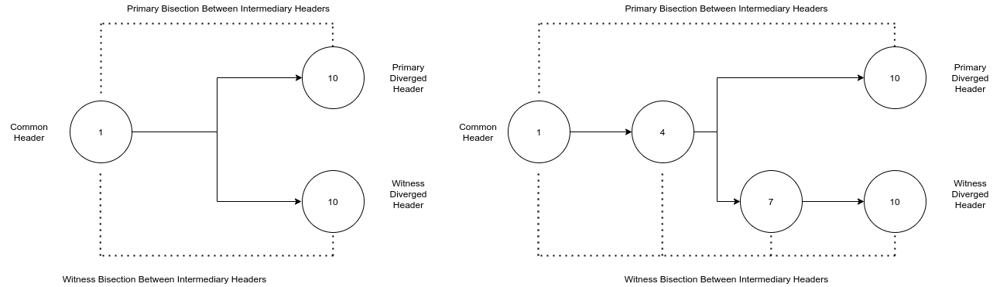

# ADR 047: Handling evidence from light client

## Changelog
* 18-02-2020: Initial draft
* 24-02-2020: Second version
* 13-04-2020: Add PotentialAmnesiaEvidence and a few remarks
* 31-07-2020: Remove PhantomValidatorEvidence
* 14-08-2020: Introduce light traces (listed now as an alternative approach)
* 20-08-2020: Light client produces evidence when detected instead of passing to full node
* 16-09-2020: Post-implementation revision
* 15-03-2020: Ammends for the case of a forward lunatic attack

### Glossary of Terms

- a `LightBlock` is the unit of data that a light client receives, verifies and stores.
It is composed of a validator set, commit and header all at the same height.
- a **Trace** is seen as an array of light blocks across a range of heights that were
created as a result of skipping verification.
- a **Provider** is a full node that a light client is connected to and serves the light
client signed headers and validator sets.
- `VerifySkipping` (sometimes known as bisection or verify non-adjacent) is a method the
light client uses to verify a target header from a trusted header. The process involves verifying
intermediate headers in between the two by making sure that 1/3 of the validators that signed
the trusted header also signed the untrusted one.
- **Light Bifurcation Point**: If the light client was to run `VerifySkipping` with two providers
(i.e. a primary and a witness), the bifurcation point is the height that the headers
from each of these providers are different yet valid. This signals that one of the providers
may be trying to fool the light client.

## Context

The bisection method of header verification used by the light client exposes
itself to a potential attack if any block within the light clients trusted period has
a malicious group of validators with power that exceeds the light clients trust level
(default is 1/3). To improve light client (and overall network) security, the light
client has a detector component that compares the verified header provided by the
primary against witness headers. This ADR outlines the process of mitigating attacks
on the light client by using witness nodes to cross reference with.

## Alternative Approaches

A previously discussed approach to handling evidence was to pass all the data that the
light client had witnessed when it had observed diverging headers for the full node to
process.This was known as a light trace and had the following structure:

```go
type ConflictingHeadersTrace struct {
  Headers []*types.SignedHeader
}
```

This approach has the advantage of not requiring as much processing on the light
client side in the event that an attack happens. Although, this is not a significant
difference as the light client would in any case have to validate all the headers
from both witness and primary. Using traces would consume a large amount of bandwidth
and adds a DDOS vector to the full node.


## Decision

The light client will be divided into two components: a `Verifier` (either sequential or
skipping) and a `Detector` (see [Informal's Detector](https://github.com/informalsystems/tendermint-rs/blob/master/docs/spec/lightclient/detection/detection.md))
. The detector will take the trace of headers from the primary and check it against all
witnesses. For a witness with a diverging header, the detector will first verify the header
by bisecting through all the heights defined by the trace that the primary provided. If valid,
the light client will trawl through both traces and find the point of bifurcation where it
can proceed to extract any evidence (as is discussed in detail later).

Upon successfully detecting the evidence, the light client will send it to both primary and
witness before halting. It will not send evidence to other peers nor continue to verify the
primary's header against any other header.


## Detailed Design

The verification process of the light client will start from a trusted header and use a bisectional
algorithm to verify up to a header at a given height. This becomes the verified header (does not
mean that it is trusted yet). All headers that were verified in between are cached and known as
intermediary headers and the entire array is sometimes referred to as a trace.

The light client's detector then takes all the headers and runs the detect function.

```golang
func (c *Client) detectDivergence(primaryTrace []*types.LightBlock, now time.Time) error
```

The function takes the last header it received, the target header and compares it against all the witnesses
it has through the following function:

```golang
func (c *Client) compareNewHeaderWithWitness(errc chan error, h *types.SignedHeader,
	witness provider.Provider, witnessIndex int)
```

The err channel is used to send back all the outcomes so that they can be processed in parallel.
Invalid headers result in dropping the witness, lack of response or not having the headers is ignored
just as headers that have the same hash. Headers, however,
of a different hash then trigger the detection process between the primary and that particular witness.

This begins with verification of the witness's header via skipping verification which is run in tande
with locating the Light Bifurcation Point


This is done with:

```golang
func (c *Client) examineConflictingHeaderAgainstTrace(
	trace []*types.LightBlock,
	targetBlock *types.LightBlock,
	source provider.Provider, 
	now time.Time,
	) ([]*types.LightBlock, *types.LightBlock, error)
```

which performs the following

1. Checking that the trusted header is the same. Currently, they should not theoretically be different
because witnesses cannot be added and removed after the client is initialized. But we do this any way
as a sanity check. If this fails we have to drop the witness.

2. Querying and verifying the witness's headers using bisection at the same heights of all the
intermediary headers of the primary (In the above example this is A, B, C, D, F, H). If bisection fails
or the witness stops responding then we can call the witness faulty and drop it.

3. We eventually reach a verified header by the witness which is not the same as the intermediary header 
(In the above example this is E). This is the point of bifurcation (This could also be the last header).

4. There is a unique case where the trace that is being examined against has blocks that have a greater 
height than the targetBlock. This can occur as part of a forward lunatic attack where the primary has 
provided a light block that has a height greater than the head of the chain (see Appendix B). In this 
case, the light client will verify the sources blocks up to the targetBlock and return the block in the 
trace that is directly after the targetBlock in height as the `ConflictingBlock`

This function then returns the trace of blocks from the witness node between the common header and the
divergent header of the primary as it is likely, as seen in the example to the right, that multiple 
headers where required in order to verify the divergent one. This trace will
be used later (as is also described later in this document).



Now, that an attack has been detected, the light client must form evidence to prove it. There are
three types of attacks that either the primary or witness could have done to try fool the light client
into verifying the wrong header: Lunatic, Equivocation and Amnesia. As the consequence is the same and
the data required to prove it is also very similar, we bundle these attack styles together in a single
evidence:

```golang
type LightClientAttackEvidence struct {
	ConflictingBlock *LightBlock
	CommonHeight     int64
}
```

The light client takes the stance of first suspecting the primary. Given the bifurcation point found
above, it takes the two divergent headers and compares whether the one from the primary is valid with
respect to the one from the witness. This is done by calling `isInvalidHeader()` which looks to see if
any one of the deterministically derived header fields differ from one another. This could be one of
`ValidatorsHash`, `NextValidatorsHash`, `ConsensusHash`, `AppHash`, and `LastResultsHash`.
In this case we know it's a Lunatic attack and to help the witness verify it we send the height
of the common header which is 1 in the example above or C in the example above that. If all these
hashes are the same then we can infer that it is either Equivocation or Amnesia. In this case we send
the height of the diverged headers because we know that the validator sets are the same, hence the
malicious nodes are still bonded at that height. In the example above, this is height 10 and the
example above that it is the height at E.

The light client now has the evidence and broadcasts it to the witness.

However, it could have been that the header the light client used from the witness against the primary
was forged, so before halting the light client swaps the process and thus suspects the witness and
uses the primary to create evidence. It calls `examineConflictingHeaderAgainstTrace` this time using
the witness trace found earlier.
If the primary was malicious it is likely that it will not respond but if it is innocent then the
light client will produce the same evidence but this time the conflicting
block will come from the witness node instead of the primary. The evidence is then formed and sent to
the primary node.

This then ends the process and the verify function that was called at the start returns the error to
the user.

For a detailed overview of how each of these three attacks can be conducted please refer to the
[fork accountability spec]((https://github.com/tendermint/spec/blob/master/spec/consensus/light-client/accountability.md)).

## Full Node Verification

When a full node receives evidence from the light client it will need to verify
it for itself before gossiping it to peers and trying to commit it on chain. This process is outlined
 in [ADR-059](https://github.com/tendermint/tendermint/blob/master/docs/architecture/adr-059-evidence-composition-and-lifecycle.md).

## Status

Implemented.

## Consequences

### Positive

* Light client has increased security against Lunatic, Equivocation and Amnesia attacks.
* Do not need intermediate data structures to encapsulate the malicious behavior
* Generalized evidence makes the code simpler

### Negative

* Breaking change on the light client from versions 0.33.8 and below. Previous
versions will still send `ConflictingHeadersEvidence` but it won't be recognized
by the full node. Light clients will however still refuse the header and shut down.
* Amnesia attacks although detected, will not be able to be punished as it is not
clear from the current information which nodes behaved maliciously.
* Evidence module must handle both individual and grouped evidence.

### Neutral

## References

* [Fork accountability spec](https://github.com/tendermint/spec/blob/master/spec/consensus/light-client/accountability.md)
* [ADR 056: Proving amnesia attacks](https://github.com/tendermint/tendermint/blob/master/docs/architecture/adr-056-proving-amnesia-attacks.md)
* [ADR-059: Evidence Composition and Lifecycle](https://github.com/tendermint/tendermint/blob/master/docs/architecture/adr-059-evidence-composition-and-lifecycle.md)
* [Informal's Light Client Detector](https://github.com/informalsystems/tendermint-rs/blob/master/docs/spec/lightclient/detection/detection.md)


## Appendix A

PhantomValidatorEvidence was used to capture when a validator that was still staked
(i.e. within the bonded period) but was not in the current validator set had voted for a block.

In later discussions it was argued that although possible to keep phantom validator
evidence, any case a phantom validator that could have the capacity to be involved
in fooling a light client would have to be aided by 1/3+ lunatic validators.

It would also be very unlikely that the new validators injected by the lunatic attack
would be validators that currently still have something staked.

Not only this but there was a large degree of extra computation required in storing all
the currently staked validators that could possibly fall into the group of being
a phantom validator. Given this, it was removed.

## Appendix B

A unique flavor of lunatic attack is a forward lunatic attack. This is where a malicious
node provides a header with a height greater than the height of the blockchain. Thus there
are no witnesses capable of rebutting the malicious header. Such an attack will also 
require an accomplice, i.e. at least one other witness to also return the same forged header.
Although such attacks can be any arbitrary height ahead, they must still remain within the
clock drift of the light clients real time. Therefore, to detect such an attack, a light
client will wait for a time

```
2 * MAX_CLOCK_DRIFT + LAG
```

for a witness to provide the latest block it has. Given the time constraints, if the witness
is operating at the head of the blockchain, it will have a header with an earlier height but
a later timestamp. This can be used to prove that the primary has submitted a lunatic header
which violates monotonically increasing time. 
