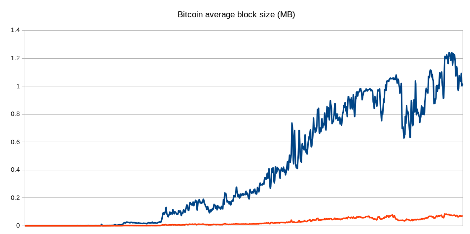
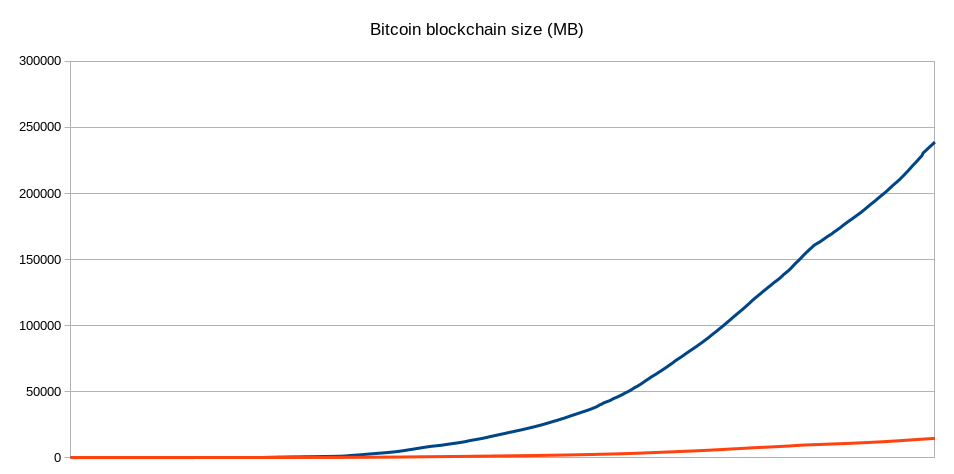

# ADR 048: Stamping transactions

## Changelog

* 11-09-2019: Initial draft

## Context

In this ADR I am going to explain how we can decouple transactions from the block by stamping them.
Stamping a transaction simply means putting the previous block hash in the header of a transaction.
A *stamped transaction* unlike normal transaction has life time and it's only valid for a certain time.
If `N` is the number of blocks after the stamp (or block hash), the *stamped transaction* after N blocks will be invalid.
By stamping transactions we don't need to save the transactions inside a block and only keeping the transaction hash is fair enough.

```
 Stamped transaction

 +----------------------------+
 | STAMP                      |
 +----------------------------+
 | PAYLOAD                    |
 |                            |
 |                            |
 +----------------------------+
 | SIGNATURE                  |
 |                            |
 +----------------------------+
```

### How to validate a stamped transaction

A stamped transaction easily can be verified off-chain.
First we need to find the block with corresponding stamp (or block hash).
If it doesn’t exist it means transaction is not valid (or probably not belong to this fork).
If the block is found, we need to iterate over `N` block after to check if transaction hash is inside a block. Otherwise transaction is not valid.

```
 Block M-1                             Block M                               Block M+1
+------------------------+\          +------------------------+\          +------------------------+
| HEADER                 ||          |                        ||          |                        |
|                        ||          |                        ||          |                        |
|                        ||          |                        ||          |                        |
|                        ||--\------>| prev_block_id          ||--------->| prev_block_id          |
|                        ||  |       |                        ||          |                        |
|                        ||  |       |                        ||          |                        |
+------------------------+/  |       +------------------------+/          +------------------------+
| DATA                   |   |       |                        |           |                        |
.                        .   |       .                        .           .                        .
.                        .   |       .                        .     /-----> Tx-Hash (32 bytes)     .
|                        |   |       |                        |     |     |                        |
+------------------------+   |       +------------------------+     |     +------------------------+
                             |                                      |
                             |                                      |
                             |                                      |
                             |          Tx                          |
                             |         +-------------------+\       |
                             \-------->| STAMP             ||       |
                                       +-------------------+|       |
                                       | PAYLOAD           ||       |
                                       |                   ||-------/
                                       |                   ||
                                       |                   ||
                                       +-------------------+|
                                       | SIGNATURE         ||
                                       +-------------------+/
```

### Where stamped transactions will be saved?

Full nodes can have separate database for saving stamped transactions.
This database will only be used for querying transaction. A node can choose to save all txs, part of them or nothing.
Nodes can query transaction by hash from each other. Users also can save their own transactions in their own wallets.


### Can a stamped transaction be lost?

Probably yes and it's not a curse. Should we care about transaction happened 10 years ago and try to keep it in our DB?
By decoupling transaction from the block, transactions will have their own way to survive.


## Decision

## Status

## Consequences

* Reducing block size.

  Stamping transaction can reduce the block size dramatically. For keeping a stamped transaction inside a block we need to store only 32 bytes hash of transaction instead of whole transaction data. In the bitcoin, the average transaction size has increased from 450 bytes in Jan 2013 to almost 600 bytes in Oct 2015. In the below chart you can see how stamped transaction could reduce the size of bitcoin blockchian if they could had applied from the beginning:

  
  

* Easy light clint implementation for PoS

  Implementing a light client for PoW is easy since having block header is fair enough to check validity of a transaction using merkle tree.
  However in PoS implementing a light client is a big pain. By stamping transaction light client implementation will be easy. A light client doesn't need to store any transaction data.


* Mitigating any possible forks.

  *Nothing at stake attack* and *long range attack* are most fundamental attacks in PoS blockchains. There is no solution to overcome long range attack in PoS   blockchain. Stamping transactions can mitigate this issue by binding transactions to the main fork. A stamped transaction is always loyal to the main fork. Byzantine forks aren't able to put them in their fork because the stamp is not belongs to their fork.

* Transactions have lifetime.

  Each stamped transaction has a life time and transaction will be invalid after certain time. It can help reduce the size of mempool.


### Copyright

Copyright and related rights waived via [CC0](https://creativecommons.org/publicdomain/zero/1.0/).


## References
* [Analysis of Bitcoin Transaction Size Trends](https://tradeblock.com/blog/analysis-of-bitcoin-transaction-size-trends)
* [Light Clients and Proof of Stake](https://blog.ethereum.org/2015/01/10/light-clients-proof-stake/)
* [A Survey on Long-Range Attacks for Proof of Stake Protocols](https://ieeexplore.ieee.org/stamp/stamp.jsp?arnumber=8653269)
