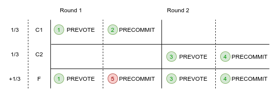

# ADR 056: Proving amnesia attacks

## Changelog

- 02.04.20: Initial Draft
- 06.04.20: Second Draft

## Context

Whilst most created evidence of malicious behaviour is self evident such that any individual can verify them independently there are types of evidence, known collectively as global evidence, that require further collaboration from the network in order to accumulate enough information to create evidence that is individually verifiable and can therefore be processed through consensus. [Fork Accountability](https://github.com/tendermint/spec/blob/master/spec/consensus/light-client/accountability.md) has been coined to describe the entire process of detection, proving and punishing of malicious behaviour. This ADR addresses specifically how to prove an amnesia attack but also generally outlines how global evidence can be converted to individual evidence.

### Amnesia Attack

The currently only known form of global evidence stems from [flip flopping](https://github.com/tendermint/spec/blob/master/spec/consensus/light-client/accountability.md#flip-flopping) attacks. The schematic below explains one scenario where an amnesia attack, a form of flip flopping, can occur such that two sets of honest nodes, C1 and C2, commit different blocks.



1. C1 and F send PREVOTE messages for block A.
2. C1 sends PRECOMMIT for round 1 for block A.
3. A new round is started, C2 and F send PREVOTE messages for a different block B.
4. C2 and F then send PRECOMMIT messages for block B.
5. F breaks the lock and goes back and sends PRECOMMIT messages in round 1 for block A.


This creates a fork on the main chain.  Back to the past, another form of flip flopping, creates a light fork (capable of fooling those not involved in consensus), in a similar way, with F taking the precommits from C1 and forging a commit from them.

## Decision

As the distinction between these two attacks (amnesia and back to the past) can only be distinguished by confirming with all validators (to see if it is a full fork or a light fork), for the purpose of simplicity, these attacks will be treated as the same.

Currently, the evidence reactor is used to simply broadcast and store evidence. Instead of perhaps creating a new reactor for the specific task of verifying these attacks, the current evidence reactor will be extended.

The process begins with a light client receiving conflicting headers (in the future this could also be a full node during fast sync), which it sends to a full node to analyse. As part of [evidence handling](https://github.com/tendermint/tendermint/blob/master/docs/architecture/adr-047-handling-evidence-from-light-client.md), this could be deduced into potential amnesia evidence

```golang
type PotentialAmnesiaEvidence struct {
	V1 []*types.Vote
	V2 []*types.Vote

	timestamp time.Time
}
```

*NOTE: Unlike prior evidence types, `PotentialAmnesiaEvidence` and `AmnesiaEvidence` are processed as a batch instead
 of individually. This will require changes to much of the API.*

 *NOTE: `PotentialAmnesiaEvidence` could be constructed for when 1/3 or less vote in two different rounds but as it is not currently detected nor can it cause a fork, it will be ignored.*

The evidence should contain the precommit votes for the intersection of validators that voted for both rounds. The votes should be all valid and the height and time that the infringement was made should be within:

`MaxEvidenceAge - Amnesia trial period`

where `Amnesia trial period` is a configurable duration defaulted at 1 day.

With reference to the honest nodes, C1 and C2, in the schematic, C2 will not PRECOMMIT an earlier round, but it is likely, if a node in C1 were to receive +2/3 PREVOTE's or PRECOMMIT's for a higher round, that it would remove the lock and PREVOTE and PRECOMMIT for the later round. Therefore, unfortunately it is not a case of simply punishing all nodes that have double voted in the `PotentialAmnesiaEvidence`.

Instead we use the Proof of Lock Change (PoLC) referred to in the [consensus spec](https://github.com/tendermint/spec/blob/master/spec/consensus/consensus.md#terms). When an honest node votes again for a different block in a later round
(which will only occur in very rare cases), it will generate the PoLC and store it in the evidence reactor for a time equal to the `MaxEvidenceAge`

```golang
type ProofOfLockChange struct {
	Votes []*types.Vote
}
```

This can be either evidence of +2/3 PREVOTES or PRECOMMITS (either warrants the honest node the right to vote) and is valid, among other checks, so long as the PRECOMMIT vote of the node in V2 came after all the votes in the `ProofOfLockChange` i.e. it received +2/3 votes for a block and then voted for that block thereafter (F is unable to prove this).

In the event that an honest node receives `PotentialAmnesiaEvidence` it will first `Verify()` it and then will check if it is among the suspected nodes in the evidence. If so, it will retrieve the `ProofOfLockChange` and combine it with `PotentialAmensiaEvidence` to form `AmensiaEvidence`:

```golang
type AmnesiaEvidence struct {
	Evidence *types.PotentialAmnesiaEvidence
	Proofs	 []*types.ProofOfLockChange
}
```

If the node is not required to submit any proof than it will simply broadcast the `PotentialAmnesiaEvidence` .

When a node has successfully validated `PotentialAmnesiaEvidence` it timestamps it and refuses to receive the same form of `PotentialAmnesiaEvidence`. If a node receives `AmnesiaEvidence` it checks it against any current `AmnesiaEvidence` it might have and if so merges the two by adding the proofs, if it doesn't have it yet it run's `Verify()` and stores it.

There can only be one `AmnesiaEvidence` and one `PotentialAmneisaEvidence` stored for each attack (i.e. for each height).

When, `time.Now() > PotentialAmnesiaEvidence.timestamp + AmnesiaTrialPeriod`, honest validators of the current validator set can begin proposing the block that contains the `AmnesiaEvidence`.

*NOTE: Even before the evidence is proposed and committed, the off-chain process of gossiping valid evidence could be
 enough for honest nodes to recognize the fork and halt.*

Other validators will vote <nil> if:

- The Amnesia Evidence is not valid
- The Amensia Evidence is not within the validators trial period i.e. too soon.
- The Amensia Evidence is of the same height but is different to the Amnesia Evidence that they have. i.e. is missing proofs.
    (In this case, the validator will try again to gossip the latest Amnesia Evidence that it has)
- Is of an AmnesiaEvidence that has already been committed to the chain.


## Status

Proposed

## Consequences

### Positive

Increasing fork detection makes the system more secure

### Negative

Non-responsive but honest nodes that are part of the suspect group that don't produce a proof will be punished

A delay between the detection of a fork and the punishment of one

### Neutral

Evidence package will need to be able to handle batch evidence as well as individual evidence (i.e. extra work)

## References

- [Fork accountability algorithm](https://docs.google.com/document/d/11ZhMsCj3y7zIZz4udO9l25xqb0kl7gmWqNpGVRzOeyY/edit)
- [Fork accountability spec](https://github.com/tendermint/spec/blob/master/spec/consensus/light-client/accountability.md)
