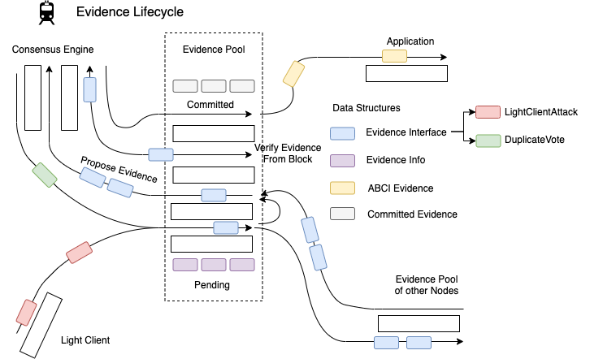

# ADR 059: Evidence Composition and Lifecycle

## Changelog

- 04/09/2020: Initial Draft (Unabridged)
- 07/09/2020: First Version
- 13.03.21: Ammendment to accomodate forward lunatic attack

## Scope

This document is designed to collate together and surface some predicaments involving evidence in Tendermint: both its composition and lifecycle. It then aims to find a solution to these. The scope does not extend to the verification nor detection of certain types of evidence but concerns itself mainly with the general form of evidence and how it moves from inception to application.

## Background

For a long time `DuplicateVoteEvidence`, formed in the consensus reactor, was the only evidence Tendermint had. It was produced whenever two votes from the same validator in the same round
was observed and thus it was designed that each evidence was for a single validator. It was predicted that there may come more forms of evidence and thus `DuplicateVoteEvidence` was used as the model for the `Evidence` interface and also for the form of the evidence data sent to the application. It is important to note that Tendermint concerns itself just with the detection and reporting of evidence and it is the responsibility of the application to exercise punishment.

```go
type Evidence interface { //existing
  Height() int64                                     // height of the offense
  Time() time.Time                                   // time of the offense
  Address() []byte                                   // address of the offending validator
  Bytes() []byte                                     // bytes which comprise the evidence
  Hash() []byte                                      // hash of the evidence
  Verify(chainID string, pubKey crypto.PubKey) error // verify the evidence
  Equal(Evidence) bool                               // check equality of evidence

  ValidateBasic() error
  String() string
}
```

```go
type DuplicateVoteEvidence struct {
  VoteA *Vote
  VoteB *Vote

  timestamp time.Time // taken from the block time
}
```

Tendermint has now introduced a new type of evidence to protect light clients from being attacked. This `LightClientAttackEvidence` (see [here](https://github.com/informalsystems/tendermint-rs/blob/31ca3e64ce90786c1734caf186e30595832297a4/docs/spec/lightclient/attacks/evidence-handling.md) for more information) is vastly different to `DuplicateVoteEvidence` in that it is physically a much different size containing a complete signed header and validator set. It is formed within the light client, not the consensus reactor and requires a lot more information from state to verify (`VerifyLightClientAttack(commonHeader, trustedHeader *SignedHeader, commonVals *ValidatorSet)`  vs `VerifyDuplicateVote(chainID string, pubKey PubKey)`). Finally it batches validators together (a single piece of evidence that implicates multiple malicious validators at a height) as opposed to having individual evidence (each piece of evidence is per validator per height). This evidence stretches the existing mould that was used to accommodate new types of evidence and has thus caused us to reconsider how evidence should be formatted and processed.

```go
type LightClientAttackEvidence struct { // proposed struct in spec
  ConflictingBlock *LightBlock
  CommonHeight int64
  Type  AttackType     // enum: {Lunatic|Equivocation|Amnesia}

  timestamp time.Time // taken from the block time at the common height
}
```
*Note: These three attack types have been proven by the research team to be exhaustive*

## Possible Approaches for Evidence Composition

### Individual framework

Evidence remains on a per validator basis. This causes the least disruption to the current processes but requires that we break `LightClientAttackEvidence` into several pieces of evidence for each malicious validator. This not only has performance consequences in that there are n times as many database operations and that the gossiping of evidence will require more bandwidth then necessary (by requiring a header for each piece) but it potentially impacts our ability to validate it. In batch form, the full node can run the same process the light client did to see that 1/3 validating power was present in both the common block and the conflicting block whereas this becomes more difficult to verify individually without opening the possibility that malicious validators forge evidence against innocent . Not only that, but `LightClientAttackEvidence` also deals with amnesia attacks which unfortunately have the characteristic where we know the set of validators involved but not the subset that were actually malicious (more to be said about this later). And finally splitting the evidence into individual pieces makes it difficult to understand the severity of the attack (i.e. the total voting power involved in the attack)

#### An example of a possible implementation path

We would ignore amnesia evidence (as individually it's hard to make) and revert to the initial split we had before where `DuplicateVoteEvidence` is also used for light client equivocation attacks and thus we only need `LunaticEvidence`. We would also most likely need to remove `Verify` from the interface as this isn't really something that can be used.

``` go
type LunaticEvidence struct { // individual lunatic attack
  header *Header
  commonHeight int64
  vote *Vote

  timestamp time.Time // once again taken from the block time at the height of the common header
}
```

### Batch Framework

The last approach of this category would be to consider batch only evidence. This works fine with `LightClientAttackEvidence` but would require alterations to `DuplicateVoteEvidence` which would most likely mean that the consensus would send conflicting votes to a buffer in the evidence module which would then wrap all the votes together per height before gossiping them to other nodes and trying to commit it on chain. At a glance this may improve IO and verification speed and perhaps more importantly grouping validators gives the application and Tendermint a better overview of the severity of the attack.

However individual evidence has the advantage that it is easy to check if a node already has that evidence meaning we just need to check hashes to know that we've already verified this evidence before. Batching evidence would imply that each node may have a different combination of duplicate votes which may complicate things.

#### An example of a possible implementation path

`LightClientAttackEvidence` won't change but the evidence interface will need to look like the proposed one above and `DuplicateVoteEvidence` will need to change to encompass multiple double votes. A problem with batch evidence is that it needs to be unique to avoid people from submitting different permutations.

## Decision

The decision is to adopt a hybrid design.

We allow individual and batch evidence to coexist together, meaning that verification is done depending on the evidence type and that  the bulk of the work is done in the evidence pool itself (including forming the evidence to be sent to the application).


## Detailed Design

Evidence has the following simple interface:

```go
type Evidence interface {  //proposed
  Height() int64                                     // height of the offense
  Bytes() []byte                                     // bytes which comprise the evidence
  Hash() []byte                                      // hash of the evidence
  ValidateBasic() error
  String() string
}
```

The changing of the interface is backwards compatible as these methods are all present in the previous version of the interface. However, networks will need to upgrade to be able to process the new evidence as verification has changed.

We have two concrete types of evidence that fulfil this interface

```go
type LightClientAttackEvidence struct {
  ConflictingBlock *LightBlock
  CommonHeight int64 // the last height at which the primary provider and witness provider had the same header
}
```
where the `Hash()` is the hash of the header and commonHeight.

Note: It was also discussed whether to include the commit hash which captures the validators that signed the header. However this would open the opportunity for someone to propose multiple permutations of the same evidence (through different commit signatures) hence it was omitted. Consequentially, when it comes to verifying evidence in a block, for `LightClientAttackEvidence` we can't just check the hashes because someone could have the same hash as us but a different commit where less than 1/3 validators voted which would be an invalid version of the evidence. (see `fastCheck` for more details)

```go
type DuplicateVoteEvidence {
  VoteA *Vote
  VoteB *Vote
}
```
where the `Hash()` is the hash of the two votes

For both of these types of evidence, `Bytes()` represents the proto-encoded byte array format of the evidence and `ValidateBasic` is
an initial consistency check to make sure the evidence has a valid structure.

### The Evidence Pool

`LightClientAttackEvidence` is generated in the light client and `DuplicateVoteEvidence` in consensus. Both are sent to the evidence pool through `AddEvidence(ev Evidence) error`. The evidence pool's primary purpose is to verify evidence. It also gossips evidence to other peers' evidence pool and serves it to consensus so it can be committed on chain and the relevant information can be sent to the application in order to exercise punishment. When evidence is added, the pool first runs `Has(ev Evidence)` to check if it has already received it (by comparing hashes) and then  `Verify(ev Evidence) error`.  Once verified the evidence pool stores it it's pending database. There are two databases: one for pending evidence that is not yet committed and another of the committed evidence (to avoid committing evidence twice)

#### Verification

`Verify()` does the following:

- Use the hash to see if we already have this evidence in our committed database.

- Use the height to check if the evidence hasn't expired.

- If it has expired then use the height to find the block header and check if the time has also expired in which case we drop the evidence

- Then proceed with switch statement for each of the two evidence:

For `DuplicateVote`:

- Check that height, round, type and validator address are the same

- Check that the Block ID is different

- Check the look up table for addresses to make sure there already isn't evidence against this validator

- Fetch the validator set and confirm that the address is in the set at the height of the attack

- Check that the chain ID and signature is valid.

For `LightClientAttack`

- Fetch the common signed header and val set from the common height and use skipping verification to verify the conflicting header

- Fetch the trusted signed header at the same height as the conflicting header and compare with the conflicting header to work out which type of attack it is and in doing so return the malicious validators. NOTE: If the node doesn't have the signed header at the height of the conflicting header, it instead fetches the latest header it has and checks to see if it can prove the evidence based on a violation of header time. This is known as forward lunatic attack.

  - If equivocation, return the validators that signed for the commits of both the trusted and signed header

  - If lunatic, return the validators from the common val set that signed in the conflicting block

  - If amnesia, return no validators (since we can't know which validators are malicious). This also means that we don't currently send amnesia evidence to the application, although we will introduce more robust amnesia evidence handling in future Tendermint Core releases

- Check that the hashes of the conflicting header and the trusted header are different

- In the case of a forward lunatic attack, where the trusted header height is less than the conflicting header height, the node checks that the time of the trusted header is later than the time of conflicting header. This proves that the conflicting header breaks monotonically increasing time. If the node doesn't have a trusted header with a later time then it is unable to validate the evidence for now. 

- Lastly, for each validator, check the look up table to make sure there already isn't evidence against this validator

After verification we persist the evidence with the key `height/hash` to the pending evidence database in the evidence pool with the following format:

```go
type EvidenceInfo struct {
  ev Evidence
  time time.Time
  validators []Validator
  totalVotingPower int64
}
```

`time`, `validators` and `totalVotingPower` are need to form the `abci.Evidence` that we send to the application layer. More in this to come later.


#### Broadcasting and receiving evidence

The evidence pool also runs a reactor that broadcasts the newly validated
evidence to all connected peers.

Receiving evidence from other evidence reactors works in the same manner as receiving evidence from the consensus reactor or a light client.


#### Proposing evidence on the block

When it comes to prevoting and precomitting a proposal that contains evidence, the full node will once again
call upon the evidence pool to verify the evidence using `CheckEvidence(ev []Evidence)`:

This performs the following actions:

1. Loops through all the evidence to check that nothing has been duplicated

2. For each evidence, run `fastCheck(ev evidence)` which works similar to `Has` but instead for `LightClientAttackEvidence` if it has the
same hash it then goes on to check that the validators it has are all signers in the commit of the conflicting header. If it doesn't pass fast check (because it hasn't seen the evidence before) then it will have to verify the evidence.

3. runs `Verify(ev Evidence)` - Note: this also saves the evidence to the db as mentioned before.


#### Updating application and pool

The final part of the lifecycle is when the block is committed and the `BlockExecutor` then updates state. As part of this process, the `BlockExecutor` gets the evidence pool to create a simplified format for the evidence to be sent to the application. This happens in `ApplyBlock` where the executor calls `Update(Block, State) []abci.Evidence`.

```go
abciResponses.BeginBlock.ByzantineValidators = evpool.Update(block, state)
```

Here is the format of the evidence that the application will receive. As seen above, this is stored as an array within `BeginBlock`.
The changes to the application are minimal (it is still formed one for each malicious validator) with the exception of using an enum instead of a string for the evidence type.

```go
type Evidence struct {
  // either LightClientAttackEvidence or DuplicateVoteEvidence as an enum (abci.EvidenceType)
	Type EvidenceType `protobuf:"varint,1,opt,name=type,proto3,enum=tendermint.abci.EvidenceType" json:"type,omitempty"`
	// The offending validator
	Validator Validator `protobuf:"bytes,2,opt,name=validator,proto3" json:"validator"`
	// The height when the offense occurred
	Height int64 `protobuf:"varint,3,opt,name=height,proto3" json:"height,omitempty"`
	// The corresponding time where the offense occurred
	Time time.Time `protobuf:"bytes,4,opt,name=time,proto3,stdtime" json:"time"`
	// Total voting power of the validator set in case the ABCI application does
	// not store historical validators.
	// https://github.com/tendermint/tendermint/issues/4581
	TotalVotingPower int64 `protobuf:"varint,5,opt,name=total_voting_power,json=totalVotingPower,proto3" json:"total_voting_power,omitempty"`
}
```


This `Update()` function does the following:

- Increments state which keeps track of both the current time and height used for measuring expiry

- Marks evidence as committed and saves to db. This prevents validators from proposing committed evidence in the future
  Note: the db just saves the height and the hash. There is no need to save the entire committed evidence

- Forms ABCI evidence as such:  (note for `DuplicateVoteEvidence` the validators array size is 1)
  ```go
  for _, val := range evInfo.Validators {
    abciEv = append(abciEv, &abci.Evidence{
      Type: evType,   // either DuplicateVote or LightClientAttack
      Validator: val,   // the offending validator (which includes the address, pubkey and power)
      Height: evInfo.ev.Height(),    // the height when the offense happened
      Time: evInfo.time,      // the time when the offense happened
      TotalVotingPower: evInfo.totalVotingPower   // the total voting power of the validator set
    })
  }
  ```

- Removes expired evidence from both pending and committed databases

The ABCI evidence is then sent via the `BlockExecutor` to the application.

#### Summary

To summarize, we can see the lifecycle of evidence as such:



Evidence is first detected and created in the light client and consensus reactor. It is verified and stored as `EvidenceInfo` and gossiped to the evidence pools in other nodes. The consensus reactor later communicates with the evidence pool to either retrieve evidence to be put into a block, or verify the evidence the consensus reactor has retrieved in a block. Lastly when a block is added to the chain, the block executor sends the committed evidence back to the evidence pool so a pointer to the evidence can be stored in the evidence pool and it can update it's height and time. Finally, it turns the committed evidence into ABCI evidence and through the block executor passes the evidence to the application so the application can handle it.

## Status

Implemented

## Consequences

<!-- > This section describes the consequences, after applying the decision. All consequences should be summarized here, not just the "positive" ones. -->

### Positive

- Evidence is better contained to the evidence pool / module
- LightClientAttack is kept together (easier for verification and bandwidth)
- Variations on commit sigs in LightClientAttack doesn't lead to multiple permutations and multiple evidence
- Address to evidence map prevents DOS attacks, where a single validator could DOS the network by flooding it with evidence submissions

### Negative

- Changes the `Evidence` interface and thus is a block breaking change
- Changes the ABCI `Evidence` and is thus a ABCI breaking change
- Unable to query evidence for address / time without evidence pool

### Neutral


## References

<!-- > Are there any relevant PR comments, issues that led up to this, or articles referenced for why we made the given design choice? If so link them here! -->

- [LightClientAttackEvidence](https://github.com/informalsystems/tendermint-rs/blob/31ca3e64ce90786c1734caf186e30595832297a4/docs/spec/lightclient/attacks/evidence-handling.md)
