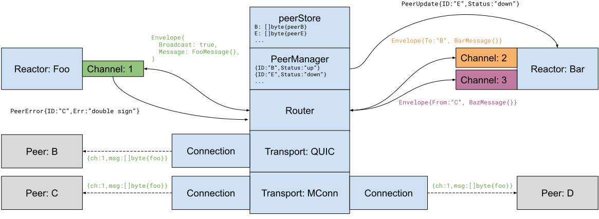

# ADR 062: P2P Architecture and Abstractions

## Changelog

- 2020-11-09: Initial version (@erikgrinaker)

- 2020-11-13: Remove stream IDs, move peer errors onto channel, note on moving PEX into core (@erikgrinaker)

- 2020-11-16: Notes on recommended reactor implementation patterns, approve ADR (@erikgrinaker)

- 2021-02-04: Update with new P2P core and Transport API changes (@erikgrinaker).

## Context

In [ADR 061](adr-061-p2p-refactor-scope.md) we decided to refactor the peer-to-peer (P2P) networking stack. The first phase is to redesign and refactor the internal P2P architecture, while retaining protocol compatibility as far as possible.

## Alternative Approaches

Several variations of the proposed design were considered, including e.g. calling interface methods instead of passing messages (like the current architecture), merging channels with streams, exposing the internal peer data structure to reactors, being message format-agnostic via arbitrary codecs, and so on. This design was chosen because it has very loose coupling, is simpler to reason about and more convenient to use, avoids race conditions and lock contention for internal data structures, gives reactors better control of message ordering and processing semantics, and allows for QoS scheduling and backpressure in a very natural way.

[multiaddr](https://github.com/multiformats/multiaddr) was considered as a transport-agnostic peer address format over regular URLs, but it does not appear to have very widespread adoption, and advanced features like protocol encapsulation and tunneling do not appear to be immediately useful to us.

There were also proposals to use LibP2P instead of maintaining our own P2P stack, which were rejected (for now) in [ADR 061](adr-061-p2p-refactor-scope.md).

The initial version of this ADR had a byte-oriented multi-stream transport API, but this had to be abandoned/postponed to maintain backwards-compatibility with the existing MConnection protocol which is message-oriented. See the rejected RFC in [tendermint/spec#227](https://github.com/tendermint/spec/pull/227) for details.

## Decision

The P2P stack will be redesigned as a message-oriented architecture, primarily relying on Go channels for communication and scheduling. It will use a message-oriented transport to binary messages with individual peers, bidirectional peer-addressable channels to send and receive Protobuf messages, a router to route messages between reactors and peers, and a peer manager to manage peer lifecycle information. Message passing is asynchronous with at-most-once delivery.

## Detailed Design

This ADR is primarily concerned with the architecture and interfaces of the P2P stack, not implementation details. The interfaces described here should therefore be considered a rough architecture outline, not a complete and final design.

Primary design objectives have been:

* Loose coupling between components, for a simpler, more robust, and test-friendly architecture.
* Pluggable transports (not necessarily networked).
* Better scheduling of messages, with improved prioritization, backpressure, and performance.
* Centralized peer lifecycle and connection management.
* Better peer address detection, advertisement, and exchange.
* Wire-level backwards compatibility with current P2P network protocols, except where it proves too obstructive.

The main abstractions in the new stack are:

* `Transport`: An arbitrary mechanism to exchange binary messages with a peer across a `Connection`.
* `Channel`: A bidirectional channel to asynchronously exchange Protobuf messages with peers using node ID addressing.
* `Router`: Maintains transport connections to relevant peers and routes channel messages.
* `PeerManager`: Manages peer lifecycle information, e.g. deciding which peers to dial and when, using a `peerStore` for storage.
* Reactor: A design pattern loosely defined as "something which listens on a channel and reacts to messages".

These abstractions are illustrated in the following diagram (representing the internals of node A) and described in detail below.



### Transports

Transports are arbitrary mechanisms for exchanging binary messages with a peer. For example, a gRPC transport would connect to a peer over TCP/IP and send data using the gRPC protocol, while an in-memory transport might communicate with a peer running in another goroutine using internal Go channels. Note that transports don't have a notion of a "peer" or "node" as such - instead, they establish connections between arbitrary endpoint addresses (e.g. IP address and port number), to decouple them from the rest of the P2P stack.

Transports must satisfy the following requirements:

* Be connection-oriented, and support both listening for inbound connections and making outbound connections using endpoint addresses.

* Support sending binary messages with distinct channel IDs (although channels and channel IDs are a higher-level application protocol concept explained in the Router section, they are threaded through the transport layer as well for backwards compatibilty with the existing MConnection protocol).

* Exchange the MConnection `NodeInfo` and public key via a node handshake, and possibly encrypt or sign the traffic as appropriate.

The initial transport is a port of the current MConnection protocol currently used by Tendermint, and should be backwards-compatible at the wire level. An in-memory transport for testing has also been implemented. There are plans to explore a QUIC transport that may replace the MConnection protocol.

The `Transport` interface is as follows:

```go
// Transport is a connection-oriented mechanism for exchanging data with a peer.
type Transport interface {
    // Protocols returns the protocols supported by the transport. The Router
    // uses this to pick a transport for an Endpoint.
    Protocols() []Protocol

    // Endpoints returns the local endpoints the transport is listening on, if any.
    // How to listen is transport-dependent, e.g. MConnTransport uses Listen() while
    // MemoryTransport starts listening via MemoryNetwork.CreateTransport().
    Endpoints() []Endpoint

    // Accept waits for the next inbound connection on a listening endpoint, blocking
    // until either a connection is available or the transport is closed. On closure,
    // io.EOF is returned and further Accept calls are futile.
    Accept() (Connection, error)

    // Dial creates an outbound connection to an endpoint.
    Dial(context.Context, Endpoint) (Connection, error)

    // Close stops accepting new connections, but does not close active connections.
    Close() error
}
```

How the transport configures listening is transport-dependent, and not covered by the interface. This typically happens during transport construction, where a single instance of the transport is created and set to listen on an appropriate network interface before being passed to the router.

#### Endpoints

`Endpoint` represents a transport endpoint (e.g. an IP address and port). A connection always has two endpoints: one at the local node and one at the remote peer. Outbound connections to remote endpoints are made via `Dial()`, and inbound connections to listening endpoints are returned via `Accept()`.

The `Endpoint` struct is:

```go
// Endpoint represents a transport connection endpoint, either local or remote.
//
// Endpoints are not necessarily networked (see e.g. MemoryTransport) but all
// networked endpoints must use IP as the underlying transport protocol to allow
// e.g. IP address filtering. Either IP or Path (or both) must be set.
type Endpoint struct {
    // Protocol specifies the transport protocol.
    Protocol Protocol

    // IP is an IP address (v4 or v6) to connect to. If set, this defines the
    // endpoint as a networked endpoint.
    IP net.IP

    // Port is a network port (either TCP or UDP). If 0, a default port may be
    // used depending on the protocol.
    Port uint16

    // Path is an optional transport-specific path or identifier.
    Path string
}

// Protocol identifies a transport protocol.
type Protocol string
```

Endpoints are arbitrary transport-specific addresses, but if they are networked they must use IP addresses and thus rely on IP as a fundamental packet routing protocol. This enables policies for address discovery, advertisement, and exchange - for example, a private `192.168.0.0/24` IP address should only be advertised to peers on that IP network, while the public address `8.8.8.8` may be advertised to all peers. Similarly, any port numbers if given must represent TCP and/or UDP port numbers, in order to use [UPnP](https://en.wikipedia.org/wiki/Universal_Plug_and_Play) to autoconfigure e.g. NAT gateways.

Non-networked endpoints (without an IP address) are considered local, and will only be advertised to other peers connecting via the same protocol. For example, the in-memory transport used for testing uses `Endpoint{Protocol: "memory", Path: "foo"}` as an address for the node "foo", and this should only be advertised to other nodes using `Protocol: "memory"`.

#### Connections

A connection represents an established transport connection between two endpoints (i.e. two nodes), which can be used to exchange binary messages with logical channel IDs (corresponding to the higher-level channel IDs used in the router). Connections are set up either via `Transport.Dial()` (outbound) or `Transport.Accept()` (inbound).

Once a connection is esablished, `Transport.Handshake()` must be called to perform a node handshake, exchanging node info and public keys to verify node identities. Node handshakes should not really be part of the transport layer (it's an application protocol concern), this exists for backwards-compatibility with the existing MConnection protocol which conflates the two. `NodeInfo` is part of the existing MConnection protocol, but does not appear to be documented in the specification -- refer to the Go codebase for details.

The `Connection` interface is shown below. It omits certain additions that are currently implemented for backwards compatibility with the legacy P2P stack and are planned to be removed before the final release.

```go
// Connection represents an established connection between two endpoints.
type Connection interface {
    // Handshake executes a node handshake with the remote peer. It must be
    // called once the connection is established, and returns the remote peer's
    // node info and public key. The caller is responsible for validation.
    Handshake(context.Context, NodeInfo, crypto.PrivKey) (NodeInfo, crypto.PubKey, error)

    // ReceiveMessage returns the next message received on the connection,
    // blocking until one is available. Returns io.EOF if closed.
    ReceiveMessage() (ChannelID, []byte, error)

    // SendMessage sends a message on the connection. Returns io.EOF if closed.
    SendMessage(ChannelID, []byte) error

    // LocalEndpoint returns the local endpoint for the connection.
    LocalEndpoint() Endpoint

    // RemoteEndpoint returns the remote endpoint for the connection.
    RemoteEndpoint() Endpoint

    // Close closes the connection.
    Close() error
}
```

This ADR initially proposed a byte-oriented multi-stream connection API that follows more typical networking API conventions (using e.g. `io.Reader` and `io.Writer` interfaces which easily compose with other libraries). This would also allow moving the responsibility for message framing, node handshakes, and traffic scheduling to the common router instead of reimplementing this across transports, and would allow making better use of multi-stream protocols such as QUIC. However, this would require minor breaking changes to the MConnection protocol which were rejected, see [tendermint/spec#227](https://github.com/tendermint/spec/pull/227) for details. This should be revisited when starting work on a QUIC transport.

### Peer Management

Peers are other Tendermint nodes. Each peer is identified by a unique `NodeID` (tied to the node's private key).

#### Peer Addresses

Nodes have one or more `NodeAddress` addresses expressed as URLs that they can be reached at. Examples of node addresses might be e.g.:

* `mconn://nodeid@host.domain.com:25567/path`
* `memory:nodeid`

Addresses are resolved into one or more transport endpoints, e.g. by resolving DNS hostnames into IP addresses. Peers should always be expressed as address URLs rather than endpoints (which are a lower-level transport construct).

```go
// NodeID is a hex-encoded crypto.Address. It must be lowercased
// (for uniqueness) and of length 40.
type NodeID string

// NodeAddress is a node address URL. It differs from a transport Endpoint in
// that it contains the node's ID, and that the address hostname may be resolved
// into multiple IP addresses (and thus multiple endpoints).
//
// If the URL is opaque, i.e. of the form "scheme:opaque", then the opaque part
// is expected to contain a node ID.
type NodeAddress struct {
    NodeID   NodeID
    Protocol Protocol
    Hostname string
    Port     uint16
    Path     string
}

// ParseNodeAddress parses a node address URL into a NodeAddress, normalizing
// and validating it.
func ParseNodeAddress(urlString string) (NodeAddress, error)

// Resolve resolves a NodeAddress into a set of Endpoints, e.g. by expanding
// out a DNS hostname to IP addresses.
func (a NodeAddress) Resolve(ctx context.Context) ([]Endpoint, error)
```

#### Peer Manager

The P2P stack needs to track a lot of internal state about peers, such as their addresses, connection state, priorities, availability, failures, retries, and so on. This responsibility has been separated out to a `PeerManager`, which track this state for the `Router` (but does not maintain the actual transport connections themselves, which is the router's responsibility).

The `PeerManager` is a synchronous state machine, where all state transitions are serialized (implemented as synchronous method calls holding an exclusive mutex lock). Most peer state is intentionally kept internal, stored in a `peerStore` database that persists it as appropriate, and the external interfaces pass the minimum amount of information necessary in order to avoid shared state between router goroutines. This design significantly simplifies the model, making it much easier to reason about and test than if it was baked into the asynchronous ball of concurrency that the P2P networking core must necessarily be. As peer lifecycle events are expected to be relatively infrequent, this should not significantly impact performance either.

The `Router` uses the `PeerManager` to request which peers to dial and evict, and reports in with peer lifecycle events such as connections, disconnections, and failures as they occur. The manager can reject these events (e.g. reject an inbound connection) by returning errors. This happens as follows:

* Outbound connections, via `Transport.Dial`:
    * `DialNext()`: returns a peer address to dial, or blocks until one is available.
    * `DialFailed()`: reports a peer dial failure.
    * `Dialed()`: reports a peer dial success.
    * `Ready()`: reports the peer as routed and ready.
    * `Disconnected()`: reports a peer disconnection.

* Inbound connections, via `Transport.Accept`:
    * `Accepted()`: reports an inbound peer connection.
    * `Ready()`: reports the peer as routed and ready.
    * `Disconnected()`: reports a peer disconnection.

* Evictions, via `Connection.Close`:
    * `EvictNext()`: returns a peer to disconnect, or blocks until one is available.
    * `Disconnected()`: reports a peer disconnection.

These calls have the following interface:

```go
// DialNext returns a peer address to dial, blocking until one is available.
func (m *PeerManager) DialNext(ctx context.Context) (NodeAddress, error)

// DialFailed reports a dial failure for the given address.
func (m *PeerManager) DialFailed(address NodeAddress) error

// Dialed reports a successful outbound connection to the given address.
func (m *PeerManager) Dialed(address NodeAddress) error

// Accepted reports a successful inbound connection from the given node.
func (m *PeerManager) Accepted(peerID NodeID) error

// Ready reports the peer as fully routed and ready for use.
func (m *PeerManager) Ready(peerID NodeID) error

// EvictNext returns a peer ID to disconnect, blocking until one is available.
func (m *PeerManager) EvictNext(ctx context.Context) (NodeID, error)

// Disconnected reports a peer disconnection.
func (m *PeerManager) Disconnected(peerID NodeID) error
```

Internally, the `PeerManager` uses a numeric peer score to prioritize peers, e.g. when deciding which peers to dial next. The scoring policy has not yet been implemented, but should take into account e.g. node configuration such a `persistent_peers`, uptime and connection failures, performance, and so on. The manager will also attempt to automatically upgrade to better-scored peers by evicting lower-scored peers when a better one becomes available (e.g. when a persistent peer comes back online after an outage).

The `PeerManager` should also have an API for reporting peer behavior from reactors that affects its score (e.g. signing a block increases the score, double-voting decreases it or even bans the peer), but this has not yet been designed and implemented.

Additionally, the `PeerManager` provides `PeerUpdates` subscriptions that will receive `PeerUpdate` events whenever significant peer state changes happen. Reactors can use these e.g. to know when peers are connected or disconnected, and take appropriate action. This is currently fairly minimal:

```go
// Subscribe subscribes to peer updates. The caller must consume the peer updates
// in a timely fashion and close the subscription when done, to avoid stalling the
// PeerManager as delivery is semi-synchronous, guaranteed, and ordered.
func (m *PeerManager) Subscribe() *PeerUpdates

// PeerUpdate is a peer update event sent via PeerUpdates.
type PeerUpdate struct {
    NodeID NodeID
    Status PeerStatus
}

// PeerStatus is a peer status.
type PeerStatus string

const (
    PeerStatusUp   PeerStatus = "up"   // Connected and ready.
    PeerStatusDown PeerStatus = "down" // Disconnected.
)

// PeerUpdates is a real-time peer update subscription.
type PeerUpdates struct { ... }

// Updates returns a channel for consuming peer updates.
func (pu *PeerUpdates) Updates() <-chan PeerUpdate

// Close closes the peer updates subscription.
func (pu *PeerUpdates) Close()
```

The `PeerManager` will also be responsible for providing peer information to the PEX reactor that can be gossipped to other nodes. This requires an improved system for peer address detection and advertisement, that e.g. reliably detects peer and self addresses and only gossips private network addresses to other peers on the same network, but this system has not yet been fully designed and implemented.

### Channels

While low-level data exchange happens via the `Transport`, the high-level API is based on a bidirectional `Channel` that can send and receive Protobuf messages addressed by `NodeID`. A channel is identified by an arbitrary `ChannelID` identifier, and can exchange Protobuf messages of one specific type (since the type to unmarshal into must be predefined). Message delivery is asynchronous and at-most-once.

The channel can also be used to report peer errors, e.g. when receiving an invalid or malignant message. This may cause the peer to be disconnected or banned depending on `PeerManager` policy, but should probably be replaced by a broader peer behavior API that can also report good behavior.

A `Channel` has this interface:

```go
// ChannelID is an arbitrary channel ID.
type ChannelID uint16

// Channel is a bidirectional channel to exchange Protobuf messages with peers.
type Channel struct {
    ID          ChannelID        // Channel ID.
    In          <-chan Envelope  // Inbound messages (peers to reactors).
    Out         chan<- Envelope  // outbound messages (reactors to peers)
    Error       chan<- PeerError // Peer error reporting.
    messageType proto.Message    // Channel's message type, for e.g. unmarshaling.
}

// Close closes the channel, also closing Out and Error.
func (c *Channel) Close() error

// Envelope specifies the message receiver and sender.
type Envelope struct {
    From      NodeID        // Sender (empty if outbound).
    To        NodeID        // Receiver (empty if inbound).
    Broadcast bool          // Send to all connected peers, ignoring To.
    Message   proto.Message // Message payload.
}

// PeerError is a peer error reported via the Error channel.
type PeerError struct {
    NodeID   NodeID
    Err      error
}
```

A channel can reach any connected peer, and will automatically (un)marshal the Protobuf messages. Message scheduling and queueing is a `Router` implementation concern, and can use any number of algorithms such as FIFO, round-robin, priority queues, etc. Since message delivery is not guaranteed, both inbound and outbound messages may be dropped, buffered, reordered, or blocked as appropriate.

Since a channel can only exchange messages of a single type, it is often useful to use a wrapper message type with e.g. a Protobuf `oneof` field that specifies a set of inner message types that it can contain. The channel can automatically perform this (un)wrapping if the outer message type implements the `Wrapper` interface (see [Reactor Example](#reactor-example) for an example):

```go
// Wrapper is a Protobuf message that can contain a variety of inner messages.
// If a Channel's message type implements Wrapper, the channel will
// automatically (un)wrap passed messages using the container type, such that
// the channel can transparently support multiple message types.
type Wrapper interface {
    proto.Message

    // Wrap will take a message and wrap it in this one.
    Wrap(proto.Message) error

    // Unwrap will unwrap the inner message contained in this message.
    Unwrap() (proto.Message, error)
}
```

### Routers

The router exeutes P2P networking for a node, taking instructions from and reporting events to the `PeerManager`, maintaining transport connections to peers, and routing messages between channels and peers.

Practically all concurrency in the P2P stack has been moved into the router and reactors, while as many other responsibilities as possible have been moved into separate components such as the `Transport` and `PeerManager` that can remain largely synchronous. Limiting concurrency to a single core component makes it much easier to reason about since there is only a single concurrency structure, while the remaining components can be serial, simple, and easily testable.

The `Router` has a very minimal API, since it is mostly driven by `PeerManager` and `Transport` events:

```go
// Router maintains peer transport connections and routes messages between
// peers and channels.
type Router struct {
    // Some details have been omitted below.

    logger          log.Logger
    options         RouterOptions
    nodeInfo        NodeInfo
    privKey         crypto.PrivKey
    peerManager     *PeerManager
    transports      []Transport

    peerMtx         sync.RWMutex
    peerQueues      map[NodeID]queue

    channelMtx      sync.RWMutex
    channelQueues   map[ChannelID]queue
}

// OpenChannel opens a new channel for the given message type. The caller must
// close the channel when done, before stopping the Router. messageType is the
// type of message passed through the channel.
func (r *Router) OpenChannel(id ChannelID, messageType proto.Message) (*Channel, error)

// Start starts the router, connecting to peers and routing messages.
func (r *Router) Start() error

// Stop stops the router, disconnecting from all peers and stopping message routing.
func (r *Router) Stop() error
```

All Go channel sends in the `Router` and reactors are blocking (the router also selects on signal channels for closure and shutdown). The responsibility for message scheduling, prioritization, backpressure, and load shedding is centralized in a core `queue` interface that is used at contention points (i.e. from all peers to a single channel, and from all channels to a single peer):

```go
// queue does QoS scheduling for Envelopes, enqueueing and dequeueing according
// to some policy. Queues are used at contention points, i.e.:
// - Receiving inbound messages to a single channel from all peers.
// - Sending outbound messages to a single peer from all channels.
type queue interface {
    // enqueue returns a channel for submitting envelopes.
    enqueue() chan<- Envelope

    // dequeue returns a channel ordered according to some queueing policy.
    dequeue() <-chan Envelope

    // close closes the queue. After this call enqueue() will block, so the
    // caller must select on closed() as well to avoid blocking forever. The
    // enqueue() and dequeue() channels will not be closed.
    close()

    // closed returns a channel that's closed when the scheduler is closed.
    closed() <-chan struct{}
}
```

The current implementation is `fifoQueue`, which is a simple unbuffered lossless queue that passes messages in the order they were received and blocks until the message is delivered (i.e. it is a Go channel). The router will need a more sophisticated queueing policy, but this has not yet been implemented.

The internal `Router` goroutine structure and design is described in the `Router` GoDoc, which is included below for reference:

```go
// On startup, three main goroutines are spawned to maintain peer connections:
//
//   dialPeers(): in a loop, calls PeerManager.DialNext() to get the next peer
//   address to dial and spawns a goroutine that dials the peer, handshakes
//   with it, and begins to route messages if successful.
//
//   acceptPeers(): in a loop, waits for an inbound connection via
//   Transport.Accept() and spawns a goroutine that handshakes with it and
//   begins to route messages if successful.
//
//   evictPeers(): in a loop, calls PeerManager.EvictNext() to get the next
//   peer to evict, and disconnects it by closing its message queue.
//
// When a peer is connected, an outbound peer message queue is registered in
// peerQueues, and routePeer() is called to spawn off two additional goroutines:
//
//   sendPeer(): waits for an outbound message from the peerQueues queue,
//   marshals it, and passes it to the peer transport which delivers it.
//
//   receivePeer(): waits for an inbound message from the peer transport,
//   unmarshals it, and passes it to the appropriate inbound channel queue
//   in channelQueues.
//
// When a reactor opens a channel via OpenChannel, an inbound channel message
// queue is registered in channelQueues, and a channel goroutine is spawned:
//
//   routeChannel(): waits for an outbound message from the channel, looks
//   up the recipient peer's outbound message queue in peerQueues, and submits
//   the message to it.
//
// All channel sends in the router are blocking. It is the responsibility of the
// queue interface in peerQueues and channelQueues to prioritize and drop
// messages as appropriate during contention to prevent stalls and ensure good
// quality of service.
```

### Reactor Example

While reactors are a first-class concept in the current P2P stack (i.e. there is an explicit `p2p.Reactor` interface), they will simply be a design pattern in the new stack, loosely defined as "something which listens on a channel and reacts to messages".

Since reactors have very few formal constraints, they can be implemented in a variety of ways. There is currently no recommended pattern for implementing reactors, to avoid overspecification and scope creep in this ADR. However, prototyping and developing a reactor pattern should be done early during implementation, to make sure reactors built using the `Channel` interface can satisfy the needs for convenience, deterministic tests, and reliability.

Below is a trivial example of a simple echo reactor implemented as a function. The reactor will exchange the following Protobuf messages:

```protobuf
message EchoMessage {
    oneof inner {
        PingMessage ping = 1;
        PongMessage pong = 2;
    }
}

message PingMessage {
    string content = 1;
}

message PongMessage {
    string content = 1;
}
```

Implementing the `Wrapper` interface for `EchoMessage` allows transparently passing `PingMessage` and `PongMessage` through the channel, where it will automatically be (un)wrapped in an `EchoMessage`:

```go
func (m *EchoMessage) Wrap(inner proto.Message) error {
    switch inner := inner.(type) {
    case *PingMessage:
        m.Inner = &EchoMessage_PingMessage{Ping: inner}
    case *PongMessage:
        m.Inner = &EchoMessage_PongMessage{Pong: inner}
    default:
        return fmt.Errorf("unknown message %T", inner)
    }
    return nil
}

func (m *EchoMessage) Unwrap() (proto.Message, error) {
    switch inner := m.Inner.(type) {
    case *EchoMessage_PingMessage:
        return inner.Ping, nil
    case *EchoMessage_PongMessage:
        return inner.Pong, nil
    default:
        return nil, fmt.Errorf("unknown message %T", inner)
    }
}
```

The reactor itself would be implemented e.g. like this:

```go
// RunEchoReactor wires up an echo reactor to a router and runs it.
func RunEchoReactor(router *p2p.Router, peerManager *p2p.PeerManager) error {
    channel, err := router.OpenChannel(1, &EchoMessage{})
    if err != nil {
        return err
    }
    defer channel.Close()
    peerUpdates := peerManager.Subscribe()
    defer peerUpdates.Close()

    return EchoReactor(context.Background(), channel, peerUpdates)
}

// EchoReactor provides an echo service, pinging all known peers until the given
// context is canceled.
func EchoReactor(ctx context.Context, channel *p2p.Channel, peerUpdates *p2p.PeerUpdates) error {
    ticker := time.NewTicker(5 * time.Second)
    defer ticker.Stop()

    for {
        select {
        // Send ping message to all known peers every 5 seconds.
        case <-ticker.C:
            channel.Out <- Envelope{
                Broadcast: true,
                Message:   &PingMessage{Content: "👋"},
            }

        // When we receive a message from a peer, either respond to ping, output
        // pong, or report peer error on unknown message type.
        case envelope := <-channel.In:
            switch msg := envelope.Message.(type) {
            case *PingMessage:
                channel.Out <- Envelope{
                    To:      envelope.From,
                    Message: &PongMessage{Content: msg.Content},
                }

            case *PongMessage:
                fmt.Printf("%q replied with %q\n", envelope.From, msg.Content)

            default:
                channel.Error <- PeerError{
                    PeerID: envelope.From,
                    Err:    fmt.Errorf("unexpected message %T", msg),
                }
            }

        // Output info about any peer status changes.
        case peerUpdate := <-peerUpdates:
            fmt.Printf("Peer %q changed status to %q", peerUpdate.PeerID, peerUpdate.Status)

        // Exit when context is canceled.
        case <-ctx.Done():
            return nil
        }
    }
}
```

## Status

Proposed

Was partially implemented in v0.35 ([#5670](https://github.com/tendermint/tendermint/issues/5670))

## Consequences

### Positive

* Reduced coupling and simplified interfaces should lead to better understandability, increased reliability, and more testing.

* Using message passing via Go channels gives better control of backpressure and quality-of-service scheduling.

* Peer lifecycle and connection management is centralized in a single entity, making it easier to reason about.

* Detection, advertisement, and exchange of node addresses will be improved.

* Additional transports (e.g. QUIC) can be implemented and used in parallel with the existing MConn protocol.

* The P2P protocol will not be broken in the initial version, if possible.

### Negative

* Fully implementing the new design as indended is likely to require breaking changes to the P2P protocol at some point, although the initial implementation shouldn't.

* Gradually migrating the existing stack and maintaining backwards-compatibility will be more labor-intensive than simply replacing the entire stack.

* A complete overhaul of P2P internals is likely to cause temporary performance regressions and bugs as the implementation matures.

* Hiding peer management information inside the `PeerManager` may prevent certain functionality or require additional deliberate interfaces for information exchange, as a tradeoff to simplify the design, reduce coupling, and avoid race conditions and lock contention.

### Neutral

* Implementation details around e.g. peer management, message scheduling, and peer and endpoint advertisement are not yet determined.

## References

* [ADR 061: P2P Refactor Scope](adr-061-p2p-refactor-scope.md)
* [#5670 p2p: internal refactor and architecture redesign](https://github.com/tendermint/tendermint/issues/5670)
