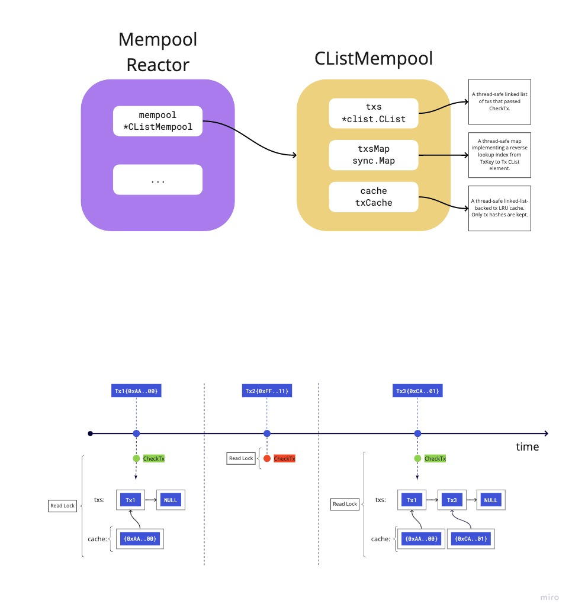

# ADR 067: Mempool Refactor

- [ADR 067: Mempool Refactor](#adr-067-mempool-refactor)
  - [Changelog](#changelog)
  - [Status](#status)
  - [Context](#context)
    - [Current Design](#current-design)
  - [Alternative Approaches](#alternative-approaches)
  - [Prior Art](#prior-art)
    - [Ethereum](#ethereum)
    - [Diem](#diem)
  - [Decision](#decision)
  - [Detailed Design](#detailed-design)
    - [CheckTx](#checktx)
    - [Mempool](#mempool)
    - [Eviction](#eviction)
    - [Gossiping](#gossiping)
    - [Performance](#performance)
  - [Future Improvements](#future-improvements)
  - [Consequences](#consequences)
    - [Positive](#positive)
    - [Negative](#negative)
    - [Neutral](#neutral)
  - [References](#references)

## Changelog

- April 19, 2021: Initial Draft (@alexanderbez)

## Status

Accepted

## Context

Tendermint Core has a reactor and data structure, mempool, that facilitates the
ephemeral storage of uncommitted transactions. Honest nodes participating in a
Tendermint network gossip these uncommitted transactions to each other if they
pass the application's `CheckTx`. In addition, block proposers select from the
mempool a subset of uncommitted transactions to include in the next block.

Currently, the mempool in Tendermint Core is designed as a FIFO queue. In other
words, transactions are included in blocks as they are received by a node. There
currently is no explicit and prioritized ordering of these uncommitted transactions.
This presents a few technical and UX challenges for operators and applications.

Namely, validators are not able to prioritize transactions by their fees or any
incentive aligned mechanism. In addition, the lack of prioritization also leads
to cascading effects in terms of DoS and various attack vectors on networks,
e.g. [cosmos/cosmos-sdk#8224](https://github.com/cosmos/cosmos-sdk/discussions/8224).

Thus, Tendermint Core needs the ability for an application and its users to
prioritize transactions in a flexible and performant manner. Specifically, we're
aiming to either improve, maintain or add the following properties in the
Tendermint mempool:

- Allow application-determined transaction priority.
- Allow efficient concurrent reads and writes.
- Allow block proposers to reap transactions efficiently by priority.
- Maintain a fixed mempool capacity by transaction size and evict lower priority
  transactions to make room for higher priority transactions.
- Allow transactions to be gossiped by priority efficiently.
- Allow operators to specify a maximum TTL for transactions in the mempool before
  they're automatically evicted if not selected for a block proposal in time.
- Ensure the design allows for future extensions, such as replace-by-priority and
  allowing multiple pending transactions per sender, to be incorporated easily.

Note, not all of these properties will be addressed by the proposed changes in
this ADR. However, this proposal will ensure that any unaddressed properties
can be addressed in an easy and extensible manner in the future.

### Current Design



At the core of the `v0` mempool reactor is a concurrent linked-list. This is the
primary data structure that contains `Tx` objects that have passed `CheckTx`.
When a node receives a transaction from another peer, it executes `CheckTx`, which
obtains a read-lock on the `*CListMempool`. If the transaction passes `CheckTx`
locally on the node, it is added to the `*CList` by obtaining a write-lock. It
is also added to the `cache` and `txsMap`, both of which obtain their own respective
write-locks and map a reference from the transaction hash to the `Tx` itself.

Transactions are continuously gossiped to peers whenever a new transaction is added
to a local node's `*CList`, where the node at the front of the `*CList` is selected.
Another transaction will not be gossiped until the `*CList` notifies the reader
that there are more transactions to gossip.

When a proposer attempts to propose a block, they will execute `ReapMaxBytesMaxGas`
on the reactor's `*CListMempool`. This call obtains a read-lock on the `*CListMempool`
and selects as many transactions as possible starting from the front of the `*CList`
moving to the back of the list.

When a block is finally committed, a caller invokes `Update` on the reactor's
`*CListMempool` with all the selected transactions. Note, the caller must also
explicitly obtain a write-lock on the reactor's `*CListMempool`. This call
will remove all the supplied transactions from the `txsMap` and the `*CList`, both
of which obtain their own respective write-locks. In addition, the transaction
may also be removed from the `cache` which obtains it's own write-lock.

## Alternative Approaches

When considering which approach to take for a priority-based flexible and
performant mempool, there are two core candidates. The first candidate is less
invasive in the required  set of protocol and implementation changes, which
simply extends the existing `CheckTx` ABCI method. The second candidate essentially
involves the introduction of new ABCI method(s) and would require a higher degree
of complexity in protocol and implementation changes, some of which may either
overlap or conflict with the upcoming introduction of [ABCI++](https://github.com/tendermint/tendermint/blob/main/docs/rfc/rfc-013-abci%2B%2B.md).

For more information on the various approaches and proposals, please see the
[mempool discussion](https://github.com/tendermint/tendermint/discussions/6295).

## Prior Art

### Ethereum

The Ethereum mempool, specifically [Geth](https://github.com/ethereum/go-ethereum),
contains a mempool, `*TxPool`, that contains various mappings indexed by account,
such as a `pending` which contains all processable transactions for accounts
prioritized by nonce. It also contains a `queue` which is the exact same mapping
except it contains not currently processable transactions. The mempool also
contains a `priced` index of type `*txPricedList` that is a priority queue based
on transaction price.

### Diem

The [Diem mempool](https://github.com/diem/diem/blob/master/mempool/README.md#implementation-details)
contains a similar approach to the one we propose. Specifically, the Diem mempool
contains a mapping from `Account:[]Tx`. On top of this primary mapping from account
to a list of transactions, are various indexes used to perform certain actions.

The main index, `PriorityIndex`. is an ordered queue of transactions that are
“consensus-ready” (i.e., they have a sequence number which is sequential to the
current sequence number for the account). This queue is ordered by gas price so
that if a client is willing to pay more (than other clients) per unit of
execution, then they can enter consensus earlier.

## Decision

To incorporate a priority-based flexible and performant mempool in Tendermint Core,
we will introduce new fields, `priority` and `sender`, into the `ResponseCheckTx`
type.

We will introduce a new versioned mempool reactor, `v1` and assume an implicit
version of the current mempool reactor as `v0`. In the new `v1` mempool reactor,
we largely keep the functionality the same as `v0` except we augment the underlying
data structures. Specifically, we keep a mapping of senders to transaction objects.
On top of this mapping, we index transactions to provide the ability to efficiently
gossip and reap transactions by priority.

## Detailed Design

### CheckTx

We introduce the following new fields into the `ResponseCheckTx` type:

```diff
message ResponseCheckTx {
  uint32         code       = 1;
  bytes          data       = 2;
  string         log        = 3;  // nondeterministic
  string         info       = 4;  // nondeterministic
  int64          gas_wanted = 5 [json_name = "gas_wanted"];
  int64          gas_used   = 6 [json_name = "gas_used"];
  repeated Event events     = 7 [(gogoproto.nullable) = false, (gogoproto.jsontag) = "events,omitempty"];
  string         codespace  = 8;
+ int64          priority   = 9;
+ string         sender     = 10;
}
```

It is entirely up the application in determining how these fields are populated
and with what values, e.g. the `sender` could be the signer and fee payer
of the transaction, the `priority` could be the cumulative sum of the fee(s).

Only `sender` is required, while `priority` can be omitted which would result in
using the default value of zero.

### Mempool

The existing concurrent-safe linked-list will be replaced by a thread-safe map
of `<sender:*Tx>`, i.e a mapping from `sender` to a single `*Tx` object, where
each `*Tx` is the next valid and processable transaction from the given `sender`.

On top of this mapping, we index all transactions by priority using a thread-safe
priority queue, i.e. a [max heap](https://en.wikipedia.org/wiki/Min-max_heap).
When a proposer is ready to select transactions for the next block proposal,
transactions are selected from this priority index by highest priority order.
When a transaction is selected and reaped, it is removed from this index and
from the `<sender:*Tx>` mapping.

We define `Tx` as the following data structure:

```go
type Tx struct {
  // Tx represents the raw binary transaction data.
  Tx []byte

  // Priority defines the transaction's priority as specified by the application
  // in the ResponseCheckTx response.
  Priority int64

  // Sender defines the transaction's sender as specified by the application in
  // the ResponseCheckTx response.
  Sender string

  // Index defines the current index in the priority queue index. Note, if
  // multiple Tx indexes are needed, this field will be removed and each Tx
  // index will have its own wrapped Tx type.
  Index int
}
```

### Eviction

Upon successfully executing `CheckTx` for a new `Tx` and the mempool is currently
full, we must check if there exists a `Tx` of lower priority that can be evicted
to make room for the new `Tx` with higher priority and with sufficient size
capacity left.

If such a `Tx` exists, we find it by obtaining a read lock and sorting the
priority queue index. Once sorted, we find the first `Tx` with lower priority and
size such that the new `Tx` would fit within the mempool's size limit. We then
remove this `Tx` from the priority queue index as well as the `<sender:*Tx>`
mapping.

This will require additional `O(n)` space and `O(n*log(n))` runtime complexity. Note that the space complexity does not depend on the size of the tx.

### Gossiping

We keep the existing thread-safe linked list as an additional index. Using this
index, we can efficiently gossip transactions in the same manner as they are
gossiped now (FIFO).

Gossiping transactions will not require locking any other indexes.

### Performance

Performance should largely remain unaffected apart from the space overhead of
keeping an additional priority queue index and the case where we need to evict
transactions from the priority queue index. There should be no reads which
block writes on any index

## Future Improvements

There are a few considerable ways in which the proposed design can be improved or
expanded upon. Namely, transaction gossiping and for the ability to support
multiple transactions from the same `sender`.

With regards to transaction gossiping, we need empirically validate whether we
need to gossip by priority. In addition, the current method of gossiping may not
be the most efficient. Specifically, broadcasting all the transactions a node
has in it's mempool to it's peers. Rather, we should explore for the ability to
gossip transactions on a request/response basis similar to Ethereum and other
protocols. Not only does this reduce bandwidth and complexity, but also allows
for us to explore gossiping by priority or other dimensions more efficiently.

Allowing for multiple transactions from the same `sender` is important and will
most likely be a needed feature in the future development of the mempool, but for
now it suffices to have the preliminary design agreed upon. Having the ability
to support multiple transactions per `sender` will require careful thought with
regards to the interplay of the corresponding ABCI application. Regardless, the
proposed design should allow for adaptations to support this feature in a
non-contentious and backwards compatible manner.

## Consequences

### Positive

- Transactions are allowed to be prioritized by the application.

### Negative

- Increased size of the `ResponseCheckTx` Protocol Buffer type.
- Causal ordering is NOT maintained.
  - It is possible that certain transactions broadcasted in a particular order may
  pass `CheckTx` but not end up being committed in a block because they fail
  `CheckTx` later. e.g. Consider Tx<sub>1</sub> that sends funds from existing
  account Alice to a _new_ account Bob with priority P<sub>1</sub> and then later
  Bob's _new_ account sends funds back to Alice in Tx<sub>2</sub> with P<sub>2</sub>,
  such that P<sub>2</sub> > P<sub>1</sub>. If executed in this order, both
  transactions will pass `CheckTx`. However, when a proposer is ready to select
  transactions for the next block proposal, they will select Tx<sub>2</sub> before
  Tx<sub>1</sub> and thus Tx<sub>2</sub> will _fail_ because Tx<sub>1</sub> must
  be executed first. This is because there is a _causal ordering_,
  Tx<sub>1</sub> ➝ Tx<sub>2</sub>. These types of situations should be rare as
  most transactions are not causally ordered and can be circumvented by simply
  trying again at a later point in time or by ensuring the "child" priority is
  lower than the "parent" priority. In other words, if parents always have
  priories that are higher than their children, then the new mempool design will
  maintain causal ordering.

### Neutral

- A transaction that passed `CheckTx` and entered the mempool can later be evicted
  at a future point in time if a higher priority transaction entered while the
  mempool was full.

## References

- [ABCI++](https://github.com/tendermint/tendermint/blob/main/docs/rfc/rfc-013-abci%2B%2B.md)
- [Mempool Discussion](https://github.com/tendermint/tendermint/discussions/6295)
