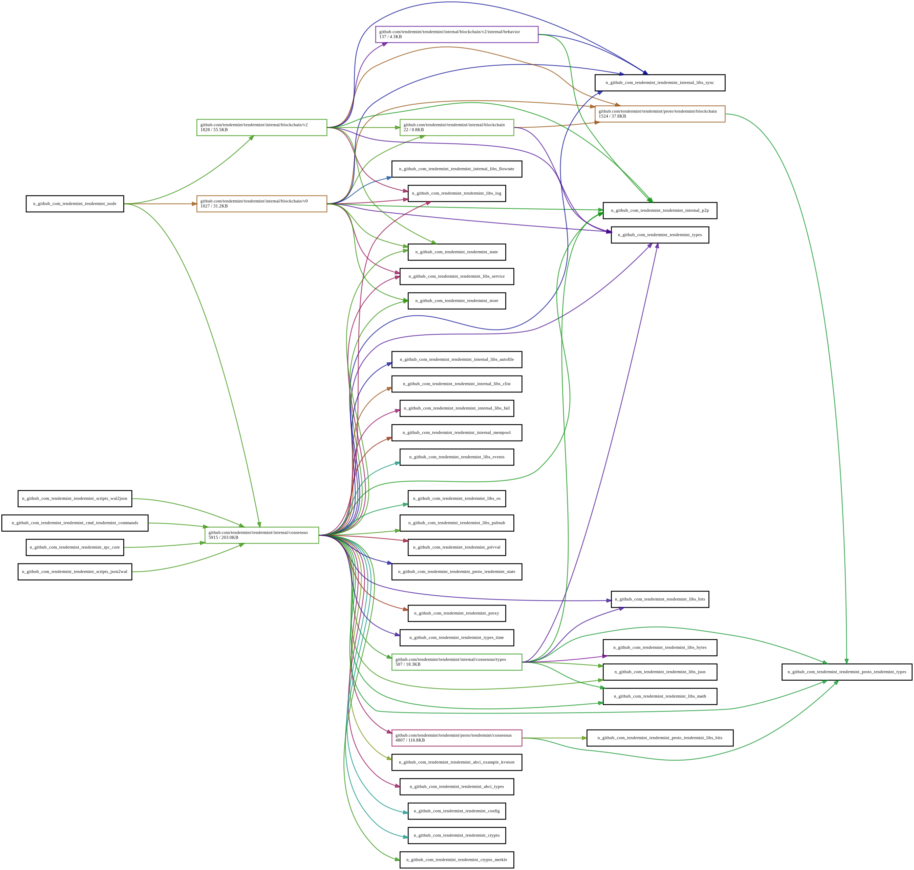

# ADR 069: Flexible Node Initialization

## Changlog

- 2021-06-09: Initial Draft (@tychoish)

- 2021-07-21: Major Revision (@tychoish)

## Status

Proposed.

## Context

In an effort to support [Go-API-Stability](./adr-060-go-api-stability.md),
during the 0.35 development cycle, we have attempted to reduce the the API
surface area by moving most of the interface of the `node` package into
unexported functions, as well as moving the reactors to an `internal`
package. Having this coincide with the 0.35 release made a lot of sense
because these interfaces were _already_ changing as a result of the `p2p`
[refactor](./adr-061-p2p-refactor-scope.md), so it made sense to think a bit
more about how tendermint exposes this API.

While the interfaces of the P2P layer and most of the node package are already
internalized, this precludes some operational patterns that are important to
users who use tendermint as a library. Specifically, introspecting the
tendermint node service and replacing components is not supported in the latest
version of the code, and some of these use cases would require maintaining a
vendor copy of the code. Adding these features requires rather extensive
(internal/implementation) changes to the `node` and `rpc` packages, and this
ADR describes a model for changing the way that tendermint nodes initialize, in
service of providing this kind of functionality.

We consider node initialization, because the current implemention
provides strong connections between all components, as well as between
the components of the node and the RPC layer, and being able to think
about the interactions of these components will help enable these
features and help define the requirements of the node package.

## Alternative Approaches

These alternatives are presented to frame the design space and to
contextualize the decision in terms of product requirements. These
ideas are not inherently bad, and may even be possible or desireable
in the (distant) future, and merely provide additional context for how
we, in the moment came to our decision(s).

### Do Nothing

The current implementation is functional and sufficient for the vast
majority of use cases (e.g., all users of the Cosmos-SDK as well as
anyone who runs tendermint and the ABCI application in separate
processes). In the current implementation, and even previous versions,
modifying node initialization or injecting custom components required
copying most of the `node` package, which required such users
to maintain a vendored copy of tendermint.

While this is (likely) not tenable in the long term, as users do want
more modularity, and the current service implementation is brittle and
difficult to maintain, in the short term it may be possible to delay
implementation somewhat. Eventually, however, we will need to make the
`node` package easier to maintain and reason about.

### Generic Service Pluggability

One possible system design would export interfaces (in the Golang
sense) for all components of the system, to permit runtime dependency
injection of all components in the system, so that users can compose
tendermint nodes of arbitrary user-supplied components.

Although this level of customization would provide benefits, it would be a huge
undertaking (particularly with regards to API design work) that we do not have
scope for at the moment.  Eventually providing support for some kinds of
pluggability may be useful, so the current solution does not explicitly
foreclose the possibility of this alternative.

### Abstract Dependency Based Startup and Shutdown

The main proposal in this document makes tendermint node initialization simpler
and more abstract, but the system lacks a number of
features which daemon/service initialization could provide, such as a
system allowing the authors of services to control initialization and shutdown order
of components using dependency relationships.

Such a system could work by allowing services to declare
initialization order dependencies to other reactors (by ID, perhaps)
so that the node could decide the initialization based on the
dependencies declared by services rather than requiring the node to
encode this logic directly.

This level of configuration is probably more complicated than is needed.  Given
that the authors of components in the current implementation of tendermint
already *do* need to know about other components, a dependency-based system
would probably be overly-abstract at this stage.

## Decisions

- To the greatest extent possible, factor the code base so that
  packages are responsible for their own initialization, and minimize
  the amount of code in the `node` package itself.

- As a design goal, reduce direct coupling and dependencies between
  components in the implementation of `node`.

- Begin iterating on a more-flexible internal framework for
  initializing tendermint nodes to make the initatilization process
  less hard-coded by the implementation of the node objects.

  - Reactors should not need to expose their interfaces *within* the
	implementation of the node type

  - This refactoring should be entirely opaque to users.

  - These node initialization changes should not require a
	reevaluation of the `service.Service` or a generic initialization
	orchestration framework.

- Do not proactively provide a system for injecting
  components/services within a tendtermint node, though make it
  possible to retrofit this kind of plugability in the future if
  needed.

- Prioritize implementation of p2p-based statesync reactor to obviate
  need for users to inject a custom state-sync provider.

## Detailed Design

The [current
nodeImpl](https://github.com/tendermint/tendermint/blob/main/node/node.go#L47)
includes direct references to the implementations of each of the
reactors, which should be replaced by references to `service.Service`
objects. This will require moving construction of the [rpc
service](https://github.com/tendermint/tendermint/blob/main/node/node.go#L771)
into the constructor of
[makeNode](https://github.com/tendermint/tendermint/blob/main/node/node.go#L126). One
possible implementation of this would be to eliminate the current
`ConfigureRPC` method on the node package and instead [configure it
here](https://github.com/tendermint/tendermint/pull/6798/files#diff-375d57e386f20eaa5f09f02bb9d28bfc48ac3dca18d0325f59492208219e5618R441).

To avoid adding complexity to the `node` package, we will add a
composite service implementation to the `service` package
that implements `service.Service` and is composed of a sequence of
underlying `service.Service` objects and handles their
startup/shutdown in the specified sequential order.

Consensus, blocksync (*née* fast sync), and statesync all depend on
each other, and have significant initialization dependencies that are
presently encoded in the `node` package. As part of this change, a
new package/component (likely named `blocks` located at
`internal/blocks`) will encapsulate the initialization of these block
management areas of the code.

### Injectable Component Option

This section briefly describes a possible implementation for
user-supplied services running within a node. This should not be
implemented unless user-supplied components are a hard requirement for
a user.

In order to allow components to be replaced, a new public function
will be added to the public interface of `node` with a signature that
resembles the following:

```go
func NewWithServices(conf *config.Config,
	logger log.Logger,
	cf proxy.ClientCreator,
	gen *types.GenesisDoc,
	srvs []service.Service,
) (service.Service, error) {
```

The `service.Service` objects will be initialized in the order supplied, after
all pre-configured/default services have started (and shut down in reverse
order).  The given services may implement additional interfaces, allowing them
to replace specific default services. `NewWithServices` will validate input
service lists with the following rules:

- None of the services may already be running.
- The caller may not supply more than one replacement reactor for a given
  default service type.

If callers violate any of these rules, `NewWithServices` will return
an error. To retract support for this kind of operation in the future,
the function can be modified to *always* return an error.

## Consequences

### Positive

- The node package will become easier to maintain.

- It will become easier to add additional services within tendermint
  nodes.

- It will become possible to replace default components in the node
  package without vendoring the tendermint repo and modifying internal
  code.

- The current end-to-end (e2e) test suite will be able to prevent any
  regressions, and the new functionality can be thoroughly unit tested.

- The scope of this project is very narrow, which minimizes risk.

### Negative

- This increases our reliance on the `service.Service` interface which
  is probably not an interface that we want to fully commit to.

- This proposal implements a fairly minimal set of functionality and
  leaves open the possibility for many additional features which are
  not included in the scope of this proposal.

### Neutral

N/A

## Open Questions

- To what extent does this new initialization framework need to accommodate
  the legacy p2p stack? Would it be possible to delay a great deal of this
  work to the 0.36 cycle to avoid this complexity?

  - Answer: _depends on timing_, and the requirement to ship pluggable reactors in 0.35.

- Where should additional public types be exported for the 0.35
  release?

  Related to the general project of API stabilization we want to deprecate
  the `types` package, and move its contents into a new `pkg` hierarchy;
  however, the design of the `pkg` interface is currently underspecified.
  If `types` is going to remain for the 0.35 release, then we should consider
  the impact of using multiple organizing modalities for this code within a
  single release.

## Future Work

- Improve or simplify the `service.Service` interface. There are some
  pretty clear limitations with this interface as written (there's no
  way to timeout slow startup or shut down, the cycle between the
  `service.BaseService` and `service.Service` implementations is
  troubling, the default panic in `OnReset` seems troubling.)

- As part of the refactor of `service.Service` have all services/nodes
  respect the lifetime of a `context.Context` object, and avoid the
  current practice of creating `context.Context` objects in p2p and
  reactor code. This would be required for in-process multi-tenancy.

- Support explicit dependencies between components and allow for
  parallel startup, so that different reactors can startup at the same
  time, where possible.

## References

- [the component
  graph](https://peter.bourgon.org/go-for-industrial-programming/#the-component-graph)
  as a framing for internal service construction.

## Appendix

### Dependencies

There's a relationship between the blockchain and consensus reactor
described by the following dependency graph makes replacing some of
these components more difficult relative to other reactors or
components.


