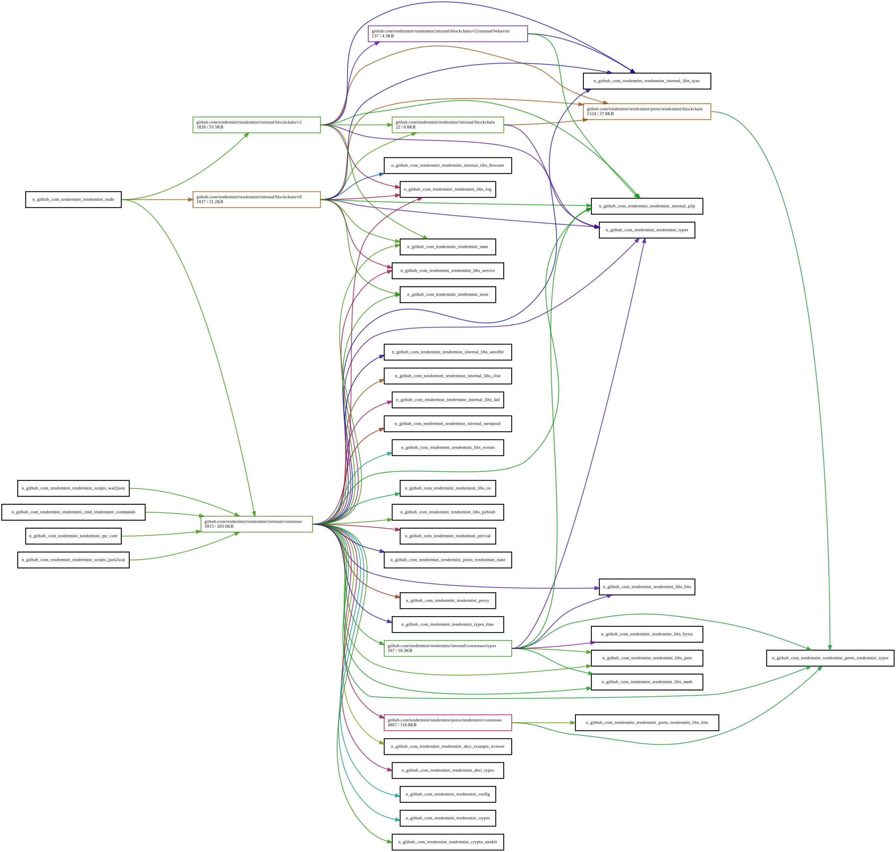

# ADR 069: Flexible Node Initialization

## Changlog

- 2021-06-09: Initial Draft (@tychoish)

- 2021-07-21: Major Revision (@tychoish)

## Status

Proposed.

## Context

In an effort to support [Go-API-Stability](./adr-060-go-api-stability.Md),
during the 0.35 development cycle, we have attempted to reduce the total size
of the API surface area by moving most of the interface of the `node` package
into unexported functions, as well as moving the reactors to an `internal`
package. Having this coincide with the 0.35 release made a lot of sense
because these interfaces were _already_ changing as a result of the `p2p`
[refactor](./adr-061-p2p-refactor-scope.md), so it made sense to think a bit
more about how tendermint exposes this API.

While the interfaces of the P2P layer and most of the node package are
already internalized, this precludes several kinds of operational
patterns that are important to key tendermint users who use tendermint
as a library, specifically introspecting the tendermint node service
and replacing components is not supported in the latest version of the
code, and some of these use cases would require maintaining a vendor
copy of the code. Adding these features requires rather extensive
(internal/implementation) changes to the `node` and `rpc` packages,
and this ADR describes a model for changing the way that tendermint
nodes initialize, in service of providing this kind of functionality.

We consider node initialization, because the current implemention
provides strong connections between all components, as well as between
the components of the node and the RPC layer, and being able to think
about the interactions of these components will help enable these
features and help define the requirements of the node package.

## Alternative Approaches

### Do Nothing

The current implementation is functional and sufficient for the vast
majority of use cases (e.g. all users of the Cosmos-SDK as well as
anyone who runs tendermint and the ABCI application in separate
processes.) In the current implementation, and even previous versions,
modifying node initialization or injecting custom components required
copying most of the `node` package, which amounts to requiring users
to maintain a vendored copy of tendermint for these kinds of use
cases.

While this is (likely) not tenable in the long term, as users do want
more modularity, and the current service implementation is brittle and
difficult to maintain, it may be viable in the short and medium term
to delay implementation which will allow us to do more product
research and build more confidence and consensus around the eventual
solution.

### Generic Service Plugability

We can imagine a system design that exports interfaces (in the Golang
sense) for all components of the system, to permit runtime dependency
injection of all components in the system so that users can compose
tendermint nodes of arbitrary user supplied components.

This is an interesting proposal, and may be interesting to persue, but
essentially requires doing a lot more API design and increases the
surface area of our API. While this is not a goal at the moment,
eventually providing support for some kinds of plugability may be
useful, so the current solution does not explicitly forclose the
possibility of this alternative.

### Abstract Dependency Based Startup and Shutdown

The proposal on in this document simplifies and makes tendermint node
initialization more abstract, but the system lacks a number of
features which daemon/service initialization might provide, such as a
dependency based system that allows the authors of services to control
the initialization and shutdown order of components using an
dependencies to control the ordering.

Dependency based orderings make it possible to write components
(reactors, etc.) with only limited awareness of other components or of
node initialization, and is the state of the art for process
initialization. However, this may be too abstract and complicated, and
authors of components in the current implementation of tendermint
*would* need to know about other components, so a dependency based
system would be unhelpfully abstract at this stage.

## Decisions

- Provide a more flexible internal framework for initializing tendermint
  nodes to make the initatilization process less hard-coded by the
  implementation of the node objects.

  - Reactors should not need to expose their interfaces *within* the
	implementation of the node type, except in the context of some groups of
	services.

  - This refactoring should be entirely opaque to users.

  - These node initialization changes should not require a
	reevaluation of the `service.Service` or a generic initialization
	orchestration framework.

- If required for the 0.35 release, add an "unsafe" way to construct a
  node service with user-supplied mempool, including making the
  relevant interfaces and types external/exported.

- Prioritize implementation of p2p-based statesync reactor to obviate
  need for users to inject a custom state-sync provider.

## Detailed Design

The [current
nodeImpl](https://github.com/tendermint/tendermint/blob/master/node/node.go#L47)
includes direct references to the implementations of each of the
reactors, which should be replaced by references to `service.Service`
objects. This will require moving the construction of the [rpc
service](https://github.com/tendermint/tendermint/blob/master/node/node.go#L771)
into the constructor of
[makeNode](https://github.com/tendermint/tendermint/blob/master/node/node.go#L126).

In order to prevent adding complexity to the `node` package, this
project will add an implementation to the service `service` package
that implements `service.Service` and is comprised of a sequence of
underlying `service.Service` objects and handles their
startup/shutdown in a consistent order.

Consensus, blocksync (nee fast sync.), and statesync all depend on
each other, and have significant initialization dependencies that are
presently encoded in the `node` package, and as part of this change,
a new package/component will encapsulate the initialization of this
area of functionality.

In order to support replacement of a component, a new public function
will be added to the public interface of `node` with a signature that
resembles the following:

```go
func NewWithServices(conf *config.Config,
	logger log.Logger,
	cf proxy.ClientCreator,
	gen *types.GenesisDoc,
	srvs ...service.Service
) (service.Service, error) {
```

The `service.Service` objects will be initialized in the order their
supplied, after all pre-configured/default services have started (and
shut down first, comparatively.) If any of the services implement
additional interfaces, that allow them to replace specific default
services. `NewWithServices` will validate input service lists with the
following rules:

- no running services
- all values of `service.Service.String()` must be unique.
- for replacing default services, callers cannot supply more than
  one replacement reactor for any specified type.

If callers violate any of these rules, `NewWithServices` will return
an error.

## Consequences

### Positive

- The node package will become easier to maintain.

- It will become easier to add additional services within tendermint
  nodes.

- It will become possible to replace default components in the node
  package without vendoring the tendermint repo and modifying internal
  code.

- The current end-to-end (e2e) test suite will be able to prevent any
  regressions, and the new functionality can be thoroughly unittested.

- The scope of this project is very narrow, which minimizes risk and

### Negative

- This increases our reliance on the `service.Service` interface which
  is probably not an interface that we want to fully commit to.

- This proposal implements a fairly minimal set of functionality and
  leaves open the possibility for many additional features which are
  not included in the scope of this proposal.

### Neutral

N/A

## Open Questions

- To what extent does this new initialization framework need to accommodate
  the legacy p2p stack? Would it be possible to delay a great deal of this
  work to the 0.36 cycle to avoid this complexity?

  - Answer: _depends on timing_, and the requirement to ship pluggable
	reactors in 0.35.

- Where should additional public types be exported for the 0.35
  release?

  Related to the general project of API stabilization there is a
  desire to deprecate the `types` package, and move these public types
  into a new `pkg` hierarchy; however, the design of the `pkg`
  interface is currently underspecified. If `types` is going to remain
  for the 0.35 release, then we should consider the impact of using
  multiple organizing modalities for this code within a single release.

## Future Work

- Improve or simplify the `service.Service` interface. There are some
  pretty clear limitations with this interface as written (there's no
  way to timeout slow startup or shut down, the cycle between the
  `service.BaseService` and `service.Service` implementations is
  troubling, the default panic in `OnReset` seems troubling.)

- As part of the refactor of `service.Service` have all services/nodes
  respect the lifetime of a `context.Context` object, and avoid the
  current practice of creating `context.Context` objects in p2p and
  reactor code. This would be required for in-process multi-tenancy.

- Support explicit dependencies between components and allow for
  parallel startup, so that different reactors can startup at the same
  time, where possible.

## References

- [this
  branch](https://github.com/tendermint/tendermint/tree/tychoish/scratch-node-minimize)
  contains experimental work in the implementation of the node package
  to unwind some of the hard dependencies between components.

- [the component
  graph](https://peter.bourgon.org/go-for-industrial-programming/#the-component-graph)
  as a framing for internal service construction.

## Appendix

### Dependencies

There's a relationship between the blockchain and consensus reactor
described by the following dependency graph makes replacing some of
these components more difficult relative to other reactors or
components.


