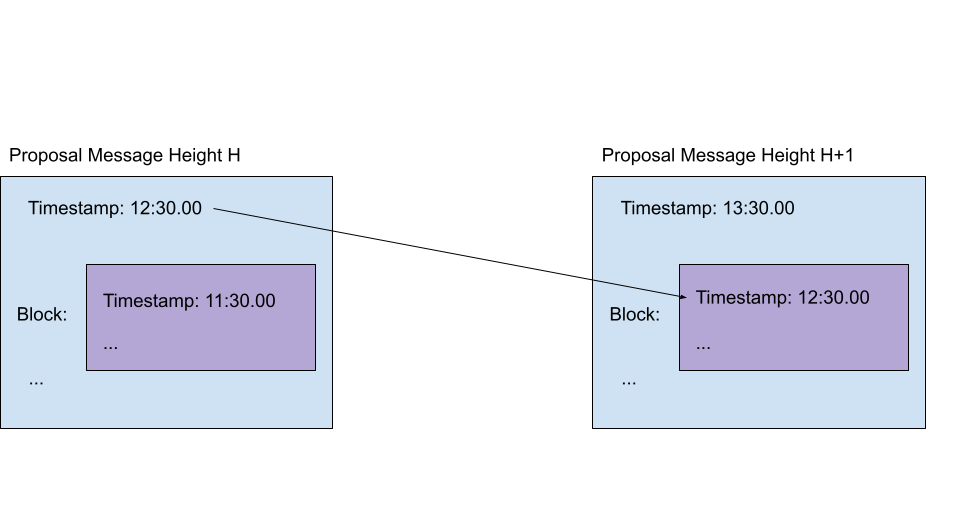

# ADR 71: Proposer-Based Timestamps

* [Changelog](#changelog)
* [Status](#status)
* [Context](#context)
* [Alternative Approaches](#alternative-approaches)
	* [Remove timestamps altogether](#remove-timestamps-altogether)
* [Decision](#decision)
* [Detailed Design](#detailed-design)
	* [Overview](#overview)
	* [Proposal Timestamp and Block Timestamp](#proposal-timestamp-and-block-timestamp)
	* [Saving the timestamp across heights](#saving-the-timestamp-across-heights)
	* [Changes to `CommitSig`](#changes-to-commitsig)
	* [Changes to `Commit`](#changes-to-commit)
	* [Changes to `Vote` messages](#changes-to-vote-messages)
	* [New consensus parameters](#new-consensus-parameters)
	* [Changes to `Header`](#changes-to-header)
	* [Changes to the block proposal step](#changes-to-the-block-proposal-step)
		* [Proposer selects proposal timestamp](#proposer-selects-proposal-timestamp)
		* [Proposer selects block timestamp](#proposer-selects-block-timestamp)
		* [Proposer waits](#proposer-waits)
		* [Changes to the propose step timeout](#changes-to-the-propose-step-timeout)
	* [Changes to validation rules](#changes-to-validation-rules)
		* [Proposal timestamp validation](#proposal-timestamp-validation)
		* [Block timestamp validation](#block-timestamp-validation)
	* [Changes to the prevote step](#changes-to-the-prevote-step)
	* [Changes to the precommit step](#changes-to-the-precommit-step)
	* [Changes to locking a block](#changes-to-locking-a-block)
	* [Remove voteTime Completely](#remove-votetime-completely)
* [Future Improvements](#future-improvements)
* [Consequences](#consequences)
	* [Positive](#positive)
	* [Neutral](#neutral)
	* [Negative](#negative)
* [References](#references)

## Changelog

 - July 15 2021: Created by @williambanfield 
 - Aug 4 2021: Draft completed by @williambanfield
 - Aug 5 2021: Draft updated to include data structure changes by @williambanfield
 - Aug 20 2021: Language edits completed by @williambanfield

## Status

 **Accepted**

## Context

Tendermint currently provides a monotonically increasing source of time known as [BFTTime](https://github.com/tendermint/spec/blob/master/spec/consensus/bft-time.md).
This mechanism for producing a source of time is reasonably simple.
Each correct validator adds a timestamp to each `Precommit` message it sends.
The timestamp it sends is either the validator's current known Unix time or one millisecond greater than the previous block time, depending on which value is greater.
When a block is produced, the proposer chooses the block timestamp as the weighted median of the times in all of the `Precommit` messages the proposer received.
The weighting is proportional to the amount of voting power, or stake, a validator has on the network.
This mechanism for producing timestamps is both deterministic and byzantine fault tolerant.
 
This current mechanism for producing timestamps has a few drawbacks.
Validators do not have to agree at all on how close the selected block timestamp is to their own currently known Unix time.
Additionally, any amount of voting power `>1/3` may directly control the block timestamp.
As a result, it is quite possible that the timestamp is not particularly meaningful.

These drawbacks present issues in the Tendermint protocol.
Timestamps are used by light clients to verify blocks.
Light clients rely on correspondence between their own currently known Unix time and the block timestamp to verify blocks they see; 
However, their currently known Unix time may be greatly divergent from the block timestamp as a result of the limitations of `BFTTime`.

The proposer-based timestamps specification suggests an alternative approach for producing block timestamps that remedies these issues.
Proposer-based timestamps alter the current mechanism for producing block timestamps in two main ways:

1. The block proposer is amended to offer up its currently known Unix time as the timestamp for the next block. 
1. Correct validators only approve the proposed block timestamp if it is close enough to their own currently known Unix time. 

The result of these changes is a more meaningful timestamp that cannot be controlled by `<= 2/3` of the validator voting power. 
This document outlines the necessary code changes in Tendermint to implement the corresponding [proposer-based timestamps specification](https://github.com/tendermint/spec/tree/master/spec/consensus/proposer-based-timestamp).

## Alternative Approaches

### Remove timestamps altogether

Computer clocks are bound to skew for a variety of reasons.
Using timestamps in our protocol means either accepting the timestamps as not reliable or impacting the protocol’s liveness guarantees.
This design requires impacting the protocol’s liveness in order to make the timestamps more reliable.
An alternate approach is to remove timestamps altogether from the block protocol.
`BFTTime` is deterministic but may be arbitrarily inaccurate.
However, having a reliable source of time is quite useful for applications and protocols built on top of a blockchain.

We therefore decided not to remove the timestamp. 
Applications often wish for some transactions to occur on a certain day, on a regular period, or after some time following a different event.
All of these require some meaningful representation of agreed upon time.
The following protocols and application features require a reliable source of time:
* Tendermint Light Clients [rely on correspondence between their known time](https://github.com/tendermint/spec/blob/master/spec/light-client/verification/README.md#definitions-1) and the block time for block verification.
* Tendermint Evidence validity is determined [either in terms of heights or in terms of time](https://github.com/tendermint/spec/blob/8029cf7a0fcc89a5004e173ec065aa48ad5ba3c8/spec/consensus/evidence.md#verification).
* Unbonding of staked assets in the Cosmos Hub [occurs after a period of 21 days](https://github.com/cosmos/governance/blob/ce75de4019b0129f6efcbb0e752cd2cc9e6136d3/params-change/Staking.md#unbondingtime).
* IBC packets can use either a [timestamp or a height to timeout packet delivery](https://docs.cosmos.network/v0.43/ibc/overview.html#acknowledgements).

Finally, inflation distribution in the Cosmos Hub uses an approximation of time to calculate an annual percentage rate. 
This approximation of time is calculated using [block heights with an estimated number of blocks produced in a year](https://github.com/cosmos/governance/blob/master/params-change/Mint.md#blocksperyear). 
Proposer-based timestamps will allow this inflation calculation to use a more meaningful and accurate source of time.


## Decision

Implement proposer-based timestamps and remove `BFTTime`.

## Detailed Design

### Overview

Implementing proposer-based timestamps will require a few changes to Tendermint’s code.
These changes will be to the following components:
* The `internal/consensus/` package.
* The `state/` package.
* The `Vote`, `CommitSig`, `Commit` and `Header` types.
* The consensus parameters.

### Proposal Timestamp and Block Timestamp

This design discusses two timestamps: (1) The timestamp in the block and (2) the timestamp in the proposal message.
The existence and use of both of these timestamps can get a bit confusing, so some background is given here to clarify their uses.

The [proposal message currently has a timestamp](https://github.com/tendermint/tendermint/blob/e5312942e30331e7c42b75426da2c6c9c00ae476/types/proposal.go#L31).
This timestamp is the current Unix time known to the proposer when sending the `Proposal` message.
This timestamp is not currently used as part of consensus.
The changes in this ADR will begin using the proposal message timestamp as part of consensus.
We will refer to this as the **proposal timestamp** throughout this design.

The block has a timestamp field [in the header](https://github.com/tendermint/tendermint/blob/dc7c212c41a360bfe6eb38a6dd8c709bbc39aae7/types/block.go#L338).
This timestamp is set currently as part of Tendermint’s `BFTtime` algorithm.
It is set when a block is proposed and it is checked by the validators when they are deciding to prevote the block.
This field will continue to be used but the logic for creating and validating this timestamp will change.
We will refer to this as the **block timestamp** throughout this design.

At a high level, the proposal timestamp from height `H` is used as the block timestamp at height `H+1`.
The following image shows this relationship.
The rest of this document describes the code changes that will make this possible.



### Saving the timestamp across heights

Currently, `BFTtime` uses `LastCommit` to construct the block timestamp.
The `LastCommit` is created at height `H-1` and is saved in the state store to be included in the block at height `H`.
`BFTtime` takes the weighted median of the timestamps in `LastCommit.CommitSig` to build the timestamp for height `H`. 

For proposer-based timestamps, the `LastCommit.CommitSig` timestamps will no longer be used to build the timestamps for height `H`.
Instead, the proposal timestamp from height `H-1` will become the block timestamp for height `H`.
To enable this, we will add a `Timestamp` field to the `Commit` struct.
This field will be populated at each height with the proposal timestamp decided on at the previous height.
This timestamp will also be saved with the rest of the commit in the state store [when the commit is finalized](https://github.com/tendermint/tendermint/blob/e8013281281985e3ada7819f42502b09623d24a0/internal/consensus/state.go#L1611) so that it can be recovered if Tendermint crashes.
Changes to the `CommitSig` and `Commit` struct are detailed below. 

### Changes to `CommitSig`

The [CommitSig](https://github.com/tendermint/tendermint/blob/a419f4df76fe4aed668a6c74696deabb9fe73211/types/block.go#L604) struct currently contains a timestamp. 
This timestamp is the current Unix time known to the validator when it issued a `Precommit` for the block.
This timestamp is no longer used and will be removed in this change.

`CommitSig` will be updated as follows:

```diff
type CommitSig struct {
	BlockIDFlag      BlockIDFlag `json:"block_id_flag"`
	ValidatorAddress Address     `json:"validator_address"`
--	Timestamp        time.Time   `json:"timestamp"`
	Signature        []byte      `json:"signature"`
}
```

### Changes to `Commit`

The [Commit](https://github.com/tendermint/tendermint/blob/a419f4df76fe4aed668a6c74696deabb9fe73211/types/block.go#L746) struct does not currently contain a timestamp. 
The timestamps in the `Commit.CommitSig` entries are currently used to build the block timestamp.
With these timestamps removed, the commit time will instead be stored in the `Commit` struct.

`Commit` will be updated as follows. 

```diff
type Commit struct {
	Height     int64       `json:"height"`
	Round      int32       `json:"round"`
++	Timestamp  time.Time  `json:"timestamp"` 
	BlockID    BlockID     `json:"block_id"`
	Signatures []CommitSig `json:"signatures"`
}
```

### Changes to `Vote` messages

`Precommit` and `Prevote` messages use a common [Vote struct](https://github.com/tendermint/tendermint/blob/a419f4df76fe4aed668a6c74696deabb9fe73211/types/vote.go#L50).
This struct currently contains a timestamp.
This timestamp is set using the [voteTime](https://github.com/tendermint/tendermint/blob/e8013281281985e3ada7819f42502b09623d24a0/internal/consensus/state.go#L2241) function and therefore vote times correspond to the current Unix time known to the validator.
For precommits, this timestamp is used to construct the [CommitSig that is included in the block in the LastCommit](https://github.com/tendermint/tendermint/blob/e8013281281985e3ada7819f42502b09623d24a0/types/block.go#L754) field.
For prevotes, this field is unused.
Proposer-based timestamps will use the [RoundState.Proposal](https://github.com/tendermint/tendermint/blob/c3ae6f5b58e07b29c62bfdc5715b6bf8ae5ee951/internal/consensus/types/round_state.go#L76) timestamp to construct the `signedBytes` `CommitSig`.
This timestamp is therefore no longer useful and will be dropped.

`Vote` will be updated as follows:

```diff
type Vote struct {
	Type             tmproto.SignedMsgType `json:"type"`
	Height           int64                 `json:"height"`
	Round            int32                 `json:"round"`    
	BlockID          BlockID               `json:"block_id"` // zero if vote is nil.
--	Timestamp        time.Time             `json:"timestamp"`
	ValidatorAddress Address               `json:"validator_address"`
	ValidatorIndex   int32                 `json:"validator_index"`
	Signature        []byte                `json:"signature"`
}
```

### New consensus parameters

The proposer-based timestamp specification includes multiple new parameters that must be the same among all validators.
These parameters are `PRECISION`, `MSGDELAY`, and `ACCURACY`.

The `PRECISION` and `MSGDELAY` parameters are used to determine if the proposed timestamp is acceptable.
A validator will only Prevote a proposal if the proposal timestamp is considered `timely`.
A proposal timestamp is considered `timely` if it is within `PRECISION` and `MSGDELAY` of the Unix time known to the validator.
More specifically, a proposal timestamp is `timely` if `validatorLocalTime - PRECISION < proposalTime < validatorLocalTime + PRECISION + MSGDELAY`. 

Because the `PRECISION` and `MSGDELAY` parameters must be the same across all validators, they will be added to the [consensus parameters](https://github.com/tendermint/tendermint/blob/master/proto/tendermint/types/params.proto#L13) as [durations](https://developers.google.com/protocol-buffers/docs/reference/google.protobuf#google.protobuf.Duration).

The proposer-based timestamp specification also includes a [new ACCURACY parameter](https://github.com/tendermint/spec/blob/master/spec/consensus/proposer-based-timestamp/pbts-sysmodel_001_draft.md#pbts-clocksync-external0).
Intuitively, `ACCURACY` represents the difference between the ‘real’ time and the currently known time of correct validators.
The currently known Unix time of any validator is always somewhat different from real time.
`ACCURACY` is the largest such difference between each validator's time and real time taken as an absolute value. 
This is not something a computer can determine on its own and must be specified as an estimate by community running a Tendermint-based chain.
It is used in the new algorithm to [calculate a timeout for the propose step](https://github.com/tendermint/spec/blob/master/spec/consensus/proposer-based-timestamp/pbts-algorithm_001_draft.md#pbts-alg-startround0).
`ACCURACY` is assumed to be the same across all validators and therefore should be included as a consensus parameter.

The consensus will be updated to include this `Timestamp` field as follows:

```diff
type ConsensusParams struct {
	Block     BlockParams     `json:"block"`
	Evidence  EvidenceParams  `json:"evidence"`
	Validator ValidatorParams `json:"validator"`
	Version   VersionParams   `json:"version"`
++	Timestamp TimestampParams `json:"timestamp"`
}
```

```go
type TimestampParams struct {
	Accuracy  time.Duration `json:"accuracy"`
	Precision time.Duration `json:"precision"`
	MsgDelay  time.Duration `json:"msg_delay"`
}
```

### Changes to `Header`

The [Header](https://github.com/tendermint/tendermint/blob/a419f4df76fe4aed668a6c74696deabb9fe73211/types/block.go#L338) struct currently contains a timestamp.
This timestamp is set as the `BFTtime` derived from the block's `LastCommit.CommitSig` timestamps.
This timestamp will no longer be derived from the `LastCommit.CommitSig` timestamps and will instead be included directly into the block's `LastCommit`.
This timestamp will therfore be identical in both the `Header` and the `LastCommit`.
To clarify that the timestamp in the header corresponds to the `LastCommit`'s time, we will rename this timestamp field to `last_timestamp`.

`Header` will be updated as follows:

```diff
type Header struct {
	// basic block info
	Version       version.Consensus `json:"version"`
	ChainID       string            `json:"chain_id"`
	Height        int64             `json:"height"`
--	Time          time.Time         `json:"time"`
++	LastTimestamp time.Time         `json:"last_timestamp"`

	// prev block info
	LastBlockID BlockID `json:"last_block_id"`

	// hashes of block data
	LastCommitHash tmbytes.HexBytes `json:"last_commit_hash"`
	DataHash       tmbytes.HexBytes `json:"data_hash"`

	// hashes from the app output from the prev block
	ValidatorsHash     tmbytes.HexBytes `json:"validators_hash"`
	NextValidatorsHash tmbytes.HexBytes `json:"next_validators_hash"`
	ConsensusHash      tmbytes.HexBytes `json:"consensus_hash"`
	AppHash            tmbytes.HexBytes `json:"app_hash"`

	// root hash of all results from the txs from the previous block
	LastResultsHash tmbytes.HexBytes `json:"last_results_hash"`

	// consensus info
	EvidenceHash    tmbytes.HexBytes `json:"evidence_hash"`
	ProposerAddress Address          `json:"proposer_address"`
}
```

### Changes to the block proposal step

#### Proposer selects proposal timestamp

The proposal logic already [sets the Unix time known to the validator](https://github.com/tendermint/tendermint/blob/2abfe20114ee3bb3adfee817589033529a804e4d/types/proposal.go#L44) into the `Proposal` message.
This satisfies the proposer-based timestamp specification and does not need to change. 

#### Proposer selects block timestamp

The proposal timestamp that was decided in height `H-1` will be stored in the `State` struct's in the `RoundState.LastCommit` field.
The proposer will select this timestamp to use as the block timestamp at height `H`.

#### Proposer waits

Block timestamps must be monotonically increasing.
In `BFTTime`, if a validator’s clock was behind, the [validator added 1 millisecond to the previous block’s time and used that in its vote messages](https://github.com/tendermint/tendermint/blob/e8013281281985e3ada7819f42502b09623d24a0/internal/consensus/state.go#L2246).
A goal of adding proposer-based timestamps is to enforce some degree of clock synchronization, so having a mechanism that completely ignores the Unix time of the validator time no longer works.

Validator clocks will not be perfectly in sync.
Therefore, the proposer’s current known Unix time may be less than the `LastCommit.Timestamp`.
If the proposer’s current known Unix time is less than the `LastCommit.Timestamp`, the proposer will sleep until its known Unix time exceeds `LastCommit.Timestamp`.

This change will require amending the [defaultDecideProposal](https://github.com/tendermint/tendermint/blob/822893615564cb20b002dd5cf3b42b8d364cb7d9/internal/consensus/state.go#L1180) method.
This method should now block until the proposer’s time is greater than `LastCommit.Timestamp`.

#### Changes to the propose step timeout

Currently, a validator waiting for a proposal will proceed past the propose step if the configured propose timeout is reached and no proposal is seen.
Proposer-based timestamps requires changing this timeout logic. 

The proposer will now wait until its current known Unix time exceeds the `LastCommit.Timestamp` to propose a block.
The validators must now take this and some other factors into account when deciding when to timeout the propose step.
Specifically, the propose step timeout must also take into account potential inaccuracy in the validator’s clock and in the clock of the proposer.
Additionally, there may be a delay communicating the proposal message from the proposer to the other validators. 

Therefore, validators waiting for a proposal must wait until after the `LastCommit.Timestamp` before timing out.
To account for possible inaccuracy in its own clock, inaccuracy in the proposer’s clock, and message delay, validators waiting for a proposal will wait until `LastCommit.Timesatmp + 2*ACCURACY + MSGDELAY`.
 The spec defines this as `waitingTime`.
 
The [propose step’s timeout is set in enterPropose](https://github.com/tendermint/tendermint/blob/822893615564cb20b002dd5cf3b42b8d364cb7d9/internal/consensus/state.go#L1108) in `state.go`. 
`enterPropose` will be changed to calculate waiting time using the new consensus parameters.
The timeout in `enterPropose` will then be set as the maximum of `waitingTime` and the [configured proposal step timeout](https://github.com/tendermint/tendermint/blob/dc7c212c41a360bfe6eb38a6dd8c709bbc39aae7/config/config.go#L1013).

### Changes to validation rules

The rules for validating that a proposal is valid will need slight modification to implement proposer-based timestamps.
Specifically, we will change the validation logic to ensure that the proposal timestamp is `timely` and we will modify the way the block timestamp is validated as well.

#### Proposal timestamp validation

Adding proposal timestamp validation is a reasonably straightforward change.
The current Unix time known to the proposer is already included in the [Proposal message](https://github.com/tendermint/tendermint/blob/dc7c212c41a360bfe6eb38a6dd8c709bbc39aae7/types/proposal.go#L31).
Once the proposal is received, the complete message is stored in the `RoundState.Proposal` field.
The precommit and prevote validation logic does not currently use this timestamp.
This validation logic will be updated to check that the proposal timestamp is within `PRECISION` of the current Unix time known to the validators.
If the timestamp is not within `PRECISION` of the current Unix time known to the validator, the proposal will not be considered it valid.
The validator will also check that the proposal time is greater than the block timestamp from the previous height.

If no valid proposal is received by the proposal timeout, the validator will prevote nil.
This is identical to the current logic.

#### Block timestamp validation

The [validBlock function](https://github.com/tendermint/tendermint/blob/c3ae6f5b58e07b29c62bfdc5715b6bf8ae5ee951/state/validation.go#L14) currently [validates the proposed block timestamp in three ways](https://github.com/tendermint/tendermint/blob/c3ae6f5b58e07b29c62bfdc5715b6bf8ae5ee951/state/validation.go#L118).
First, the validation logic checks that this timestamp is greater than the previous block’s timestamp.
Additionally, it validates that the block timestamp is correctly calculated as the weighted median of the timestamps in the [block’s LastCommit](https://github.com/tendermint/tendermint/blob/e8013281281985e3ada7819f42502b09623d24a0/types/block.go#L48).
Finally, the logic also authenticates the timestamps in the `LastCommit`.
The cryptographic signature in each `CommitSig` is created by signing a hash of fields in the block with the validator’s private key.
One of the items in this `signedBytes` hash is derived from the timestamp in the `CommitSig`.
To authenticate the `CommitSig` timestamp, the validator builds a hash of fields that includes the timestamp and checks this hash against the provided signature. 
This takes place in the [VerifyCommit function](https://github.com/tendermint/tendermint/blob/e8013281281985e3ada7819f42502b09623d24a0/types/validation.go#L25).

The logic to validate that the block timestamp is greater than the previous block’s timestamp also works for proposer-based timestamps and will not change.

`BFTTime` validation is no longer applicable and will be removed.
Validators will no longer check that the block timestamp is a weighted median of `LastCommit` timestamps.
This will mean removing the call to [MedianTime in the validateBlock function](https://github.com/tendermint/tendermint/blob/4db71da68e82d5cb732b235eeb2fd69d62114b45/state/validation.go#L117).
The `MedianTime` function can be completely removed. 
The `LastCommit` timestamps may also be removed. 

The `signedBytes` validation logic in `VerifyCommit` will be slightly altered.
The `CommitSig`s in the block’s `LastCommit` will no longer each contain a timestamp.
The validation logic will instead include the `LastCommit.Timestamp` in the hash of fields for generating the `signedBytes`.
The cryptographic signatures included in the `CommitSig`s will then be checked against this `signedBytes` hash to authenticate the timestamp.
Specifically, the `VerifyCommit` function will be updated to use this new timestamp.  

### Changes to the prevote step

Currently, a validator will prevote a proposal in one of three cases:

* Case 1:  Validator has no locked block and receives a valid proposal.
* Case 2:  Validator has a locked block and receives a valid proposal matching its locked block.
* Case 3:  Validator has a locked block, sees a valid proposal not matching its locked block but sees +⅔ prevotes for the new proposal’s block. 

The only change we will make to the prevote step is to what a validator considers a valid proposal as detailed above.

### Changes to the precommit step

The precommit step will not require much modification.
Its proposal validation rules will change in the same ways that validation will change in the prevote step.

### Changes to locking a block
When a validator receives a valid proposed block and +2/3 prevotes for that block, it stores the block as its ‘locked block’ in the [RoundState.ValidBlock](https://github.com/tendermint/tendermint/blob/e8013281281985e3ada7819f42502b09623d24a0/internal/consensus/types/round_state.go#L85) field.
In each subsequent round it will prevote that block.
A validator will only change which block it has locked if it sees +2/3 prevotes for a different block.

This mechanism will remain largely unchanged.
The only difference is the addition of proposal timestamp validation.
A validator will prevote nil in a round if the proposal message it received is not `timely`.
Prevoting nil in this case will not cause a validator to ‘unlock’ its locked block.
This difference is an incidental result of the changes to prevote validation.
It is included in this design for completeness and to clarify that no additional changes will be made to block locking. 

### Remove voteTime Completely

[voteTime](https://github.com/tendermint/tendermint/blob/822893615564cb20b002dd5cf3b42b8d364cb7d9/internal/consensus/state.go#L2229) is a mechanism for calculating the next `BFTTime` given both the validator's current known Unix time and the previous block timestamp.
If the previous block timestamp is greater than the validator's current known Unix time, then voteTime returns a value one millisecond greater than the previous block timestamp.
This logic is used in multiple places and is no longer needed for proposer-based timestamps.
It should therefore be removed completely.

## Future Improvements

* Implement BLS signature aggregation.
By removing fields from the `Precommit` messages, we are able to aggregate signatures.

## Consequences

### Positive

* `<2/3` of validators can no longer influence block timestamps.
* Block timestamp will have stronger correspondence to real time.
* Improves the reliability of light client block verification.
* Enables BLS signature aggregation.
* Enables evidence handling to use time instead of height for evidence validity.

### Neutral

* Alters Tendermint’s liveness properties.
Liveness now requires that all correct validators have synchronized clocks within a bound.
Liveness will now also require that validators’ clocks move forward, which was not required under `BFTTime`.

### Negative

* May increase the length of the propose step if there is a large skew between the previous proposer and the current proposer’s local Unix time.
This skew will be bound by the `PRECISION` value, so it is unlikely to be too large.

* Current chains with block timestamps far in the future will either need to pause consensus until after the erroneous block timestamp or must maintain synchronized but very inaccurate clocks.

## References

* [PBTS Spec](https://github.com/tendermint/spec/tree/master/spec/consensus/proposer-based-timestamp)
* [BFTTime spec](https://github.com/tendermint/spec/blob/master/spec/consensus/bft-time.md)
