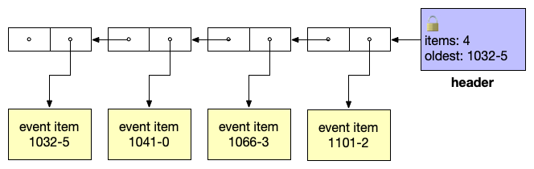
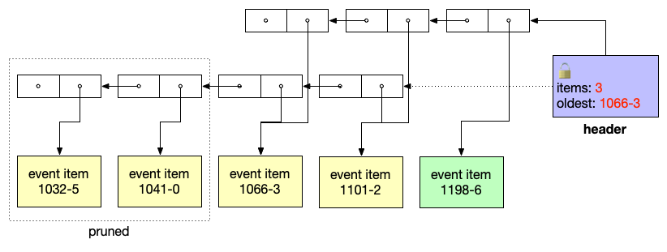

# ADR 075: RPC Event Subscription Interface

## Changelog

- 01-Mar-2022: Update long-polling interface (@creachadair).
- 10-Feb-2022: Updates to reflect implementation.
- 26-Jan-2022: Marked accepted.
- 22-Jan-2022: Updated and expanded (@creachadair).
- 20-Nov-2021: Initial draft (@creachadair).

---
## Status

Accepted

---
## Background & Context

For context, see [RFC 006: Event Subscription][rfc006].

The [Tendermint RPC service][rpc-service] permits clients to subscribe to the
event stream generated by a consensus node. This allows clients to observe the
state of the consensus network, including details of the consensus algorithm
state machine, proposals, transaction delivery, and block completion. The
application may also attach custom key-value attributes to events to expose
application-specific details to clients.

The event subscription API in the RPC service currently comprises three methods:

1. `subscribe`: A request to subscribe to the events matching a specific
   [query expression][query-grammar]. Events can be filtered by their key-value
   attributes, including custom attributes provided by the application.

2. `unsubscribe`: A request to cancel an existing subscription based on its
   query expression.

3. `unsubscribe_all`: A request to cancel all existing subscriptions belonging
   to the client.

There are some important technical and UX issues with the current RPC event
subscription API. The rest of this ADR outlines these problems in detail, and
proposes a new API scheme intended to address them.

### Issue 1: Persistent connections

To subscribe to a node's event stream, a client needs a persistent connection
to the node.  Unlike the other methods of the service, for which each call is
serviced by a short-lived HTTP round trip, subscription delivers a continuous
stream of events to the client by hijacking the HTTP channel for a websocket.
The stream (and hence the HTTP request) persists until either the subscription
is explicitly canceled, or the connection is closed.

There are several problems with this API:

1. **Expensive per-connection state**: The server must maintain a substantial
   amount of state per subscriber client:

   - The current implementation uses a [WebSocket][ws] for each active
     subscriber. The connection must be maintained even if there are no
     matching events for a given client.

     The server can drop idle connections to save resources, but doing so
     terminates all subscriptions on those connections and forces those clients
     to re-connect, adding additional resource churn for the server.

   - In addition, the server maintains a separate buffer of undelivered events
     for each client.  This is to reduce the dual risks that a client will miss
     events, and that a slow client could "push back" on the publisher,
     impeding the progress of consensus.

     Because event traffic is quite bursty, queues can potentially take up a
     lot of memory. Moreover, each subscriber may have a different filter
     query, so the server winds up having to duplicate the same events among
     multiple subscriber queues. Not only does this add memory pressure, but it
     does so most at the worst possible time, i.e., when the server is already
     under load from high event traffic.

2. **Operational access control is difficult**: The server's websocket
   interface exposes _all_ the RPC service endpoints, not only the subscription
   methods.  This includes methods that allow callers to inject arbitrary
   transactions (`broadcast_tx_*`) and evidence (`broadcast_evidence`) into the
   network, remove transactions (`remove_tx`), and request arbitrary amounts of
   chain state.

   Filtering requests to the GET endpoint is straightforward: A reverse proxy
   like [nginx][nginx] can easily filter methods by URL path. Filtering POST
   requests takes a bit more work, but can be managed with a filter program
   that speaks [FastCGI][fcgi] and parses JSON-RPC request bodies.

   Filtering the websocket interface requires a dedicated proxy implementation.
   Although nginx can [reverse-proxy websockets][rp-ws], it does not support
   filtering websocket traffic via FastCGI. The operator would need to either
   implement a custom [nginx extension module][ng-xm] or build and run a
   standalone proxy that implements websocket and filters each session.  Apart
   from the work, this also makes the system even more resource intensive, as
   well as introducing yet another connection that could potentially time out
   or stall on full buffers.

   Even for the simple case of restricting access to only event subscription,
   there is no easy solution currently: Once a caller has access to the
   websocket endpoint, it has complete access to the RPC service.

### Issue 2: Inconvenient client API

The subscription interface has some inconvenient features for the client as
well as the server. These include:

1. **Non-standard protocol:** The RPC service is mostly [JSON-RPC 2.0][jsonrpc2],
   but the subscription interface diverges from the standard.

   In a standard JSON-RPC 2.0 call, the client initiates a request to the
   server with a unique ID, and the server concludes the call by sending a
   reply for that ID. The `subscribe` implementation, however, sends multiple
   responses to the client's request:

   - The client sends `subscribe` with some ID `x` and the desired query

   - The server responds with ID `x` and an empty confirmation response.

   - The server then (repeatedly) sends event result responses with ID `x`, one
     for each item with a matching event.

   Standard JSON-RPC clients will reject the subsequent replies, as they
   announce a request ID (`x`) that is already complete. This means a caller
   has to implement Tendermint-specific handling for these responses.

   Moreover, the result format is different between the initial confirmation
   and the subsequent responses.  This means a caller has to implement special
   logic for decoding the first response versus the subsequent ones.

2. **No way to detect data loss:** The subscriber connection can be terminated
   for many reasons. Even ignoring ordinary network issues (e.g., packet loss):

   - The server will drop messages and/or close the websocket if its write
     buffer fills, or if the queue of undelivered matching events is not
     drained fast enough. The client has no way to discover that messages were
     dropped even if the connection remains open.

   - Either the client or the server may close the websocket if the websocket
     PING and PONG exchanges are not handled correctly, or frequently enough.
     Even if correctly implemented, this may fail if the system is under high
     load and cannot service those control messages in a timely manner.

   When the connection is terminated, the server drops all the subscriptions
   for that client (as if it had called `unsubscribe_all`). Even if the client
   reconnects, any events that were published during the period between the
   disconnect and re-connect and re-subscription will be silently lost, and the
   client has no way to discover that it missed some relevant messages.

3. **No way to replay old events:** Even if a client knew it had missed some
   events (due to a disconnection, for example), the API provides no way for
   the client to "play back" events it may have missed.

4. **Large response sizes:** Some event data can be quite large, and there can
   be substantial duplication across items. The API allows the client to select
   _which_ events are reported, but has no way to control which parts of a
   matching event it wishes to receive.

   This can be costly on the server (which has to marshal those data into
   JSON), the network, and the client (which has to unmarshal the result and
   then pick through for the components that are relevant to it).

   Besides being inefficient, this also contributes to some of the persistent
   connection issues mentioned above, e.g., filling up the websocket write
   buffer and forcing the server to queue potentially several copies of a large
   value in memory.

5. **Client identity is tied to network address:** The Tendermint event API
   identifies each subscriber by a (Client ID, Query) pair. In the RPC service,
   the query is provided by the client, but the client ID is set to the TCP
   address of the client (typically "host:port" or "ip:port").

   This means that even if the server did _not_ drop subscriptions immediately
   when the websocket connection is closed, a client may not be able to
   reattach to its existing subscription.  Dialing a new connection is likely
   to result in a different port (and, depending on their own proxy setup,
   possibly a different public IP).

   In isolation, this problem would be easy to work around with a new
   subscription parameter, but it would require several other changes to the
   handling of event subscriptions for that workaround to become useful.

---
## Decision

To address the described problems, we will:

1. Introduce a new API for event subscription to the Tendermint RPC service.
   The proposed API is described in [Detailed Design](#detailed-design) below.

2. This new API will target the Tendermint v0.36 release, during which the
   current ("streaming") API will remain available as-is, but deprecated.

3. The streaming API will be entirely removed in release v0.37, which will
   require all users of event subscription to switch to the new API.

> **Point for discussion:** Given that ABCI++ and PBTS are the main priorities
> for v0.36, it would be fine to slip the first phase of this work to v0.37.
> Unless there is a time problem, however, the proposed design does not disrupt
> the work on ABCI++ or PBTS, and will not increase the scope of breaking
> changes. Therefore the plan is to begin in v0.36 and slip only if necessary.

---
## Detailed Design

### Design Goals

Specific goals of this design include:

1. Remove the need for a persistent connection to each subscription client.
   Subscribers should use the same HTTP request flow for event subscription
   requests as for other RPC calls.

2. The server retains minimal state (possibly none) per-subscriber.  In
   particular:

   - The server does not buffer unconsumed writes nor queue undelivered events
     on a per-client basis.
   - A client that stalls or goes idle does not cost the server any resources.
   - Any event data that is buffered or stored is shared among _all_
     subscribers, and is not duplicated per client.

3. Slow clients have no impact (or minimal impact) on the rate of progress of
   the consensus algorithm, beyond the ambient overhead of servicing individual
   RPC requests.

4. Clients can tell when they have missed events matching their subscription,
   within some reasonable (configurable) window of time, and can "replay"
   events within that window to catch up.

5. Nice to have: It should be easy to use the event subscription API from
   existing standard tools and libraries, including command-line use for
   testing and experimentation.

### Definitions

- The **event stream** of a node is a single, time-ordered, heterogeneous
  stream of event items.

- Each **event item** comprises an **event datum** (for example, block header
  metadata for a new-block event), and zero or more optional **events**.

- An **event** means the [ABCI `Event` data type][abci-event], which comprises
  a string type and zero or more string key-value **event attributes**.

  The use of the new terms "event item" and "event datum" is to avert confusion
  between the values that are published to the event bus (what we call here
  "event items") and the ABCI `Event` data type.

- The node assigns each event item a unique identifier string called a
  **cursor**.  A cursor must be unique among all events published by a single
  node, but it is not required to be unique globally across nodes.

  Cursors are time-ordered so that given event items A and B, if A was
  published before B, then cursor(A) < cursor(B) in lexicographic order.

  A minimum viable cursor implementation is a tuple consisting of a timestamp
  and a sequence number (e.g., `16CCC798FB5F4670-0123`). However, it may also
  be useful to append basic type information to a cursor, to allow efficient
  filtering (e.g., `16CCC87E91869050-0091:BeginBlock`).

  The initial implementation will use the minimum viable format.

### Discussion

The node maintains an **event log**, a shared ordered record of the events
published to its event bus within an operator-configurable time window.  The
initial implementation will store the event log in-memory, and the operator
will be given two per-node configuration settings.  Note, these names are
provisional:

- `[rpc] event-log-window-size`: A duration before the latest published event,
  during which the node will retain event items published. Setting this value
  to zero disables event subscription.

- `[rpc] event-log-max-items`: A maximum number of event items that the node
  will retain within the time window. If the number of items exceeds this
  value, the node discardes the oldest items in the window. Setting this value
  to zero means that no limit is imposed on the number of items.

The node will retain all events within the time window, provided they do not
exceed the maximum number.  These config parameters allow the operator to
loosely regulate how much memory and storage the node allocates to the event
log. The client can use the server reply to tell whether the events it wants
are still available from the event log.

The event log is shared among all subscribers to the node.

> **Discussion point:** Should events persist across node restarts?
>
> The current event API does not persist events across restarts, so this new
> design does not either. Note, however, that we may "spill" older event data
> to disk as a way of controlling memory use. Such usage is ephemeral, however,
> and does not need to be tracked as node data (e.g., it could be temp files).

### Query API

To retrieve event data, the client will call the (new) RPC method `events`.
The parameters of this method will correspond to the following Go types:

```go
type EventParams struct {
    // Optional filter spec. If nil or empty, all items are eligible.
    Filter *Filter `json:"filter"`

    // The maximum number of eligible results to return.
    // If zero or negative, the server will report a default number.
    MaxResults int `json:"max_results"`

    // Return only items after this cursor. If empty, the limit is just
    // before the the beginning of the event log.
    After string `json:"after"`

    // Return only items before this cursor.  If empty, the limit is just
    // after the head of the event log.
    Before string `json:"before"`

    // Wait for up to this long for events to be available.
    WaitTime time.Duration `json:"wait_time"`
}

type Filter struct {
    Query string `json:"query"`
}
```

> **Discussion point:** The initial implementation will not cache filter
> queries for the client. If this turns out to be a performance issue in
> production, the service can keep a small shared cache of compiled queries.
> Given the improvements from #7319 et seq., this should not be necessary.

> **Discussion point:** For the initial implementation, the new API will use
> the existing query language as-is. Future work may extend the Filter message
> with a more structured and/or expressive query surface, but that is beyond
> the scope of this design.

The semantics of the request are as follows: An item in the event log is
**eligible** for a query if:

- It is newer than the `after` cursor (if set).
- It is older than the `before` cursor (if set).
- It matches the filter (if set).

Among the eligible items in the log, the server returns up to `max_results` of
the newest items, in reverse order of cursor. If `max_results` is unset the
server chooses a number to return, and will cap `max_results` at a sensible
limit.

The `wait_time` parameter is used to effect polling. If `before` is empty and
no items are available, the server will wait for up to `wait_time` for matching
items to arrive at the head of the log. If `wait_time` is zero or negative, the
server will wait for a default (positive) interval.

If `before` non-empty, `wait_time` is ignored: new results are only added to
the head of the log, so there is no need to wait.  This allows the client to
poll for new data, and "page" backward through matching event items. This is
discussed in more detail below.

The server will set a sensible cap on the maximum `wait_time`, overriding
client-requested intervals longer than that.

A successful reply from the `events` request corresponds to the following Go
types:

```go
type EventReply struct {
    // The items matching the request parameters, from newest
    // to oldest, if any were available within the timeout.
    Items []*EventItem `json:"items"`

    // This is true if there is at least one older matching item
    // available in the log that was not returned.
    More bool `json:"more"`

    // The cursor of the oldest item in the log at the time of this reply,
    // or "" if the log is empty.
    Oldest string `json:"oldest"`

    // The cursor of the newest item in the log at the time of this reply,
    // or "" if the log is empty.
    Newest string `json:"newest"`
}

type EventItem struct {
    // The cursor of this item.
    Cursor string `json:"cursor"`

    // The encoded event data for this item.
    // The type identifies the structure of the value.
    Data struct {
        Type  string          `json:"type"`
        Value json.RawMessage `json:"value"`
    } `json:"data"`
}
```

The `oldest` and `newest` fields of the reply report the cursors of the oldest
and newest items (of any kind) recorded in the event log at the time of the
reply, or are `""` if the log is empty.

The `data` field contains the type-specific event datum.  The datum carries any
ABCI events that may have been defined.

> **Discussion point**: Based on [issue #7273][i7273], I did not include a
> separate field in the response for the ABCI events, since it duplicates data
> already stored elsewhere in the event data.

The semantics of the reply are as follows:

- If `items` is non-empty:

    - Items are ordered from newest to oldest.

    - If `more` is true, there is at least one additional, older item in the
      event log that was not returned (in excess of `max_results`).

      In this case the client can fetch the next page by setting `before` in a
      new request, to the cursor of the oldest item fetched (i.e., the last one
      in `items`).

    - Otherwise (if `more` is false), all the matching results have been
      reported (pagination is complete).

    - The first element of `items` identifies the newest item considered.
      Subsequent poll requests can set `after` to this cursor to skip items
      that were already retrieved.

- If `items` is empty:

    - If the `before` was set in the request, there are no further eligible
      items for this query in the log (pagination is complete).

      This is just a safety case; the client can detect this without issuing
      another call by consulting the `more` field of the previous reply.

    - If the `before` was empty in the request, no eligible items were
      available before the `wait_time` expired. The client may poll again to
      wait for more event items.

A client can store cursor values to detect data loss and to recover from
crashes and connectivity issues:

- After a crash, the client requests events after the newest cursor it has
  seen.  If the reply indicates that cursor is no longer in range, the client
  may (conservatively) conclude some event data may have been lost.

- On the other hand, if it _is_ in range, the client can then page back through
  the results that it missed, and then resume polling. As long as its recovery
  cursor does not age out before it finishes, the client can be sure it has all
  the relevant results.

### Other Notes

- The new API supports two general "modes" of operation:

  1. In ordinary operation, clients will **long-poll** the head of the event
     log for new events matching their criteria (by setting a `wait_time` and
     no `before`).

  2. If there are more events than the client requested, or if the client needs
     to to read older events to recover from a stall or crash, clients will
     **page** backward through the event log (by setting `before` and `after`).

- While the new API requires explicit polling by the client, it makes better
  use of the node's existing HTTP infrastructure (e.g., connection pools).
  Moreover, the direct implementation is easier to use from standard tools and
  client libraries for HTTP and JSON-RPC.

  Explicit polling does shift the burden of timeliness to the client.  That is
  arguably preferable, however, given that the RPC service is ancillary to the
  node's primary goal, viz., consensus. The details of polling can be easily
  hidden from client applications with simple libraries.

- The format of a cursor is considered opaque to the client. Clients must not
  parse cursor values, but they may rely on their ordering properties.

- To maintain the event log, the server must prune items outside the time
  window and in excess of the item limit.

  The initial implementation will do this by checking the tail of the event log
  after each new item is published. If the number of items in the log exceeds
  the item limit, it will delete oldest items until the log is under the limit;
  then discard any older than the time window before the latest.

  To minimize coordination interference between the publisher (the event bus)
  and the subcribers (the `events` service handlers), the event log will be
  stored as a persistent linear queue with shared structure (a cons list).  A
  single reader-writer mutex will guard the "head" of the queue where new
  items are published:

  - **To publish a new item**, the publisher acquires the write lock, conses a
    new item to the front of the existing queue, and replaces the head pointer
    with the new item.

  - **To scan the queue**, a reader acquires the read lock, captures the head
    pointer, and then releases the lock. The rest of its request can be served
    without holding a lock, since the queue structure will not change.

	When a reader wants to wait, it will yield the lock and wait on a condition
	that is signaled when the publisher swings the pointer.

  - **To prune the queue**, the publisher (who is the sole writer) will track
    the queue length and the age of the oldest item separately.  When the
    length and or age exceed the configured bounds, it will construct a new
    queue spine on the same items, discarding out-of-band values.

    Pruning can be done while the publisher already holds the write lock, or
    could be done outside the lock entirely: Once the new queue is constructed,
    the lock can be re-acquired to swing the pointer. This costs some extra
    allocations for the cons cells, but avoids duplicating any event items.
    The pruning step is a simple linear scan down the first (up to) max-items
    elements of the queue, to find the breakpoint of age and length.

    Moreover, the publisher can amortize the cost of pruning by item count, if
    necessary, by pruning length "more aggressively" than the configuration
    requires (e.g., reducing to 3/4 of the maximum rather than 1/1).

    The state of the event log before the publisher acquires the lock:
    

	After the publisher has added a new item and pruned old ones:
    

### Migration Plan

This design requires that clients eventually migrate to the new event
subscription API, but provides a full release cycle with both APIs in place to
make this burden more tractable. The migration strategy is broadly:

**Phase 1**: Release v0.36.

- Implement the new `events` endpoint, keeping the existing methods as they are.
- Update the Go clients to support the new `events` endpoint, and handle polling.
- Update the old endpoints to log annoyingly about their own deprecation.
- Write tutorials about how to migrate client usage.

At or shortly after release, we should proactively update the Cosmos SDK to use
the new API, to remove a disincentive to upgrading.

**Phase 2**: Release v0.37

- During development, we should actively seek out any existing users of the
  streaming event subscription API and help them migrate.
- Possibly also: Spend some time writing clients for JS, Rust, et al.
- Release: Delete the old implementation and all the websocket support code.

> **Discussion point**: Even though the plan is to keep the existing service,
> we might take the opportunity to restrict the websocket endpoint to _only_
> the event streaming service, removing the other endpoints. To minimize the
> disruption for users in the v0.36 cycle, I have decided not to do this for
> the first phase.
>
> If we wind up pushing this design into v0.37, however, we should re-evaulate
> this partial turn-down of the websocket.

### Future Work

- This design does not immediately address the problem of allowing the client
  to control which data are reported back for event items. That concern is
  deferred to future work. However, it would be straightforward to extend the
  filter and/or the request parameters to allow more control.

- The node currently stores a subset of event data (specifically the block and
  transaction events) for use in reindexing. While these data are redundant
  with the event log described in this document, they are not sufficient to
  cover event subscription, as they omit other event types.

  In the future we should investigate consolidating or removing event data from
  the state store entirely. For now this issue is out of scope for purposes of
  updating the RPC API. We may be able to piggyback on the database unification
  plans (see [RFC 001][rfc001]) to store the event log separately, so its
  pruning policy does not need to be tied to the block and state stores.

- This design reuses the existing filter query language from the old API.  In
  the future we may want to use a more structured and/or expressive query.  The
  Filter object can be extended with more fields as needed to support this.

- Some users have trouble communicating with the RPC service because of
  configuration problems like improperly-set CORS policies. While this design
  does not address those issues directly, we might want to revisit how we set
  policies in the RPC service to make it less susceptible to confusing errors
  caused by misconfiguration.

---
## Consequences

- ✅ Reduces the number of transport options for RPC.  Supports [RFC 002][rfc002].
- ️✅ Removes the primary non-standard use of JSON-RPC.
- ⛔️ Forces clients to migrate to a different API (eventually).
- ↕️  API requires clients to poll, but this reduces client state on the server.
- ↕️  We have to maintain both implementations for a whole release, but this
  gives clients time to migrate.

---
## Alternative Approaches

The following alternative approaches were considered:

1. **Leave it alone.** Since existing tools mostly already work with the API as
   it stands today, we could leave it alone and do our best to improve its
   performance and reliability.

   Based on many issues reported by users and node operators (e.g.,
   [#3380][i3380], [#6439][i6439], [#6729][i6729], [#7247][i7247]), the
   problems described here affect even the existing use that works.  Investing
   further incremental effort in the existing API is unlikely to address these
   issues.

2. **Design a better streaming API.** Instead of polling, we might try to
   design a better "streaming" API for event subscription.

   A significant advantage of switching away from streaming is to remove the
   need for persistent connections between the node and subscribers.  A new
   streaming protocol design would lose that advantage, and would still need a
   way to let clients recover and replay.

   This approach might look better if we decided to use a different protocol
   for event subscription, say gRPC instead of JSON-RPC. That choice, however,
   would be just as breaking for existing clients, for marginal benefit.
   Moreover, this option increases both the complexity and the resource cost on
   the node implementation.

   Given that resource consumption and complexity are important considerations,
   this option was not chosen.

3. **Defer to an external event broker.** We might remove the entire event
   subscription infrastructure from the node, and define an optional interface
   to allow the node to publish all its events to an external event broker,
   such as Apache Kafka.

   This has the advantage of greatly simplifying the node, but at a great cost
   to the node operator: To enable event subscription in this design, the
   operator has to stand up and maintain a separate process in communion with
   the node, and configuration changes would have to be coordinated across
   both.

   Moreover, this approach would be highly disruptive to existing client use,
   and migration would probably require switching to third-party libraries.
   Despite the potential benefits for the node itself, the costs to operators
   and clients seems too large for this to be the best option.

   Publishing to an external event broker might be a worthwhile future project,
   if there is any demand for it. That decision is out of scope for this design,
   as it interacts with the design of the indexer as well.

---
## References

- [RFC 006: Event Subscription][rfc006]
- [Tendermint RPC service][rpc-service]
- [Event query grammar][query-grammar]
- [RFC 6455: The WebSocket protocol][ws]
- [JSON-RPC 2.0 Specification][jsonrpc2]
- [Nginx proxy server][nginx]
   - [Proxying websockets][rp-ws]
   - [Extension modules][ng-xm]
- [FastCGI][fcgi]
- [RFC 001: Storage Engines & Database Layer][rfc001]
- [RFC 002: Interprocess Communication in Tendermint][rfc002]
- Issues:
   - [rpc/client: test that client resubscribes upon disconnect][i3380] (#3380)
   - [Too high memory usage when creating many events subscriptions][i6439] (#6439)
   - [Tendermint emits events faster than clients can pull them][i6729] (#6729)
   - [indexer: unbuffered event subscription slow down the consensus][i7247] (#7247)
   - [rpc: remove duplication of events when querying][i7273] (#7273)

[rfc006]:        https://github.com/tendermint/tendermint/blob/main/docs/rfc/rfc-006-event-subscription.md
[rpc-service]:   https://github.com/tendermint/tendermint/blob/main/rpc/openapi/openapi.yaml
[query-grammar]: https://pkg.go.dev/github.com/tendermint/tendermint@master/internal/pubsub/query/syntax
[ws]:            https://datatracker.ietf.org/doc/html/rfc6455
[jsonrpc2]:      https://www.jsonrpc.org/specification
[nginx]:         https://nginx.org/en/docs/
[fcgi]:          http://www.mit.edu/~yandros/doc/specs/fcgi-spec.html
[rp-ws]:         https://nginx.org/en/docs/http/websocket.html
<!-- markdown-link-check-disable-next-line -->
[ng-xm]:         https://www.nginx.com/resources/wiki/extending/
[abci-event]:    https://pkg.go.dev/github.com/tendermint/tendermint/abci/types#Event
[rfc001]:        https://github.com/tendermint/tendermint/blob/main/docs/rfc/rfc-001-storage-engine.rst
[rfc002]:        https://github.com/tendermint/tendermint/blob/main/docs/rfc/rfc-002-ipc-ecosystem.md
[i3380]:         https://github.com/tendermint/tendermint/issues/3380
[i6439]:         https://github.com/tendermint/tendermint/issues/6439
[i6729]:         https://github.com/tendermint/tendermint/issues/6729
[i7247]:         https://github.com/tendermint/tendermint/issues/7247
[i7273]:         https://github.com/tendermint/tendermint/issues/7273
