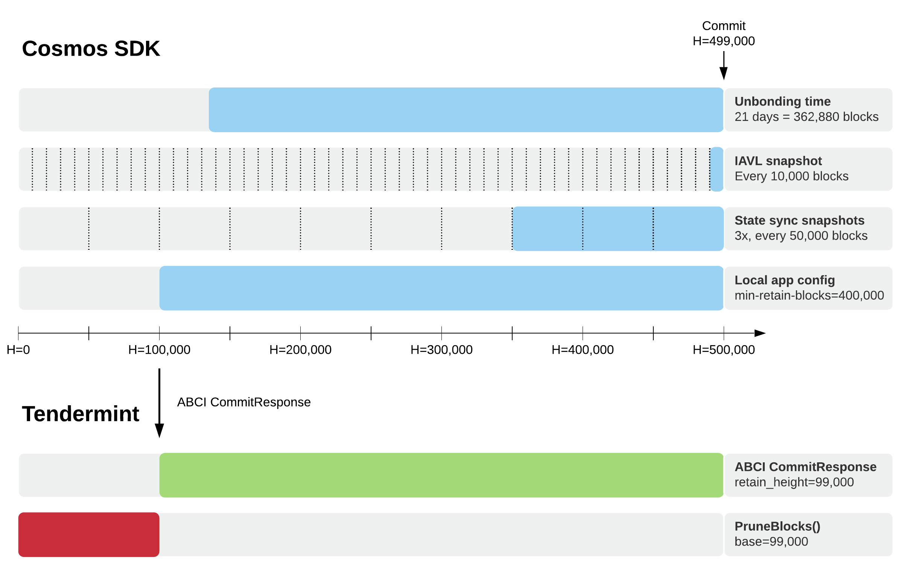

# ADR 077: Configurable Block Retention

## Changelog

- 2020-03-23: Initial draft (@erikgrinaker)
- 2020-03-25: Use local config for snapshot interval (@erikgrinaker)
- 2020-03-31: Use ABCI commit response for block retention hint
- 2020-04-02: Resolved open questions
- 2021-02-11: Migrate to tendermint repo (Originally [RFC 001](https://github.com/tendermint/spec/pull/84))

## Author(s)

- Erik Grinaker (@erikgrinaker)

## Context

Currently, all Tendermint nodes contain the complete sequence of blocks from genesis up to some height (typically the latest chain height). This will no longer be true when the following features are released:

- [Block pruning](https://github.com/tendermint/tendermint/issues/3652): removes historical blocks and associated data (e.g. validator sets) up to some height, keeping only the most recent blocks.

- [State sync](https://github.com/tendermint/tendermint/issues/828): bootstraps a new node by syncing state machine snapshots at a given height, but not historical blocks and associated data.

To maintain the integrity of the chain, the use of these features must be coordinated such that necessary historical blocks will not become unavailable or lost forever. In particular:

- Some nodes should have complete block histories, for auditability, querying, and bootstrapping.

- The majority of nodes should retain blocks longer than the Cosmos SDK unbonding period, for light client verification.

- Some nodes must take and serve state sync snapshots with snapshot intervals less than the block retention periods, to allow new nodes to state sync and then replay blocks to catch up.

- Applications may not persist their state on commit, and require block replay on restart.

- Only a minority of nodes can be state synced within the unbonding period, for light client verification and to serve block histories for catch-up.

However, it is unclear if and how we should enforce this. It may not be possible to technically enforce all of these without knowing the state of the entire network, but it may also be unrealistic to expect this to be enforced entirely through social coordination. This is especially unfortunate since the consequences of misconfiguration can be permanent chain-wide data loss.

## Proposal

Add a new field `retain_height` to the ABCI `ResponseCommit` message:

```proto
service ABCIApplication {
  rpc Commit(RequestCommit) returns (ResponseCommit);
}

message RequestCommit {}

message ResponseCommit {
  // reserve 1
  bytes  data          = 2; // the Merkle root hash
  uint64 retain_height = 3; // the oldest block height to retain
}
```

Upon ABCI `Commit`, which finalizes execution of a block in the state machine, Tendermint removes all data for heights lower than `retain_height`. This allows the state machine to control block retention, which is preferable since only it can determine the significance of historical blocks. By default (i.e. with `retain_height=0`) all historical blocks are retained.

Removed data includes not only blocks, but also headers, commit info, consensus params, validator sets, and so on. In the first iteration this will be done synchronously, since the number of heights removed for each run is assumed to be small (often 1) in the typical case. It can be made asynchronous at a later time if this is shown to be necessary.

Since `retain_height` is dynamic, it is possible for it to refer to a height which has already been removed. For example, commit at height 100 may return `retain_height=90` while commit at height 101 may return `retain_height=80`. This is allowed, and will be ignored - it is the application's responsibility to return appropriate values.

State sync will eventually support backfilling heights, via e.g. a snapshot metadata field `backfill_height`, but in the initial version it will have a fully truncated block history.

## Cosmos SDK Example

As an example, we'll consider how the Cosmos SDK might make use of this. The specific details should be discussed in a separate SDK proposal.

The returned `retain_height` would be the lowest height that satisfies:

- Unbonding time: the time interval in which validators can be economically punished for misbehavior. Blocks in this interval must be auditable e.g. by the light client.

- IAVL snapshot interval: the block interval at which the underlying IAVL database is persisted to disk, e.g. every 10000 heights. Blocks since the last IAVL snapshot must be available for replay on application restart.

- State sync snapshots: blocks since the _oldest_ available snapshot must be available for state sync nodes to catch up (oldest because a node may be restoring an old snapshot while a new snapshot was taken).

- Local config: archive nodes may want to retain more or all blocks, e.g. via a local config option `min-retain-blocks`. There may also be a need to vary rentention for other nodes, e.g. sentry nodes which do not need historical blocks.



## Status

Implemented

## Consequences

### Positive

- Application-specified block retention allows the application to take all relevant factors into account and prevent necessary blocks from being accidentally removed.

- Node operators can independently decide whether they want to provide complete block histories (if local configuration for this is provided) and snapshots.

### Negative

- Social coordination is required to run archival nodes, failure to do so may lead to permanent loss of historical blocks.

- Social coordination is required to run snapshot nodes, failure to do so may lead to inability to run state sync, and inability to bootstrap new nodes at all if no archival nodes are online.

### Neutral

- Reduced block retention requires application changes, and cannot be controlled directly in Tendermint.

- Application-specified block retention may set a lower bound on disk space requirements for all nodes.

## References

- State sync ADR: <https://github.com/tendermint/tendermint/blob/main/docs/architecture/adr-053-state-sync-prototype.md>

- State sync issue: <https://github.com/tendermint/tendermint/issues/828>

- Block pruning issue: <https://github.com/tendermint/tendermint/issues/3652>
