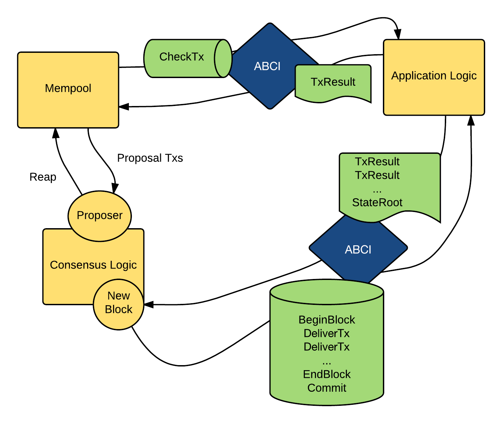

# What is Tendermint?

DEPRECATED! See [What is Tendermint?](what-is-tendermint.md).

Tendermint is software for securely and consistently replicating an
application on many machines. By securely, we mean that Tendermint works
even if up to 1/3 of machines fail in arbitrary ways. By consistently,
we mean that every non-faulty machine sees the same transaction log and
computes the same state. Secure and consistent replication is a
fundamental problem in distributed systems; it plays a critical role in
the fault tolerance of a broad range of applications, from currencies,
to elections, to infrastructure orchestration, and beyond.

The ability to tolerate machines failing in arbitrary ways, including
becoming malicious, is known as Byzantine fault tolerance (BFT). The
theory of BFT is decades old, but software implementations have only
became popular recently, due largely to the success of "blockchain
technology" like Bitcoin and Ethereum. Blockchain technology is just a
reformalization of BFT in a more modern setting, with emphasis on
peer-to-peer networking and cryptographic authentication. The name
derives from the way transactions are batched in blocks, where each
block contains a cryptographic hash of the previous one, forming a
chain. In practice, the blockchain data structure actually optimizes BFT
design.

Tendermint consists of two chief technical components: a blockchain
consensus engine and a generic application interface. The consensus
engine, called Tendermint Core, ensures that the same transactions are
recorded on every machine in the same order. The application interface,
called the Application BlockChain Interface (ABCI), enables the
transactions to be processed in any programming language. Unlike other
blockchain and consensus solutions, which come pre-packaged with built
in state machines (like a fancy key-value store, or a quirky scripting
language), developers can use Tendermint for BFT state machine
replication of applications written in whatever programming language and
development environment is right for them.

Tendermint is designed to be easy-to-use, simple-to-understand, highly
performant, and useful for a wide variety of distributed applications.

## Tendermint vs. X

Tendermint is broadly similar to two classes of software. The first
class consists of distributed key-value stores, like Zookeeper, etcd,
and consul, which use non-BFT consensus. The second class is known as
"blockchain technology", and consists of both cryptocurrencies like
Bitcoin and Ethereum, and alternative distributed ledger designs like
Hyperledger's Burrow.

### Zookeeper, etcd, consul

Zookeeper, etcd, and consul are all implementations of a key-value store
atop a classical, non-BFT consensus algorithm. Zookeeper uses a version
of Paxos called Zookeeper Atomic Broadcast, while etcd and consul use
the Raft consensus algorithm, which is much younger and simpler. A
typical cluster contains 3-5 machines, and can tolerate crash failures
in up to 1/2 of the machines, but even a single Byzantine fault can
destroy the system.

Each offering provides a slightly different implementation of a
featureful key-value store, but all are generally focused around
providing basic services to distributed systems, such as dynamic
configuration, service discovery, locking, leader-election, and so on.

Tendermint is in essence similar software, but with two key differences:

- It is Byzantine Fault Tolerant, meaning it can only tolerate up to a
  1/3 of failures, but those failures can include arbitrary behaviour -
  including hacking and malicious attacks. - It does not specify a
  particular application, like a fancy key-value store. Instead, it
  focuses on arbitrary state machine replication, so developers can build
  the application logic that's right for them, from key-value store to
  cryptocurrency to e-voting platform and beyond.

The layout of this Tendermint website content is also ripped directly
and without shame from [consul.io](https://www.consul.io/) and the other
[Hashicorp sites](https://www.hashicorp.com/#tools).

### Bitcoin, Ethereum, etc.

Tendermint emerged in the tradition of cryptocurrencies like Bitcoin,
Ethereum, etc. with the goal of providing a more efficient and secure
consensus algorithm than Bitcoin's Proof of Work. In the early days,
Tendermint had a simple currency built in, and to participate in
consensus, users had to "bond" units of the currency into a security
deposit which could be revoked if they misbehaved -this is what made
Tendermint a Proof-of-Stake algorithm.

Since then, Tendermint has evolved to be a general purpose blockchain
consensus engine that can host arbitrary application states. That means
it can be used as a plug-and-play replacement for the consensus engines
of other blockchain software. So one can take the current Ethereum code
base, whether in Rust, or Go, or Haskell, and run it as a ABCI
application using Tendermint consensus. Indeed, [we did that with
Ethereum](https://github.com/cosmos/ethermint). And we plan to do
the same for Bitcoin, ZCash, and various other deterministic
applications as well.

Another example of a cryptocurrency application built on Tendermint is
[the Cosmos network](http://cosmos.network).

### Other Blockchain Projects

[Fabric](https://github.com/hyperledger/fabric) takes a similar approach
to Tendermint, but is more opinionated about how the state is managed,
and requires that all application behaviour runs in potentially many
docker containers, modules it calls "chaincode". It uses an
implementation of [PBFT](http://pmg.csail.mit.edu/papers/osdi99.pdf).
from a team at IBM that is [augmented to handle potentially
non-deterministic
chaincode](https://www.zurich.ibm.com/~cca/papers/sieve.pdf) It is
possible to implement this docker-based behaviour as a ABCI app in
Tendermint, though extending Tendermint to handle non-determinism
remains for future work.

[Burrow](https://github.com/hyperledger/burrow) is an implementation of
the Ethereum Virtual Machine and Ethereum transaction mechanics, with
additional features for a name-registry, permissions, and native
contracts, and an alternative blockchain API. It uses Tendermint as its
consensus engine, and provides a particular application state.

## ABCI Overview

The [Application BlockChain Interface
(ABCI)](https://github.com/tendermint/tendermint/tree/master/abci)
allows for Byzantine Fault Tolerant replication of applications
written in any programming language.

### Motivation

Thus far, all blockchains "stacks" (such as
[Bitcoin](https://github.com/bitcoin/bitcoin)) have had a monolithic
design. That is, each blockchain stack is a single program that handles
all the concerns of a decentralized ledger; this includes P2P
connectivity, the "mempool" broadcasting of transactions, consensus on
the most recent block, account balances, Turing-complete contracts,
user-level permissions, etc.

Using a monolithic architecture is typically bad practice in computer
science. It makes it difficult to reuse components of the code, and
attempts to do so result in complex maintenance procedures for forks of
the codebase. This is especially true when the codebase is not modular
in design and suffers from "spaghetti code".

Another problem with monolithic design is that it limits you to the
language of the blockchain stack (or vice versa). In the case of
Ethereum which supports a Turing-complete bytecode virtual-machine, it
limits you to languages that compile down to that bytecode; today, those
are Serpent and Solidity.

In contrast, our approach is to decouple the consensus engine and P2P
layers from the details of the application state of the particular
blockchain application. We do this by abstracting away the details of
the application to an interface, which is implemented as a socket
protocol.

Thus we have an interface, the Application BlockChain Interface (ABCI),
and its primary implementation, the Tendermint Socket Protocol (TSP, or
Teaspoon).

### Intro to ABCI

[Tendermint Core](https://github.com/tendermint/tendermint) (the
"consensus engine") communicates with the application via a socket
protocol that satisfies the ABCI.

To draw an analogy, lets talk about a well-known cryptocurrency,
Bitcoin. Bitcoin is a cryptocurrency blockchain where each node
maintains a fully audited Unspent Transaction Output (UTXO) database. If
one wanted to create a Bitcoin-like system on top of ABCI, Tendermint
Core would be responsible for

- Sharing blocks and transactions between nodes
- Establishing a canonical/immutable order of transactions
  (the blockchain)

The application will be responsible for

- Maintaining the UTXO database
- Validating cryptographic signatures of transactions
- Preventing transactions from spending non-existent transactions
- Allowing clients to query the UTXO database.

Tendermint is able to decompose the blockchain design by offering a very
simple API (ie. the ABCI) between the application process and consensus
process.

The ABCI consists of 3 primary message types that get delivered from the
core to the application. The application replies with corresponding
response messages.

The messages are specified here: [ABCI Message
Types](https://github.com/tendermint/tendermint/blob/master/abci/README.md#message-types).

The **DeliverTx** message is the work horse of the application. Each
transaction in the blockchain is delivered with this message. The
application needs to validate each transaction received with the
**DeliverTx** message against the current state, application protocol,
and the cryptographic credentials of the transaction. A validated
transaction then needs to update the application state — by binding a
value into a key values store, or by updating the UTXO database, for
instance.

The **CheckTx** message is similar to **DeliverTx**, but it's only for
validating transactions. Tendermint Core's mempool first checks the
validity of a transaction with **CheckTx**, and only relays valid
transactions to its peers. For instance, an application may check an
incrementing sequence number in the transaction and return an error upon
**CheckTx** if the sequence number is old. Alternatively, they might use
a capabilities based system that requires capabilities to be renewed
with every transaction.

The **Commit** message is used to compute a cryptographic commitment to
the current application state, to be placed into the next block header.
This has some handy properties. Inconsistencies in updating that state
will now appear as blockchain forks which catches a whole class of
programming errors. This also simplifies the development of secure
lightweight clients, as Merkle-hash proofs can be verified by checking
against the block hash, and that the block hash is signed by a quorum.

There can be multiple ABCI socket connections to an application.
Tendermint Core creates three ABCI connections to the application; one
for the validation of transactions when broadcasting in the mempool, one
for the consensus engine to run block proposals, and one more for
querying the application state.

It's probably evident that applications designers need to very carefully
design their message handlers to create a blockchain that does anything
useful but this architecture provides a place to start. The diagram
below illustrates the flow of messages via ABCI.

## A Note on Determinism

The logic for blockchain transaction processing must be deterministic.
If the application logic weren't deterministic, consensus would not be
reached among the Tendermint Core replica nodes.

Solidity on Ethereum is a great language of choice for blockchain
applications because, among other reasons, it is a completely
deterministic programming language. However, it's also possible to
create deterministic applications using existing popular languages like
Java, C++, Python, or Go. Game programmers and blockchain developers are
already familiar with creating deterministic programs by avoiding
sources of non-determinism such as:

- random number generators (without deterministic seeding)
- race conditions on threads (or avoiding threads altogether)
- the system clock
- uninitialized memory (in unsafe programming languages like C
  or C++)
- [floating point
  arithmetic](http://gafferongames.com/networking-for-game-programmers/floating-point-determinism/)
- language features that are random (e.g. map iteration in Go)

While programmers can avoid non-determinism by being careful, it is also
possible to create a special linter or static analyzer for each language
to check for determinism. In the future we may work with partners to
create such tools.

## Consensus Overview

Tendermint is an easy-to-understand, mostly asynchronous, BFT consensus
protocol. The protocol follows a simple state machine that looks like
this:

Participants in the protocol are called **validators**; they take turns
proposing blocks of transactions and voting on them. Blocks are
committed in a chain, with one block at each **height**. A block may
fail to be committed, in which case the protocol moves to the next
**round**, and a new validator gets to propose a block for that height.
Two stages of voting are required to successfully commit a block; we
call them **pre-vote** and **pre-commit**. A block is committed when
more than 2/3 of validators pre-commit for the same block in the same
round.

There is a picture of a couple doing the polka because validators are
doing something like a polka dance. When more than two-thirds of the
validators pre-vote for the same block, we call that a **polka**. Every
pre-commit must be justified by a polka in the same round.

Validators may fail to commit a block for a number of reasons; the
current proposer may be offline, or the network may be slow. Tendermint
allows them to establish that a validator should be skipped. Validators
wait a small amount of time to receive a complete proposal block from
the proposer before voting to move to the next round. This reliance on a
timeout is what makes Tendermint a weakly synchronous protocol, rather
than an asynchronous one. However, the rest of the protocol is
asynchronous, and validators only make progress after hearing from more
than two-thirds of the validator set. A simplifying element of
Tendermint is that it uses the same mechanism to commit a block as it
does to skip to the next round.

Assuming less than one-third of the validators are Byzantine, Tendermint
guarantees that safety will never be violated - that is, validators will
never commit conflicting blocks at the same height. To do this it
introduces a few **locking** rules which modulate which paths can be
followed in the flow diagram. Once a validator precommits a block, it is
locked on that block. Then,

1.  it must prevote for the block it is locked on
2.  it can only unlock, and precommit for a new block, if there is a
    polka for that block in a later round

## Stake

In many systems, not all validators will have the same "weight" in the
consensus protocol. Thus, we are not so much interested in one-third or
two-thirds of the validators, but in those proportions of the total
voting power, which may not be uniformly distributed across individual
validators.

Since Tendermint can replicate arbitrary applications, it is possible to
define a currency, and denominate the voting power in that currency.
When voting power is denominated in a native currency, the system is
often referred to as Proof-of-Stake. Validators can be forced, by logic
in the application, to "bond" their currency holdings in a security
deposit that can be destroyed if they're found to misbehave in the
consensus protocol. This adds an economic element to the security of the
protocol, allowing one to quantify the cost of violating the assumption
that less than one-third of voting power is Byzantine.

The [Cosmos Network](https://cosmos.network) is designed to use this
Proof-of-Stake mechanism across an array of cryptocurrencies implemented
as ABCI applications.

The following diagram is Tendermint in a (technical) nutshell. [See here
for high resolution
version](https://github.com/mobfoundry/hackatom/blob/master/tminfo.pdf).

