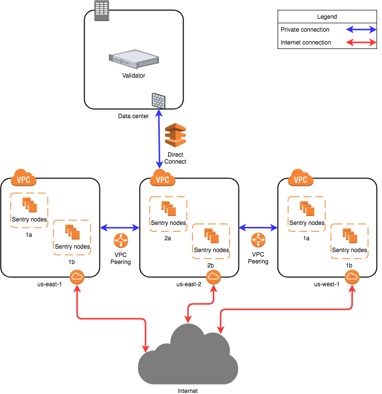

# Validators

Validators are responsible for committing new blocks in the blockchain.
These validators participate in the consensus protocol by broadcasting
_votes_ which contain cryptographic signatures signed by each
validator's private key.

Some Proof-of-Stake consensus algorithms aim to create a "completely"
decentralized system where all stakeholders (even those who are not
always available online) participate in the committing of blocks.
Tendermint has a different approach to block creation. Validators are
expected to be online, and the set of validators is permissioned/curated
by some external process. Proof-of-stake is not required, but can be
implemented on top of Tendermint consensus. That is, validators may be
required to post collateral on-chain, off-chain, or may not be required
to post any collateral at all.

Validators have a cryptographic key-pair and an associated amount of
"voting power". Voting power need not be the same.

## Becoming a Validator

There are two ways to become validator.

1. They can be pre-established in the [genesis state](../tendermint-core/using-tendermint.md#genesis)
2. The ABCI app responds to the EndBlock message with changes to the
   existing validator set.

## Setting up a Validator

When setting up a validator there are countless ways to configure your setup. This guide is aimed at showing one of them, the sentry node design. This design is mainly for DDOS prevention.

### Network Layout

The diagram is based on AWS, other cloud providers will have similar solutions to design a solution. Running nodes is not limited to cloud providers, you can run nodes on bare metal systems as well. The architecture will be the same no matter which setup you decide to go with.

The proposed network diagram is similar to the classical backend/frontend separation of services in a corporate environment. The “backend” in this case is the private network of the validator in the data center. The data center network might involve multiple subnets, firewalls and redundancy devices, which is not detailed on this diagram. The important point is that the data center allows direct connectivity to the chosen cloud environment. Amazon AWS has “Direct Connect”, while Google Cloud has “Partner Interconnect”. This is a dedicated connection to the cloud provider (usually directly to your virtual private cloud instance in one of the regions).

All sentry nodes (the “frontend”) connect to the validator using this private connection. The validator does not have a public IP address to provide its services.

Amazon has multiple availability zones within a region. One can install sentry nodes in other regions too. In this case the second, third and further regions need to have a private connection to the validator node. This can be achieved by VPC Peering (“VPC Network Peering” in Google Cloud). In this case, the second, third and further region sentry nodes will be directed to the first region and through the direct connect to the data center, arriving to the validator.

A more persistent solution (not detailed on the diagram) is to have multiple direct connections to different regions from the data center. This way VPC Peering is not mandatory, although still beneficial for the sentry nodes. This overcomes the risk of depending on one region. It is more costly.

### Local Configuration

The validator will only talk to the sentry that are provided, the sentry nodes will communicate to the validator via a secret connection and the rest of the network through a normal connection. The sentry nodes do have the option of communicating with each other as well.

When initializing nodes there are five parameters in the `config.toml` that may need to be altered.

- `mode:` (full | validator | seed) Mode of node (default: 'full'). If you want to run the node as validator, change it to 'validator'.
- `pex:` boolean. This turns the peer exchange reactor on or off for a node. When `pex=false`, only the `persistent-peers` list is available for connection.
- `persistent-peers:` a comma separated list of `nodeID@ip:port` values that define a list of peers that are expected to be online at all times. This is necessary at first startup because by setting `pex=false` the node will not be able to join the network.
- `unconditional-peer-ids:` comma separated list of nodeID's. These nodes will be connected to no matter the limits of inbound and outbound peers. This is useful for when sentry nodes have full address books.
- `private-peer-ids:` comma separated list of nodeID's. These nodes will not be gossiped to the network. This is an important field as you do not want your validator IP gossiped to the network.
- `addr-book-strict:` boolean. By default nodes with a routable address will be considered for connection. If this setting is turned off (false), non-routable IP addresses, like addresses in a private network can be added to the address book.
- `double-sign-check-height` int64 height.  How many blocks to look back to check existence of the node's consensus votes before joining consensus When non-zero, the node will panic upon restart if the same consensus key was used to sign {double_sign_check_height} last blocks. So, validators should stop the state machine, wait for some blocks, and then restart the state machine to avoid panic.

#### Validator Node Configuration

| Config Option            | Setting                    |
| ------------------------ | -------------------------- |
| mode                     | validator                  |
| pex                      | false                      |
| persistent-peers         | list of sentry nodes       |
| private-peer-ids         | none                       |
| unconditional-peer-ids   | optionally sentry node IDs |
| addr-book-strict         | false                      |
| double-sign-check-height | 10                         |

To run the node as validator ensure `mode=validator`. The validator node should have `pex=false` so it does not gossip to the entire network. The persistent peers will be your sentry nodes. Private peers can be left empty as the validator is not trying to hide who it is communicating with. Setting unconditional peers is optional for a validator because they will not have a full address books.

#### Sentry Node Configuration

| Config Option          | Setting                                       |
| ---------------------- | --------------------------------------------- |
| mode                   | full                                          |
| pex                    | true                                          |
| persistent-peers       | validator node, optionally other sentry nodes |
| private-peer-ids       | validator node ID                             |
| unconditional-peer-ids | validator node ID, optionally sentry node IDs |
| addr-book-strict       | false                                         |

The sentry nodes should be able to talk to the entire network hence why `pex=true`. The persistent peers of a sentry node will be the validator, and optionally other sentry nodes. The sentry nodes should make sure that they do not gossip the validator's ip, to do this you must put the validators nodeID as a private peer. The unconditional peer IDs will be the validator ID and optionally other sentry nodes.

> Note: Do not forget to secure your node's firewalls when setting them up.

More Information can be found at these links:

- <https://kb.certus.one/>
- <https://forum.cosmos.network/t/sentry-node-architecture-overview/454>

### Validator keys

Protecting a validator's consensus key is the most important factor to take in when designing your setup. The key that a validator is given upon creation of the node is called a consensus key, it has to be online at all times in order to vote on blocks. It is **not recommended** to merely hold your private key in the default json file (`priv_validator_key.json`). Fortunately, the [Interchain Foundation](https://interchain.io/) has worked with a team to build a key management server for validators. You can find documentation on how to use it [here](https://github.com/iqlusioninc/tmkms), it is used extensively in production. You are not limited to using this tool, there are also [HSMs](https://safenet.gemalto.com/data-encryption/hardware-security-modules-hsms/), there is not a recommended HSM.

Currently Tendermint uses [Ed25519](https://ed25519.cr.yp.to/) keys which are widely supported across the security sector and HSMs.

## Committing a Block

> **+2/3 is short for "more than 2/3"**

A block is committed when +2/3 of the validator set sign [precommit
votes](https://github.com/tendermint/tendermint/blob/953523c3cb99fdb8c8f7a2d21e3a99094279e9de/spec/blockchain/blockchain.md#vote) for that block at the same `round`.
The +2/3 set of precommit votes is called a
[_commit_](https://github.com/tendermint/tendermint/blob/953523c3cb99fdb8c8f7a2d21e3a99094279e9de/spec/blockchain/blockchain.md#commit). While any +2/3 set of
precommits for the same block at the same height&round can serve as
validation, the canonical commit is included in the next block (see
[LastCommit](https://github.com/tendermint/tendermint/blob/953523c3cb99fdb8c8f7a2d21e3a99094279e9de/spec/blockchain/blockchain.md#lastcommit)).
