# 200 Node Testnet

## Finding the Saturation Point

The first goal when examining the results of the tests is identifying the saturation point.
The saturation point is a setup with a transaction load big enough to prevent the testnet
from being stable: the load runner tries to produce slightly more transactions than can
be processed by the testnet.

The following table summarizes the results for v0.34.x, for the different experiments
(extracted from file [`v034_report_tabbed.txt`](./img/v034_report_tabbed.txt)).

The X axis of this table is `c`, the number of connections created by the load runner process to the target node.
The Y axis of this table is `r`, the rate or number of transactions issued per second.

|        |  c=4 |  c=8 | c=16 |
| :---   | ---: | ---: | ---: |
| r=20   |  144 |  309 |  632 |
| r=200  | 1547 | 3195 | 5958 |
| r=400  | 3102 | 6110 | 8526 |
| r=800  | 6231 | 8224 | 8653 |
| r=1200 | 7978 | 8368 | 9087 |

The table shows the number of 1024-byte-long transactions that were produced by the load runner,
and processed by Tendermint, during the 90 seconds of the experiment's duration.
Each cell in the table refers to an experiment with a particular number of websocket connections
to a chosen validator (`c`), and the number of transactions per second that the load runner
tries to produce (`r`). Note that the overall load is $c \cdot r$.

We can see that the saturation point is a diagonal (given that the overall load is de product
of the rate and the number of connections) that spans cells

* `r=1200,c=4`
* `r=800,c=8`
* `r=400,c=16`

These experiments and all others below the diagonal they form have in common that the total
number of transactions processed is noticeably less than the product $c \cdot r \cdot 90$,
which is the expected number of transactions when the system is able to deal well with the
load.

At this point, we chose an experiment with an important load but below the saturation point,
in order to further study the performance of this release.
**The chosen experiment is `r=400,c=8`**.

This is a plot of the CPU load of the load runner for `r=400,c=8`,
where we can see that the load (average over 1 minute) stays below 1 most of the time.

## Examining latencies

The method described [here](../method.md) allows us to plot the latencies of transactions
for all experiments.

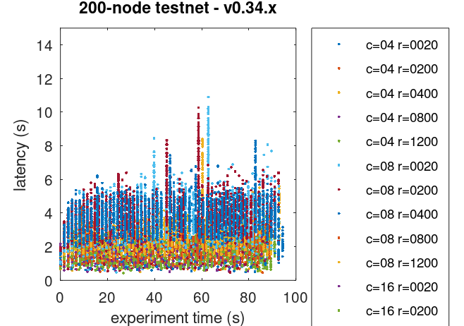

As we can see, even the experiments beyond the saturation diagonal managed to keep
transaction latency stable (i.e. not constantly increasing).
Our interpretation for this is that contention within Tendermint was propagated,
via the websockets, to the load runner,
hence the load runner could not produce the target load, but a fraction of it.

Further examination of the Prometheus data, showed that the mempool contained many transactions
at steady state, but did not grow much without quickly returning to this steady state. This demonstrates
that the transactions were able to be processed by the Tendermint network at least as quickly as they
were submitted to the mempool. Finally, the test script made sure that, at the end of an experiment, the
mempool was empty so that all transactions submitted to the chain were processed.

This plot can we used as a baseline to compare with other releases.

## Prometheus Metrics on the Chosen Experiment

As mentioned [above](#finding-the-saturation-point), the chosen experiment is `r=400,c=8`.
This section further examines key metrics for this experiment extracted from Prometheus data.

### Mempool Size

The mempool size, a count of the number of transactions in the mempool, was shown to be stable and homogeneous
at all full nodes. It did not exhibit any unconstrained growth.
The plot below shows the evolution over time of the cumulative number of transactions inside all full nodes' mempools.
The two spikes that can be observed correspond to a period where consensus instances reached round 1
at some nodes.

The plot below shows evolution of the average over all full nodes, which oscillate around 140 outstanding transactions.

The peaks observed coincide with the moments when some nodes process to round 1 of consensus (see below).

### Peers

The number of peers was stable at all nodes.
It was higher for the seed nodes (around 140) than for the rest (between 21 and 71).

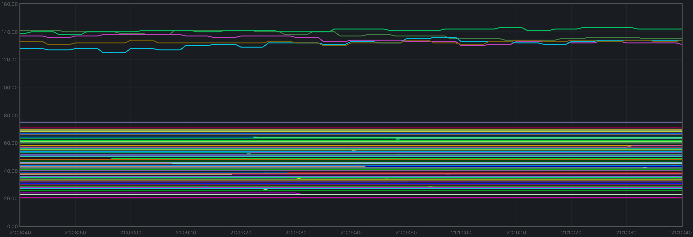

### Consensus Rounds per Height

Most heights took just one round, but some nodes needed to advance to round 1 at some point.

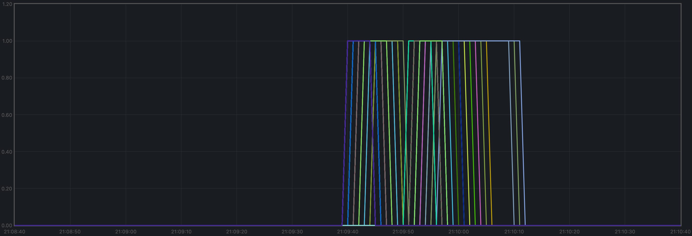

### Blocks Produced per Minute, Transactions Processed per Minute

The blocks produced per minute are the gradient of this plot.

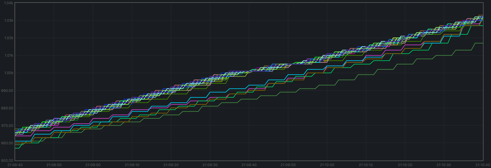

Over a period of 2 minutes, the height goes from 967 to 1033.
This results in an average of 33 blocks produced per minute.

The transactions processed per minute are the gradient of this plot.

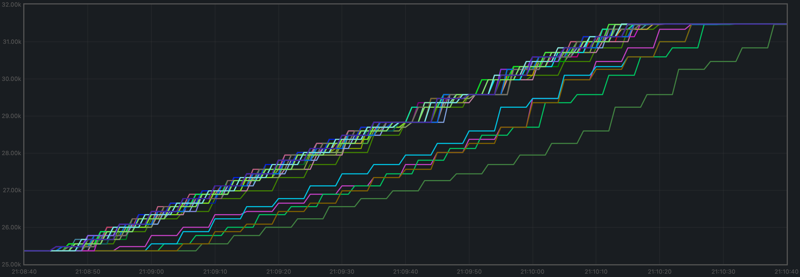

Over a period of 2 minutes, the total goes from 25362 to 31472 transactions,
resulting in 3055 transactions per minute. However, we can see in the plot that
all transactions in the load are process long before the two minutes.
If we adjust the time window when transactions are processed (approx. 92 seconds),
we obtain 3984 transactions per minute.

### Memory Resident Set Size

Resident Set Size of all monitored processes is plotted below.

The average over all processes oscillates around 420 MiB and does not demonstrate unconstrained growth.

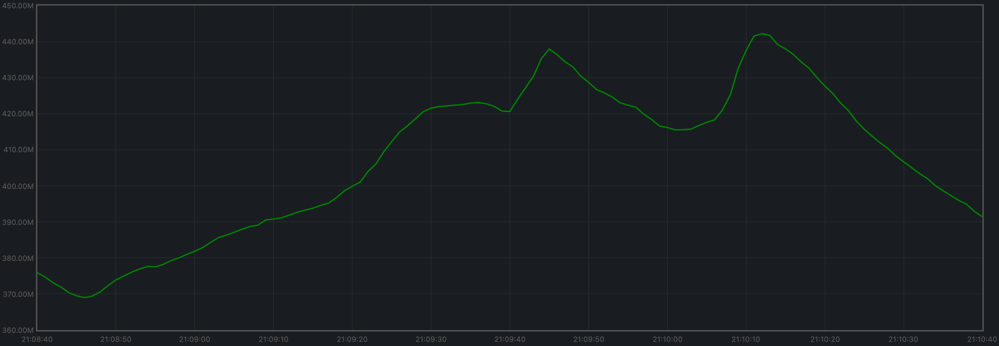

### CPU utilization

The best metric from Prometheus to gauge CPU utilization in a Unix machine is `load1`,
as it usually appears in the
[output of `top`](https://www.digitalocean.com/community/tutorials/load-average-in-linux).

It is contained between 0.3 and 4.2 at all nodes.

## Test Result

**Result: N/A**

Date: 2022-09-23

Version: a41c5eec1109121376de3d32379613856d4a47dd

# Rotating Node Testnet

We reuse the work done on the 200 node testnet where we found the saturation point,
and will thus focus on the load `c=4,r=800`.

# Latencies

The plot of all latencies can be seen in the following plot.

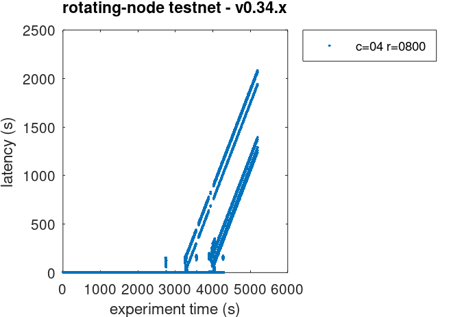

We can observe there are some very high latencies, towards the end of the test.
Upon suspicion that they are duplicate transactions, we examined the latencies
raw file and discovered there are more than 100K duplicate transactions.

The following plot shows the latencies file where all duplicate transactions have
been removed, i.e., only the first occurrence of a duplicate transaction is kept.

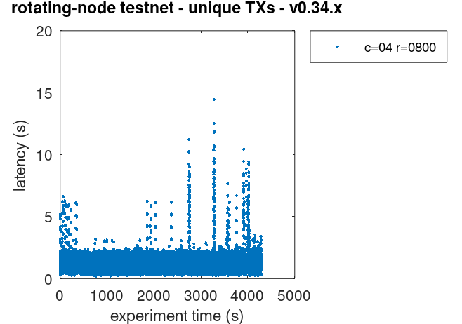

This problem, existing in `v0.34.x`, will need to be addressed.

## Prometheus Metrics

The set of metrics shown here are less than for the 200 node experiment.
We are only interested in those for which the catch-up process (blocksync) may have an impact.

### Blocks and Transactions per minute

Just as shown for the 200 node test, the blocks produced per minute are the gradient of this plot.

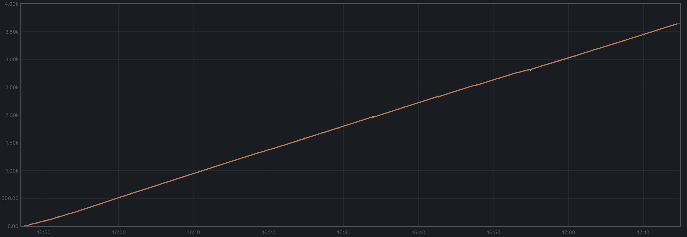

Over a period of 5229 seconds, the height goes from 2 to 3638.
This results in an average of 41 blocks produced per minute.

The following plot shows only the heights reported by ephemeral nodes
(which are also included in the plot above). Note that the _height_ metric
is only showed _once the node has switched to consensus_, hence the gaps
when nodes are killed, wiped out, started from scratch, and catching up.

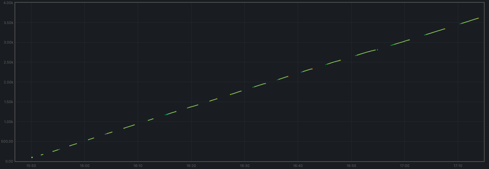

The transactions processed per minute are the gradient of this plot.

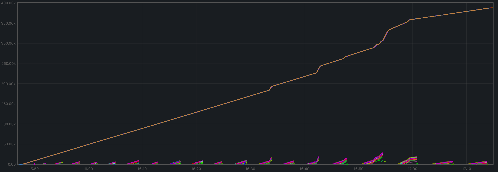

The small lines we see periodically close to `y=0` are the transactions that
ephemeral nodes start processing when they are caught up.

Over a period of 5229 minutes, the total goes from 0 to 387697 transactions,
resulting in 4449 transactions per minute. We can see some abrupt changes in
the plot's gradient. This will need to be investigated.

### Peers

The plot below shows the evolution in peers throughout the experiment.
The periodic changes observed are due to the ephemeral nodes being stopped,
wiped out, and recreated.

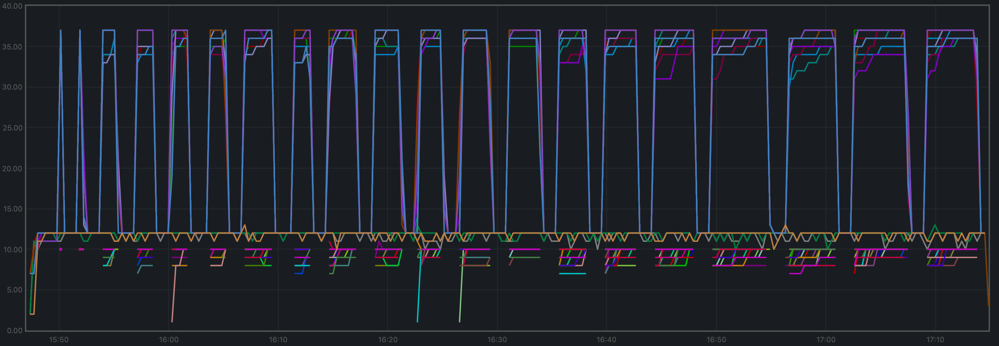

The validators' plots are concentrated at the higher part of the graph, whereas the ephemeral nodes
are mostly at the lower part.

### Memory Resident Set Size

The average Resident Set Size (RSS) over all processes seems stable, and slightly growing toward the end.
This might be related to the increased in transaction load observed above.

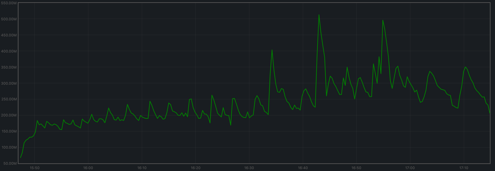

The memory taken by the validators and the ephemeral nodes (when they are up) is comparable.

### CPU utilization

The plot shows metric `load1` for all nodes.

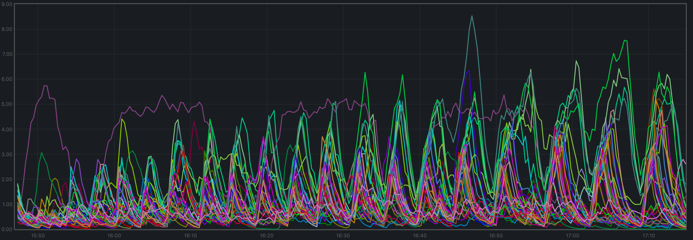

It is contained under 5 most of the time, which is considered normal load.
The purple line, which follows a different pattern is the validator receiving all
transactions, via RPC, from the load runner process.

## Test Result

**Result: N/A**

Date: 2022-10-10

Version: a28c987f5a604ff66b515dd415270063e6fb069d
