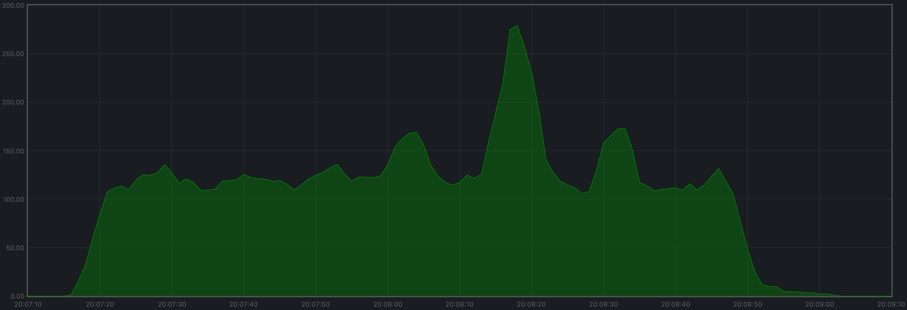
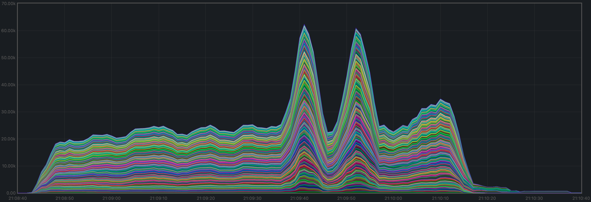
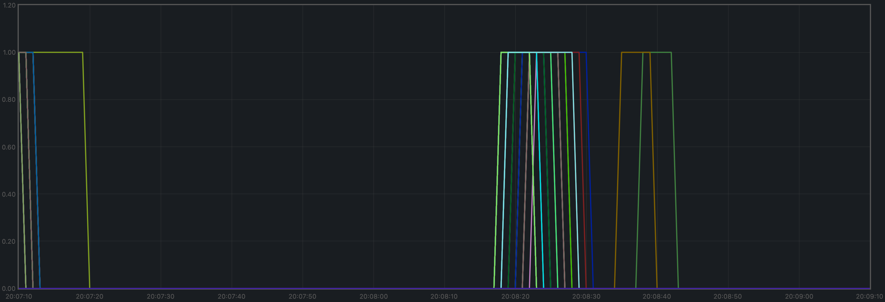
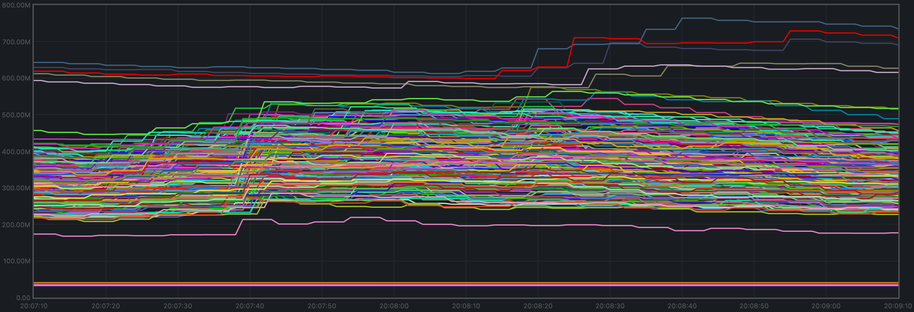
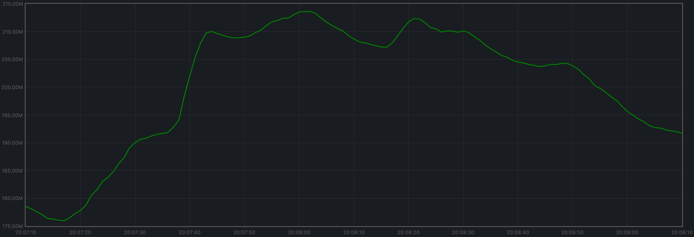
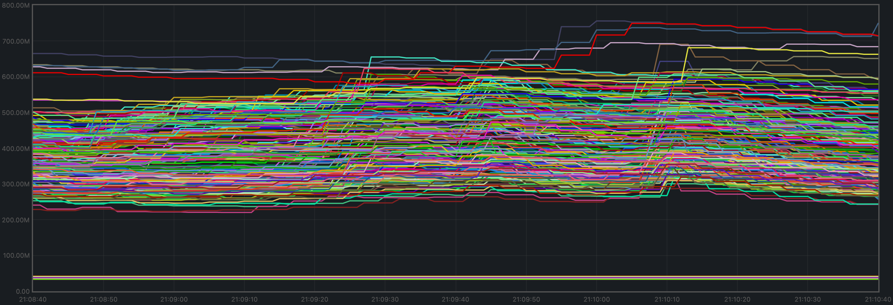
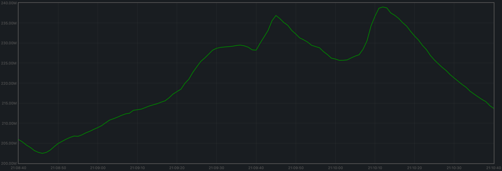
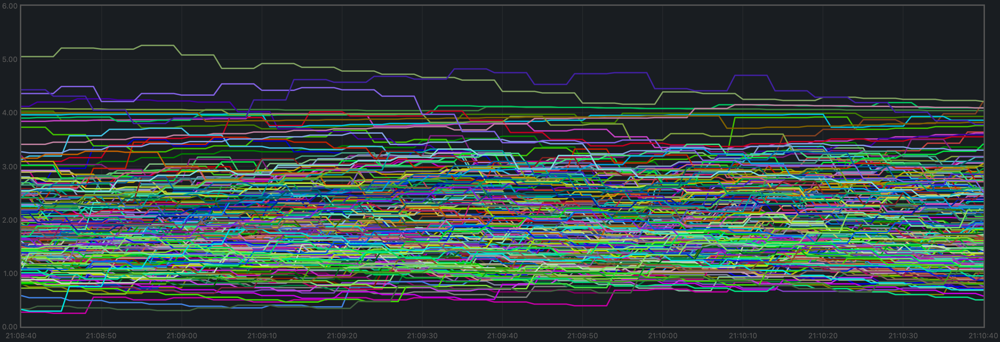

# 200 Node Testnet

## Finding the Saturation Point

The first goal is to identify the saturation point and compare it with the baseline (v0.34.x).
For further details, see [this paragraph](../v034/README.md#finding-the-saturation-point)
in the baseline version.

The following table summarizes the results for v0.37.x, for the different experiments
(extracted from file [`v037_report_tabbed.txt`](./v037_report_tabbed.txt)).

|        |  c=4 |  c=8 | c=16 |
| :---   | ---: | ---: | ---: |
| r=20   |  148 |  288 |  591 |
| r=200  | 1519 | 3087 | 6198 |
| r=400  | 3094 | 6231 | 8698 |
| r=800  | 6155 | 8444 | 8407 |
| r=1200 | 8290 | 8448 | 8666 |

For comparison, this is the table with the baseline version.

|        |  c=4 |  c=8 | c=16 |
| :---   | ---: | ---: | ---: |
| r=20   |  144 |  309 |  632 |
| r=200  | 1547 | 3195 | 5958 |
| r=400  | 3102 | 6110 | 8526 |
| r=800  | 6231 | 8224 | 8653 |
| r=1200 | 7978 | 8368 | 9087 |

The saturation point is a diagonal across:

* `r=1200,c=4`
* `r=800,c=8`
* `r=400,c=16`

which is at the same place as the baseline. For more details on the saturation point, see
[this paragraph](../v034/README.md#finding-the-saturation-point) in the baseline version.

The experiment chosen to examine Prometheus metrics is the same as in the baseline:
**`r=400,c=8`**.

## Examining latencies

The method described [here](../method.md) allows us to plot the latencies of transactions
for all experiments.

The data seen in the plot is similar to that of the baseline.

Therefore, for further details on these plots,
see [this paragraph](../v034/README.md#examining-latencies) in the baseline version.

## Prometheus Metrics on the Chosen Experiment

As mentioned [above](#finding-the-saturation-point), the chosen experiment is `r=400,c=8`.
This section further examines key metrics for this experiment extracted from Prometheus data.

### Mempool Size

The mempool size was stable and homogeneous at all full nodes.
The plot below shows the evolution over time of the cumulative number of transactions inside all full nodes' mempools.

The plot below shows evolution of the average over all full nodes, which seems to oscillate around 140 outstanding transactions.

**These plots yield similar results to the baseline**:

### Peers

The number of peers was stable at all nodes.
It was higher for the seed nodes (around 140) than for the rest (between 25 and 68).

**This plot yields similar results to the baseline**:

### Consensus Rounds per Height

Most heights took just one round, but some nodes needed to advance to round 1 at some point.

**This plot yields slightly better results than the baseline**:

### Blocks Produced per Minute

The blocks produced per minute are the gradient of this plot.

Over a period of 2 minutes, the height goes from 680 to 748.
This result in an average of 34 blocks produced per minute.

**This plot yields similar results to the baseline**:

### Memory resident set size

Resident Set Size of all monitored processes is plotted below.

The average over all processes oscillates around 210 MiB.

**These plots yield similar results to the baseline**:

### CPU utilization

The best metric from Prometheus to gauge CPU utilization is `load1`, as it usually appears in the output of `top`.

It is contained between 0.5 and 4 at all nodes.

**This plot yields similar results to the baseline**:

## Test Result

**Result: PASS**
Date: 2022-09-23
Version: b9480d0ec79c53b06344148afc6589f895d0abbf

# Rotating Node Testnet

TODO
