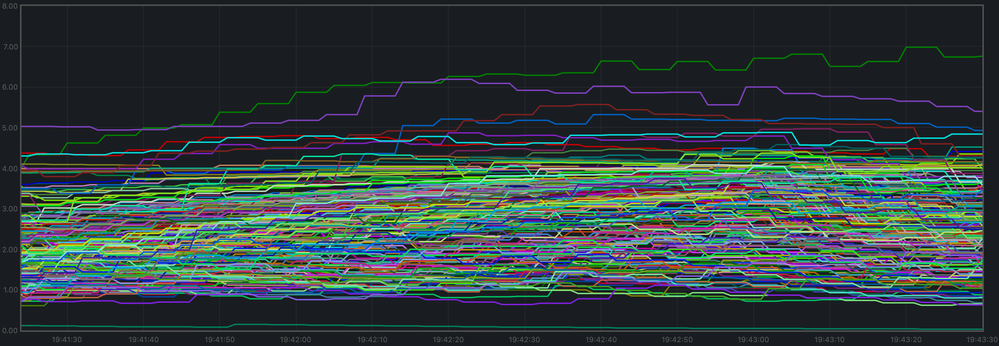
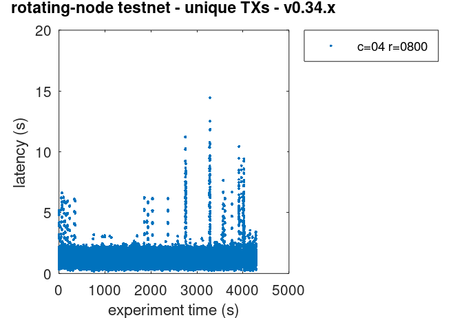
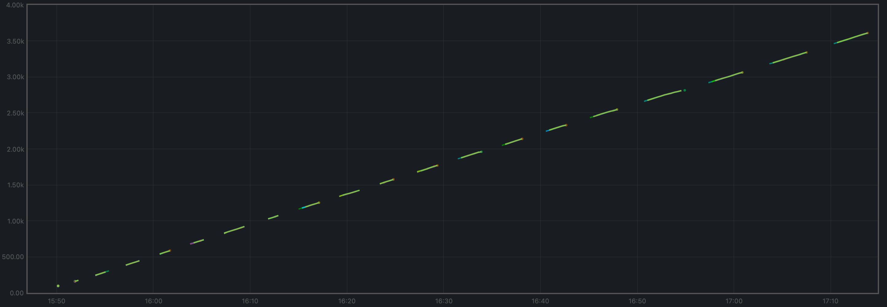

# v0.37.x

## Issues discovered

During this iteration of the QA process, the following issues were found:

* [critical, fixed] #9533. This bug caused full nodes to sometimes get stuck when blocksyncing, requiring a manual restart to unblock them.
* [critical, fixed] #9539. `loadtime` is very likely to include more than one "=" character in transactions, with is rejected by the e2e application.
* [non-critical, not fixed] #9548. Full nodes can go over 50 connected peers, which is not intended by the default configuration.
* [non-critical, not fixed] #9537. With the default mempool cache setting, duplicated transactions are not rejected when gossipped and eventually flood all mempools.
  The 200 node testnets were thus run with a value of 200000 (as opposed to the default 10000)

## 200 Node Testnet

### Finding the Saturation Point

The first goal is to identify the saturation point and compare it with the baseline (v0.34.x).
For further details, see [this paragraph](../v034/README.md#finding-the-saturation-point)
in the baseline version.

The following table summarizes the results for v0.37.x, for the different experiments
(extracted from file [`v037_report_tabbed.txt`](./img/v037_report_tabbed.txt)).

The X axis of this table is `c`, the number of connections created by the load runner process to the target node.
The Y axis of this table is `r`, the rate or number of transactions issued per second.

|        |  c=1  |  c=2  |  c=4  |
| :---   | ----: | ----: | ----: |
| r=25   |  2225 | 4450  | 8900  |
| r=50   |  4450 | 8900  | 17800 |
| r=100  |  8900 | 17800 | 35600 |
| r=200  | 17800 | 35600 | 38660 |

For comparison, this is the table with the baseline version.

|        |  c=1  |  c=2  |  c=4  |
| :---   | ----: | ----: | ----: |
| r=25   |  2225 | 4450  | 8900  |
| r=50   |  4450 | 8900  | 17800 |
| r=100  |  8900 | 17800 | 35400 |
| r=200  | 17800 | 35600 | 37358 |

The saturation point is beyond the diagonal:

* `r=200,c=2`
* `r=100,c=4`

which is at the same place as the baseline. For more details on the saturation point, see
[this paragraph](../v034/README.md#finding-the-saturation-point) in the baseline version.

The experiment chosen to examine Prometheus metrics is the same as in the baseline:
**`r=200,c=2`**.

The load runner's CPU load was negligible (near 0) when running `r=200,c=2`.

### Examining latencies

The method described [here](../method.md) allows us to plot the latencies of transactions
for all experiments.

The data seen in the plot is similar to that of the baseline.

Therefore, for further details on these plots,
see [this paragraph](../v034/README.md#examining-latencies) in the baseline version.

### Prometheus Metrics on the Chosen Experiment

As mentioned [above](#finding-the-saturation-point), the chosen experiment is `r=200,c=2`.
This section further examines key metrics for this experiment extracted from Prometheus data.

#### Mempool Size

The mempool size, a count of the number of transactions in the mempool, was shown to be stable and homogeneous
at all full nodes. It did not exhibit any unconstrained growth.
The plot below shows the evolution over time of the cumulative number of transactions inside all full nodes' mempools
at a given time.

The plot below shows evolution of the average over all full nodes, which oscillate between 1500 and 2000 outstanding transactions.

The peaks observed coincide with the moments when some nodes reached round 1 of consensus (see below).

**These plots yield similar results to the baseline**:

#### Peers

The number of peers was stable at all nodes.
It was higher for the seed nodes (around 140) than for the rest (between 16 and 78).

Just as in the baseline, the fact that non-seed nodes reach more than 50 peers is due to #9548.

**This plot yields similar results to the baseline**:

#### Consensus Rounds per Height

Most heights took just one round, but some nodes needed to advance to round 1 at some point.

**This plot yields slightly better results than the baseline**:

#### Blocks Produced per Minute, Transactions Processed per Minute

The blocks produced per minute are the gradient of this plot.

Over a period of 2 minutes, the height goes from 477 to 524.
This results in an average of 23.5 blocks produced per minute.

The transactions processed per minute are the gradient of this plot.

Over a period of 2 minutes, the total goes from 64525 to 100125 transactions,
resulting in 17800 transactions per minute. However, we can see in the plot that
all transactions in the load are process long before the two minutes.
If we adjust the time window when transactions are processed (approx. 90 seconds),
we obtain 23733 transactions per minute.

**These plots yield similar results to the baseline**:

#### Memory Resident Set Size

Resident Set Size of all monitored processes is plotted below.

The average over all processes oscillates around 380 MiB and does not demonstrate unconstrained growth.

**These plots yield similar results to the baseline**:

#### CPU utilization

The best metric from Prometheus to gauge CPU utilization in a Unix machine is `load1`,
as it usually appears in the
[output of `top`](https://www.digitalocean.com/community/tutorials/load-average-in-linux).

It is contained below 5 on most nodes.

**This plot yields similar results to the baseline**:

### Test Result

**Result: PASS**

Date: 2022-10-14

Version: b9480d0ec79c53b06344148afc6589f895d0abbf

## Rotating Node Testnet

We use the same load as in the baseline: `c=4,r=800`.

Just as in the baseline tests, the version of Tendermint used for these tests is affected by #9539.
See this paragraph in the [baseline report](../v034/README.md#rotating-node-testnet) for further details.
Finally, note that this setup allows for a fairer comparison between this version and the baseline.

### Latencies

The plot of all latencies can be seen here.

Which is similar to the baseline.

Note that we are comparing against the baseline plot with _unique_
transactions. This is because the problem with duplicate transactions
detected during the baseline experiment did not show up for `v0.37`,
which is _not_ proof that the problem is not present in `v0.37`.

### Prometheus Metrics

The set of metrics shown here match those shown on the baseline (`v0.34`) for the same experiment.
We also show the baseline results for comparison.

#### Blocks and Transactions per minute

The blocks produced per minute are the gradient of this plot.

Over a period of 4446 seconds, the height goes from 5 to 3323.
This results in an average of 45 blocks produced per minute,
which is similar to the baseline, shown below.

The following two plots show only the heights reported by ephemeral nodes.
The second plot is the baseline plot for comparison.

By the length of the segments, we can see that ephemeral nodes in `v0.37`
catch up slightly faster.

The transactions processed per minute are the gradient of this plot.

Over a period of 3852 seconds, the total goes from 597 to 267298 transactions in one of the validators,
resulting in 4154 transactions per minute, which is slightly lower than the baseline,
although the baseline had to deal with duplicate transactions.

For comparison, this is the baseline plot.

#### Peers

The plot below shows the evolution of the number of peers throughout the experiment.

This is the baseline plot, for comparison.

The plotted values and their evolution are comparable in both plots.

For further details on these plots, see the baseline report.

#### Memory Resident Set Size

The average Resident Set Size (RSS) over all processes looks slightly more stable
on `v0.37` (first plot) than on the baseline (second plot).

The memory taken by the validators and the ephemeral nodes when they are up is comparable (not shown in the plots),
just as observed in the baseline.

#### CPU utilization

The plot shows metric `load1` for all nodes.

This is the baseline plot.

In both cases, it is contained under 5 most of the time, which is considered normal load.
The green line in the `v0.37` plot and the purple line in the baseline plot (`v0.34`)
correspond to the validators receiving all transactions, via RPC, from the load runner process.
In both cases, they oscillate around 5 (normal load). The main difference is that other
nodes are generally less loaded in `v0.37`.

### Test Result

**Result: PASS**

Date: 2022-10-10

Version: 155110007b9d8b83997a799016c1d0844c8efbaf
