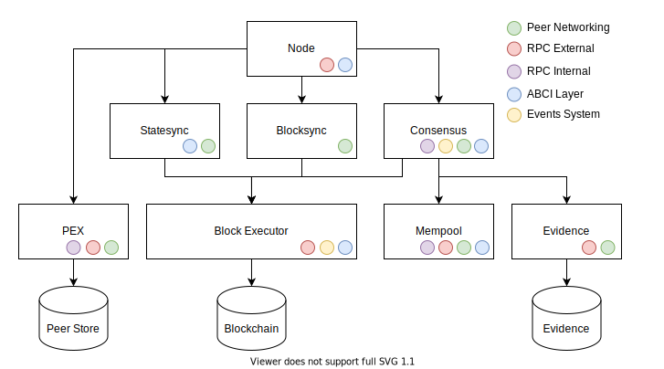

# RFC 016: Node Architecture

## Changelog

- April 8, 2022: Initial draft (@cmwaters)
- April 15, 2022: Incorporation of feedback

## Abstract

The `node` package is the entry point into the Tendermint codebase, used both by the command line and programatically to create the nodes that make up a network. The package has suffered the most from the evolution of the codebase, becoming bloated as developers clipped on their bits of code here and there to get whatever feature they wanted working.

The decisions made at the node level have the biggest impact to simplifying the protocols within them, unlocking better internal designs and making Tendermint more intuitive to use and easier to understand from the outside. Work, in minor increments, has already begun on this section of the codebase. This document exists to spark forth the necessary discourse in a few related areas that will help the team to converge on the long term makeup of the node.

## Discussion

The following is a list of points of discussion around the architecture of the node:

### Dependency Tree

The node object is currently stuffed with every component that possibly exists within Tendermint. In the constructor, all objects are built and interlaid with one another in some awkward dance. My guiding principle is that the node should only be made up of the components that it wants to have direct control of throughout its life. The node is a service which currently has the purpose of starting other services up in a particular order and stopping them all when commanded to do so. However, there are many services which are not direct dependents i.e. the mempool and evidence services should only be working when the consensus service is running. I propose to form more of a hierarchical structure of dependents which forces us to be clear about the relations that one component has to the other. More concretely, I propose the following dependency tree:



Many of the further discussion topics circle back to this representation of the node.

It's also important to distinguish two dimensions which may require different characteristics of the architecture. There is the starting and stopping of services and their general lifecycle management. What is the correct order of operations to starting a node for example. Then there is the question of the needs of the service during actual operation. Then there is the question of what resources each service needs access to during its operation. Some need to publish events, others need access to data stores, and so forth.

An alternative model and one that perhaps better suits the latter of these dimensions is the notion of an internal message passing system. Either the events bus or p2p layer could serve as a viable transport. This would essentially allow all services to communicate with any other service and could perhaps provide a solution to the coordination problem (presented below) without a centralized coordinator. The other main advantage is that such a system would be more robust to disruptions and changes to the code which may make a hierarchical structure quickly outdated and suboptimal. The addition of message routing is an added complexity to implement, will increase the degree of asynchronicity in the system and may make it harder to debug problems that are across multiple services.

### Coordination of State Advancing Mechanisms

Advancement of state in Tendermint is simply defined in heights: If the node is at height n, how does it get to height n + 1 and so on. Based on this definition we have three components that help a node to advance in height: consensus, statesync and blocksync. The way these components behave currently is very tightly coupled to one another with references passed back and forth. My guiding principle is that each of these should be able to operate completely independently of each other, e.g. a node should be able to run solely blocksync indefinitely. There have been several ideas suggested towards improving this flow. I've been leaning strongly towards a centralized system, whereby an orchestrator (in this case the node) decides what services to start and stop.
In a decentralized message passing system, individual services make their decision based upon a "global" shared state i.e. if my height is less that 10 below the average peer height, I as consensus, should stop (knowing that blocksync has the same condition for starting). As the example illustrates, each mechanism will still need to be aware of the presence of other mechanisms.

Both centralized and decentralized systems rely on the communication of the nodes current height and a judgement on the height of the head of the chain. The latter, working out the head of the chain, is quite a difficult challenge as their is nothing preventing the node from acting maliciously and providing a different height. Currently both blocksync, consensus (and to a certain degree statesync), have parallel systems where peers communicate their height. This could be streamlined with the consensus (or even the p2p layer), broadcasting peer heights and either the node or the other state advancing mechanisms acting accordingly.

Currently, when a node starts, it turns on every service that it is attached to. This means that while a node is syncing up by requesting blocks, it is also receiving transactions and votes, as well as snapshot and block requests. This is a needless use of bandwidth. An implementation of an orchestrator, regardless of whether the system is heirachical or not, should look to be able to open and close channels dynamically and effectively broadcast which services it is running. Integrating this with service discovery may also lead to a better serivce to peers.

The orchestrator allows for some deal of variablity in how a node is constructed. Does it just run blocksync, shadowing the head of the chain and be highly available for querying. Does it rely on state sync at all? An important question that arises from this dynamicism is we ideally want to encourage nodes to provide as much of their resources as possible so that their is a healthy amount of providers to consumers. Do we make all services compulsory or allow for them to be disabled? Arguably it's possible that a user forks the codebase and rips out the blocksync code because they want to reduce bandwidth so this is more a question of how easy do we want to make this for users.

### Block Executor

The block executor is an important component that is currently used by both consensus and blocksync to execute transactions and update application state. Principally, I think it should be the only component that can write (and possibly even read) the block and state stores, and we should clean up other direct dependencies on the storage engine if we can. This would mean:

- The reactors Consensus, BlockSync and StateSync should all import the executor for advancing state ie.  `ApplyBlock` and `BootstrapState`.
- Pruning should also be a concern of the block executor as well as `FinalizeBlock` and `Commit`. This can simplify consensus to focus just on the consensus part.

### The Interprocess communication systems: RPC, P2P, ABCI, and Events

The schematic supplied above shows the relations between the different services, the node, the block executor, and the storage layer. Represented as colored dots are the components responsible for different roles of interprocess communication (IPC). These components permeate throughout the code base, seeping into most services. What can provide powerful functionality on one hand can also become a twisted vine, creating messy corner cases and convoluting the protocols themselves. A lot of the thinking around
how we want our IPC systens to function has been summarised in this [RFC](./rfc-002-ipc-ecosystem.md). In this section, I'd like to focus the reader on the relation between the IPC and the node structure. An issue that has frequently risen is that the RPC has control of the components where it strikes me as being more logical for the component to dictate the information that is emitted/available and the knobs it wishes to expose. The RPC is also inextricably tied to the node instance and has situations where it is passed pointers directly to the storage engine and other components.

I am currently convinced of the approach that the p2p layer takes and would like to see other IPC components follow suit. This would mean that the RPC and events system would be constructed in the node yet would pass the adequate methods to register endpoints and topics to the sub components. For example,

```go
// Methods from the RPC and event bus that would be passed into the constructor of components like "consensus"
// NOTE: This is a hypothetical construction to convey the idea. An actual implementation may differ.
func RegisterRoute(path string, handler func(http.ResponseWriter, *http.Request))

func RegisterTopic(name string) EventPublisher

type EventPublisher func (context.Context, types.EventData, []abci.Event)
```

This would give the components control to the information they want to expose and keep all relevant logic within that package. It accomodates more to a dynamic system where services can switch on and off. Each component would also receive access to the logger and metrics system for introspection and debuggability.

#### IPC Rubric

I'd like to aim to reach a state where we as a team have either an implicit or explicit rubric which can determine, in the event of some new need to communicate information, what tool it should use for doing this. In the case of inter node communication, this is obviously the p2p stack (with perhaps the exception of the light client). Metrics and logging also have clear usage patterns. RPC and the events system are less clear. The RPC is used for debugging data and fine tuned operator control as it is for general public querying and transaction submission. The RPC is also known to have been plumbed back into the application for historical queries. The events system, similarly, is used for consuming transaction events as it is for the testing of consensus state transitions.

Principally, I think we should look to change our language away from what the actual transport is and more towards what it's being used for and to whom. We call it a peer to peer layer and not the underlying tcp connection. In the same way, we should look to split RPC into an operator interface (RPC Internal), a public interface (RPC External) and a bidirectional ABCI.

### Seperation of consumers and suppliers

When a service such as blocksync is turned on, it automatically begins requesting blocks to verify and apply them as it also tries to serve them to other peers catching up. We should look to distinguish these two aspects: supplying of information and consuming of information in many of these components. More concretely, I'd suggest:

- The blocksync and statesync service, i.e. supplying information for those trying to catch up should only start running once a node has caught up i.e. after running the blocksync and/or state sync *processes*
- The blocksync and state sync processes have defined termination clauses that inform the orchestrator when they are done and where they finished.
    - One way of achieving this would be that every process both passes and returns the `State` object
    - In some cases, a node may specify that it wants to run blocksync indefinitely.
- The mempool should also indicate whether it wants to receive transactions or to send them only (one-directional mempool)
- Similarly, the light client itself only requests information whereas the light client service (currently part of state sync) can do both.
- This distinction needs to be communicated in the p2p layer handshake itself but should also be changeable over the lifespan of the connection.
