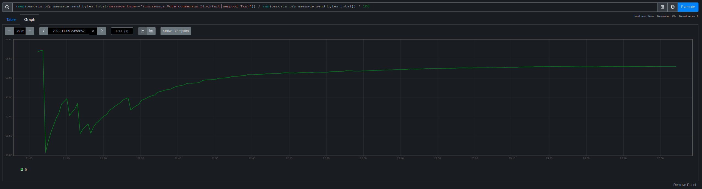
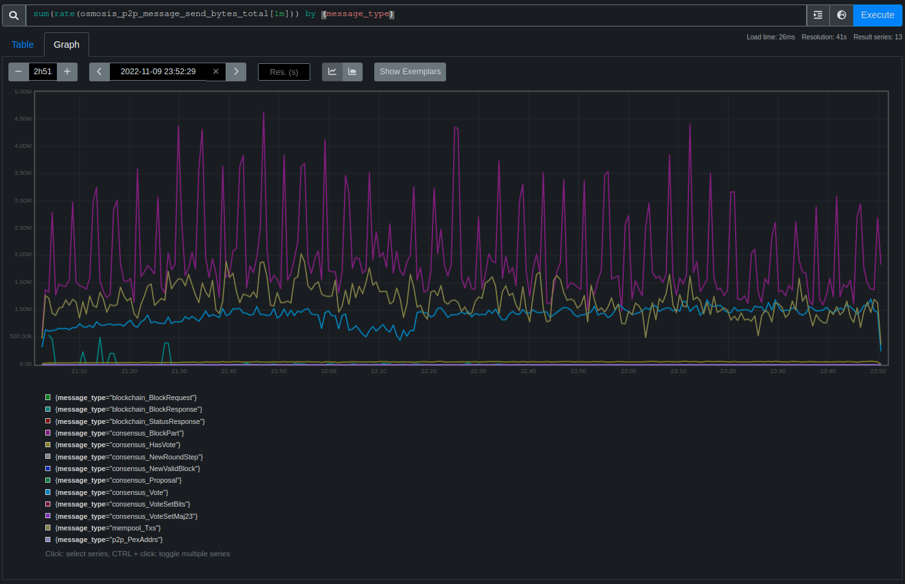
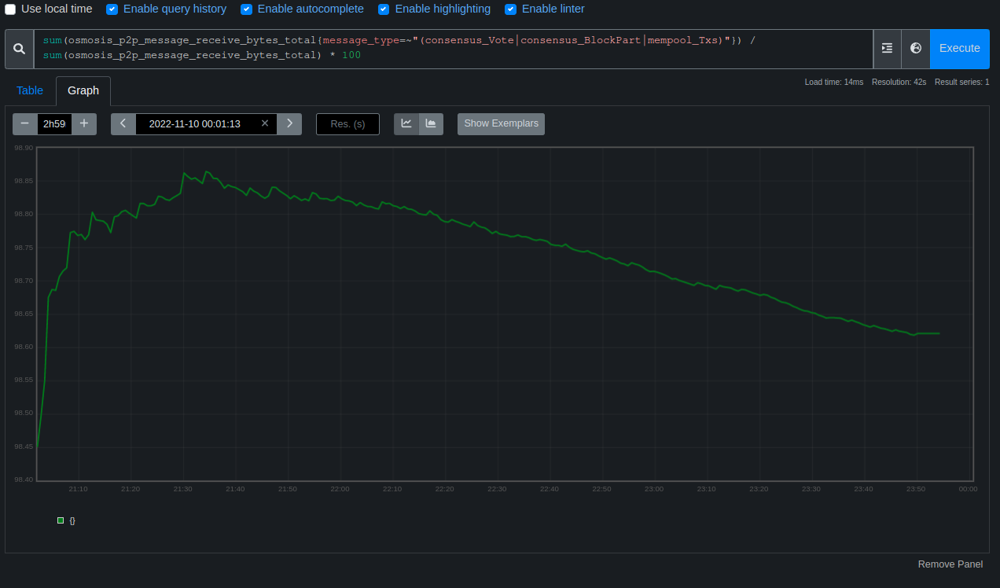
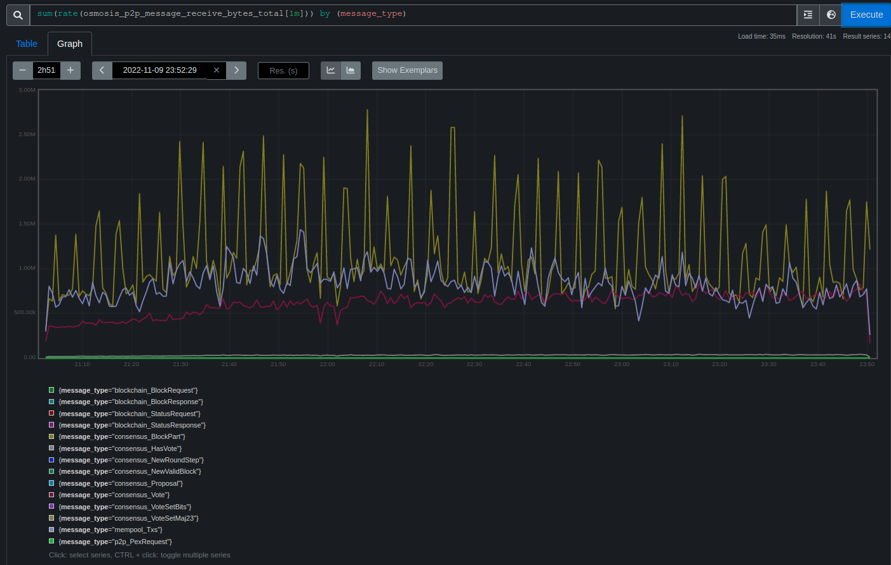

# RFC 27: P2P Message Bandwidth Report

## Changelog

- Nov 7, 2022: initial draft (@williambanfield)
- Nov 15, 2022: draft completed (@williambanfield)

## Abstract

Node operators and application developers complain that Tendermint nodes consume
larges amounts of network bandwidth. This RFC catalogues the major sources of bandwidth
consumption within Tendermint and suggests modifications to Tendermint that may reduce
bandwidth consumption for nodes.

## Background
Multiple teams running validators in production report that the validator
consumes a lot of bandwidth. They report that operators running on a network
with hundreds of validators consumes multiple terabytes of bandwidth per day.
Prometheus data collected from a validator node running on the Osmosis chain
shows that Tendermint sends and receives large amounts of data to peers. In the
nearly three hours of observation, Tendermint sent nearly 42 gigabytes and
received about 26 gigabytes, for an estimated 366 gigabytes sent daily and 208
gigabytes received daily. While this is shy of the reported terabytes number,
operators running multiple nodes for a 'sentry' pattern could easily send and
receive a terabyte of data.

Sending and receiving large amounts of data has a cost for node operators. Most
cloud platforms charge for network traffic egress. Google Cloud charges between
[$.05 to $.12 per gigabyte of egress traffic][gcloud-pricing], and ingress is
free. Hetzner [charges 1€ per TB used over the 10-20TB base bandwidth per
month][hetzner-pricing], which will be easily hit if multiple terabytes are
sent and received per day. Using the values collected from the validator on
Osmosis, a single node on Google cloud may cost $18 to $44 a day running on
Google cloud. On Hetzner, the estimated 18TB a month of both sending and
receiving may cost between 0 and 10 Euro a month per node.

## Discussion

### Overview of Major Bandwidth Usage

To determine which components of Tendermint were consuming the most bandwidth,
I gathered prometheus metrics from the [Blockpane][blockpane] validator running
on the Osmosis network for several hours. The data reveal that three message
types account for 98% of the total bandwidth consumed. These message types are
as follows:

1. [consensus.BlockPart][block-part-message]
2. [mempool.Txs][mempool-txs-message]
3. [consensus.Vote][vote-message]

The image below of p2p data collected from the Blockpane validator illustrate
the total bandwidth consumption of these three message types.

#### Send: 

##### Top 3 Percent: 

##### Rate For All Messages: 

#### Receive: 

##### Top 3 Percent: 

##### Rate For All Messages: 

### Investigation of Message Usage

This section discusses the usage of each of the three highest consumption messages.
#### BlockPart Transmission

Sending `BlockPart` messages consumes the most bandwidth out of all p2p
messages types as observed in the Blockpane Osmosis validator. In the almost 3
hour observation, the validator sent about 20 gigabytes of `BlockPart`
messages.

A block is proposed each round of Tendermint consensus. The paper does not
define a specific way that the block is to be transmitted, just that all
participants will receive it via a gossip network.

The Go implementation of Tendermint transmits the block in 'parts'. It
serializes the block to wire-format proto and splits this byte representation
into a set of 4 kilobyte arrays and sends these arrays to its peers, each in a
separate message.

The logic for sending `BlockPart` messages resides in the code for the
[consensus.Reactor][gossip-data-routine]. The consensus reactor starts a new
`gossipDataRoutine` for each peer it connects to. This routine repeatedly picks
a part of the block that Tendermint believes the peer does not know about yet
and gossips it to the peer. The set of `BlockParts` that Tendermint considers
its peer as having is only updated in one of four ways:

 1. Our peer tells us they have entered a new round [via a `NewRoundStep`
message][new-round-step-message-send]. This message is only sent when a node
moves to a new round or height and only resets the data we collect about a
peer's blockpart state.
 1. [We receive a block part from the peer][block-part-receive].
 1. [We send][block-part-send-1] [the peer a block part][block-part-send-2].
 1. Our peer tells us about the parts they have block [via `NewValidBlock`
messages][new-valid-block-message-send]. This message is only sent when the
peer has a quorum of prevotes or precommits for a block.

Each node receives block parts from all of its peers. The particular block part
to send at any given time is randomly selected from the set of parts that the
peer node is not yet known to have. Given that these are the only times that
Tendermint learns of its peers' block parts, it's very likely that a node has
an incomplete understanding of its peers' block parts and is transmitting block
parts to a peer that the peer has received from some other node.

Multiple potential mechanisms exist to reduce the number of duplicate block
parts a node receives. One set of mechanisms relies on more frequently
communicating the set of block parts a node needs to its peers. Another
potential mechanism requires a larger overhaul to the way blocks are gossiped
in the network.

#### Mempool Tx Transmission

The Tendermint mempool stages transactions that are yet to be committed to the
blockchain and communicates these transactions to its peers. Each message
contains one transaction. Data collected from the Blockpane node running on
Osmosis indicates that the validator sent about 12 gigabytes of `Txs` messages
during the nearly 3 hour observation period.

The Tendermint mempool starts a new [broadcastTxRoutine][broadcast-tx-routine]
for each peer that it is informed of. The routine sends all transactions that
the mempool is aware of to all peers with few exceptions. The only exception is
if the mempool received a transaction from a peer, then it marks it as such and
won't resend to that peer. Otherwise, it retains no information about which
transactions it already sent to a peer. In some cases it may therefore resend
transactions the peer already has. This can occur if the mempool removes a
transaction from the `CList` data structure used to store the list of
transactions while it is about to be sent and if the transaction was the tail
of the `CList` during removal. This will be more likely to occur if a large
number of transactions from the end of the list are removed during `RecheckTx`,
since multiple transactions will become the tail and then be deleted. It is
unclear at the moment how frequently this occurs on production chains.

Beyond ensuring that transactions are rebroadcast to peers less frequently,
there is not a simple scheme to communicate fewer transactions to peers. Peers
cannot communicate what transactions they need since they do not know which
transactions exist on the network.

#### Vote Transmission

Tendermint votes, both prevotes and precommits, are central to Tendermint
consensus and are gossiped by all nodes to all peers during each consensus
round. Data collected from the Blockpane node running on Osmosis indicates that
about 9 gigabytes of `Vote` messages were sent during the nearly 3 hour period
of observation. Examination of the [Vote message][vote-msg] indicates that it
contains 184 bytes of data, with the proto encoding adding a few additional
bytes when transmitting.

The Tendermint consensus reactor starts a new
[gossipVotesRoutine][gossip-votes-routine] for each peer that it connects to.
The reactor sends all votes to all peers unless it knows that the peer already
has the vote or the reactor learns that the peer is in a different round and
that thus the vote no longer applies. Tendermint learns that a peer has a vote
in one of 4 ways:

 1. Tendermint sent the peer the vote.
 1. Tendermint received the vote from the peer.
 1. The peer [sent a `HasVote` message][apply-has-vote]. This message is broadcast
to all peers [each time validator receives a vote it hasn't seen before
corresponding to its current height and round][publish-event-vote].
 1. The peer [sent a `VoteSetBits` message][apply-vote-set-bits]. This message is
[sent as a response to a peer that sends a `VoteSetMaj23`][vote-set-bits-send].

Given that Tendermint informs all peers of _each_ vote message it receives, all
nodes should be well informed of which votes their peers have. Given that the
vote messages were the third largest consumer of bandwidth in the observation
on Osmosis, it's possible that this system is not currently working correctly.
Further analysis should examine where votes may be being retransmitted.

### Suggested Improvements to Lower Message Transmission Bandwidth

#### Gossip Known BlockPart Data

The `BlockPart` messages, by far, account for the majority of the data sent to
each peer. At the moment, peers do not inform the node of which block parts
they already have. This means that each block part is _very likely_ to be
transmitted many times to each node. This frivolous consumption is even worse
in networks with large blocks.

The very simple solution to this issue is to copy the technique used in
consensus for informing peers when the node receives a vote. The consensus
reactor can be augmented with a `HasBlockPart` message that is broadcast to
each peer every time the node receives a block part. By informing each peer
every time the node receives a block part, we can drastically reduce the amount
of duplicate data sent to each node. There would be no algorithmic way of
enforcing that a peer accurately reports its block parts, so providing this
message would be a somewhat altruistic action on the part of the node. Such a
system [has been proposed in the past][i627] as well, so this is certainly not
totally new ground.

Measuring the size of duplicately received blockparts before and after this
change would help validate this approach.

#### Compress Transmitted Data

Tendermint's data is sent uncompressed on the wire. The messages are not
compressed before sending and the transport performs no compression either.
Some of the information communicated by Tendermint is a poor candidate for
compression: Data such as digital signatures and hashes have high entropy and
therefore do not compress well. However, transactions may contain lots of
information that has less entropy. Compression within Tendermint may be added
at several levels. Compression may be performed at the [Tendermint 'packet'
level][must-wrap-packet] or at the [Tendermint message send
level][message-send].

#### Transmit Less Data During Block Gossip

Block, vote, and mempool gossiping transmit much of same data. The mempool
reactor gossips candidate transactions to each peer. The consensus reactor,
when gossiping the votes, sends vote metadata and the digital signature of that
signs over that metadata. Finally, when a block is proposed, the proposing node
amalgamates the received votes, a set of transaction, and adds a header to
produce the block. This block is then serialized and gossiped as a list of
bytes. However, the data that the block contains, namely the votes and the
transactions were most likely _already transmitted to the nodes on the network_
via mempool transaction gossip and consensus vote gossip.

Therefore, block gossip can be updated to transmit a representation of the data
contained in the block that assumes the peers will already have most of this
data. Namely, the block gossip can be updated to only send 1) a list of
transaction hashes and 2) a bit array of votes selected for the block along
with the header and other required block metadata.

This new proposed method for gossiping block data could accompany a slight
update to the mempool transaction gossip and consensus vote gossip. Since all
of the contents of each block will not be gossiped together, it's possible that
some nodes are missing a proposed transaction or the vote of a validator
indicated in the new block gossip format during block gossip. The mempool and
consensus reactors may therefore be updated to provide a `NeedTxs` and
`NeedVotes` message. Each of these messages would allow a node to request a set
of data from their peers. When a node receives one of these, it will then
transmit the Tx/Votes indicate in the associated message regardless of whether
it believes it has transmitted them to the peer before. The gossip layer will
ensure that each peer eventually receives all of the data in the block.
However, if a transaction is needed immediately by a peer so that it can verify
and execute a block during consensus, a mechanism such as the `NeedTxs` and
`NeedVotes` messages should be added to ensure it receives the messages
quickly.

The same logic may applied for evidence transmission as well, since all nodes
should receive evidence and therefore do not need to re-transmit it in a block
part.

A similar idea has been proposed in the past as [Compact Block
Propagation][compact-block-propagation].

## References

[blockpane]: https://www.mintscan.io/osmosis/validators/osmovaloper1z0sh4s80u99l6y9d3vfy582p8jejeeu6tcucs2
[block-part-message]: https://github.com/tendermint/tendermint/blob/ff0f98892f24aac11e46aeff2b6d2c0ad816701a/proto/tendermint/consensus/types.proto#L44
[mempool-txs-message]: https://github.com/tendermint/tendermint/blob/ff0f98892f24aac11e46aeff2b6d2c0ad816701a/proto/tendermint/mempool/types.proto#L6
[vote-message]: https://github.com/tendermint/tendermint/blob/ff0f98892f24aac11e46aeff2b6d2c0ad816701a/proto/tendermint/consensus/types.proto#L51
[gossip-data-routine]: https://github.com/tendermint/tendermint/blob/ff0f98892f24aac11e46aeff2b6d2c0ad816701a/consensus/reactor.go#L537
[block-part-receive]: https://github.com/tendermint/tendermint/blob/ff0f98892f24aac11e46aeff2b6d2c0ad816701a/consensus/reactor.go#L324
[block-part-send-1]:  https://github.com/tendermint/tendermint/blob/ff0f98892f24aac11e46aeff2b6d2c0ad816701a/consensus/reactor.go#L566
[block-part-send-2]: https://github.com/tendermint/tendermint/blob/ff0f98892f24aac11e46aeff2b6d2c0ad816701a/consensus/reactor.go#L684.
[new-valid-block-message-send]: https://github.com/tendermint/tendermint/blob/ff0f98892f24aac11e46aeff2b6d2c0ad816701a/consensus/reactor.go#L268
[new-round-step-message-send]:  https://github.com/tendermint/tendermint/blob/ff0f98892f24aac11e46aeff2b6d2c0ad816701a/consensus/reactor.go#L266
[broadcast-tx-routine]: https://github.com/tendermint/tendermint/blob/ff0f98892f24aac11e46aeff2b6d2c0ad816701a/mempool/v0/reactor.go#L197
[gossip-votes-routine]: https://github.com/tendermint/tendermint/blob/ff0f98892f24aac11e46aeff2b6d2c0ad816701a/consensus/reactor.go#L694
[apply-has-vote]: https://github.com/tendermint/tendermint/blob/ff0f98892f24aac11e46aeff2b6d2c0ad816701a/consensus/reactor.go#L1429
[apply-vote-set-bits]: https://github.com/tendermint/tendermint/blob/ff0f98892f24aac11e46aeff2b6d2c0ad816701a/consensus/reactor.go#L1445
[publish-event-vote]: https://github.com/tendermint/tendermint/blob/ff0f98892f24aac11e46aeff2b6d2c0ad816701a/consensus/state.go#L2083
[vote-set-bits-send]: https://github.com/tendermint/tendermint/blob/ff0f98892f24aac11e46aeff2b6d2c0ad816701a/consensus/reactor.go#L306
[must-wrap-packet]: https://github.com/tendermint/tendermint/blob/ff0f98892f24aac11e46aeff2b6d2c0ad816701a/p2p/conn/connection.go#L889-L918
[message-send]: https://github.com/tendermint/tendermint/blob/ff0f98892f24aac11e46aeff2b6d2c0ad816701a/p2p/peer.go#L285
[gcloud-pricing]: https://cloud.google.com/vpc/network-pricing#vpc-pricing
[hetzner-pricing]: https://docs.hetzner.com/robot/general/traffic
[vote-msg]: https://github.com/tendermint/tendermint/blob/ff0f98892f24aac11e46aeff2b6d2c0ad816701a/proto/tendermint/types/types.pb.go#L468
[i627]: https://github.com/tendermint/tendermint/issues/627
[compact-block-propagation]: https://github.com/tendermint/tendermint/issues/7932
