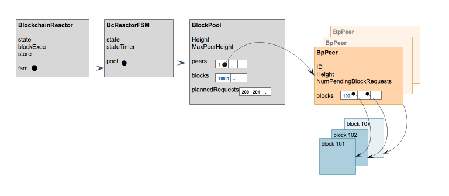
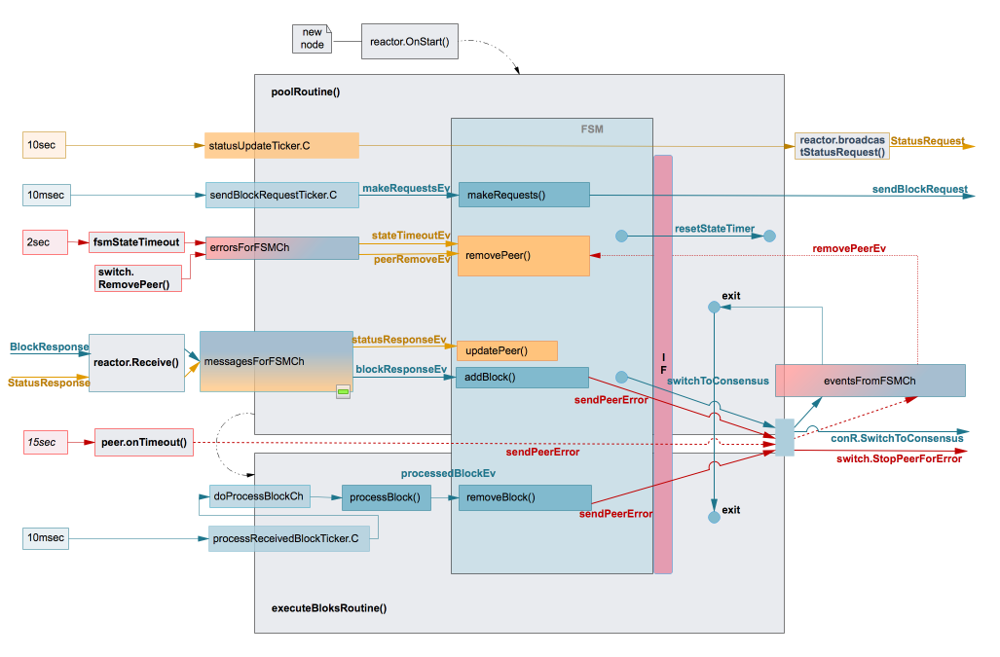
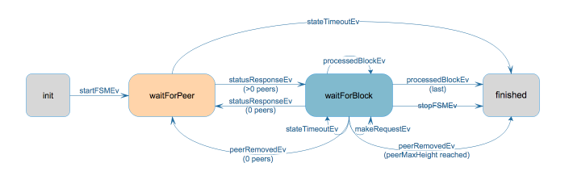

# Blockchain Reactor v1

### Data Structures
The data structures used are illustrated below.



#### BlockchainReactor
- is a `p2p.BaseReactor`.
- has a `store.BlockStore` for persistence.
- executes blocks using an `sm.BlockExecutor`.
- starts the FSM and the `poolRoutine()`.
- relays the fast-sync responses and switch messages to the FSM.
- handles errors from the FSM and when necessarily reports them to the switch.
- implements the blockchain reactor interface used by the FSM to send requests, errors to the switch and state timer resets.
- registers all the concrete types and interfaces for serialisation.

```go
type BlockchainReactor struct {
	p2p.BaseReactor

	initialState sm.State // immutable
	state        sm.State

	blockExec *sm.BlockExecutor
	store     *store.BlockStore

	fastSync bool

	fsm          *BcReactorFSM
	blocksSynced int

	// Receive goroutine forwards messages to this channel to be processed in the context of the poolRoutine.
	messagesForFSMCh chan bcReactorMessage

	// Switch goroutine may send RemovePeer to the blockchain reactor. This is an error message that is relayed
	// to this channel to be processed in the context of the poolRoutine.
	errorsForFSMCh chan bcReactorMessage

	// This channel is used by the FSM and indirectly the block pool to report errors to the blockchain reactor and
	// the switch.
	eventsFromFSMCh chan bcFsmMessage
}
```

#### BcReactorFSM
- implements a simple finite state machine.
- has a state and a state timer.
- has a `BlockPool` to keep track of block requests sent to peers and blocks received from peers.
- uses an interface to send status requests, block requests and reporting errors. The interface is implemented by the `BlockchainReactor` and tests.

```go
type BcReactorFSM struct {
	logger log.Logger
	mtx    sync.Mutex

	startTime time.Time

	state      *bcReactorFSMState
	stateTimer *time.Timer
	pool       *BlockPool

	// interface used to call the Blockchain reactor to send StatusRequest, BlockRequest, reporting errors, etc.
	toBcR bcReactor
}
```

#### BlockPool
- maintains a peer set, implemented as a map of peer ID to `BpPeer`.
- maintains a set of requests made to peers, implemented as a map of block request heights to peer IDs.
- maintains a list of future block requests needed to advance the fast-sync. This is a list of block heights. 
- keeps track of the maximum height of the peers in the set.
- uses an interface to send requests and report errors to the reactor (via FSM).

```go
type BlockPool struct {
	logger log.Logger
	// Set of peers that have sent status responses, with height bigger than pool.Height
	peers map[p2p.ID]*BpPeer
	// Set of block heights and the corresponding peers from where a block response is expected or has been received.
	blocks map[int64]p2p.ID

	plannedRequests   map[int64]struct{} // list of blocks to be assigned peers for blockRequest
	nextRequestHeight int64              // next height to be added to plannedRequests

	Height        int64 // height of next block to execute
	MaxPeerHeight int64 // maximum height of all peers
	toBcR         bcReactor
}
```
Some reasons for the `BlockPool` data structure content:
1. If a peer is removed by the switch fast access is required to the peer and the block requests made to that peer in order to redo them.
2. When block verification fails fast access is required from the block height to the peer and the block requests made to that peer in order to redo them.
3. The `BlockchainReactor` main routine decides when the block pool is running low and asks the `BlockPool` (via FSM) to make more requests. The `BlockPool` creates a list of requests and triggers the sending of the block requests (via the interface). The reason it maintains a list of requests is the redo operations that may occur during error handling. These are redone when the `BlockchainReactor` requires more blocks.

#### BpPeer
- keeps track of a single peer, with height bigger than the initial height.
- maintains the block requests made to the peer and the blocks received from the peer until they are executed.
- monitors the peer speed when there are pending requests.
- it has an active timer when pending requests are present and reports error on timeout.

```go
type BpPeer struct {
	logger log.Logger
	ID     p2p.ID

	Height                  int64                  // the peer reported height
	NumPendingBlockRequests int                    // number of requests still waiting for block responses
	blocks                  map[int64]*types.Block // blocks received or expected to be received from this peer
	blockResponseTimer      *time.Timer
	recvMonitor             *flow.Monitor
	params                  *BpPeerParams // parameters for timer and monitor

	onErr func(err error, peerID p2p.ID) // function to call on error
}
```

### Concurrency Model

The diagram below shows the goroutines (depicted by the gray blocks), timers (shown on the left with their values) and channels (colored rectangles). The FSM box shows some of the functionality and it is not a separate goroutine.

The interface used by the FSM is shown in light red with the `IF` block. This is used to:
- send block requests 
- report peer errors to the switch - this results in the reactor calling `switch.StopPeerForError()` and, if triggered by the peer timeout routine, a `removePeerEv` is sent to the FSM and action is taken from the context of the `poolRoutine()`
- ask the reactor to reset the state timers. The timers are owned by the FSM while the timeout routine is defined by the reactor. This was done in order to avoid running timers in tests and will change in the next revision.
 
There are two main goroutines implemented by the blockchain reactor. All I/O operations are performed from the `poolRoutine()` context while the CPU intensive operations related to the block execution are performed from the context of the `executeBlocksRoutine()`. All goroutines are detailed in the next sections.



#### Receive()
Fast-sync messages from peers are received by this goroutine. It performs basic validation and:
- in helper mode (i.e. for request message) it replies immediately. This is different than the proposal in adr-040 that specifies having the FSM handling these.
- forwards response messages to the `poolRoutine()`.

#### poolRoutine()
(named kept as in the previous reactor). 
It starts the `executeBlocksRoutine()` and the FSM. It then waits in a loop for events. These are received from the following channels:
- `sendBlockRequestTicker.C` - every 10msec the reactor asks FSM to make more block requests up to a maximum. Note: currently this value is constant but could be changed based on low/ high watermark thresholds for the number of blocks received and waiting to be processed, the number of blockResponse messages waiting in messagesForFSMCh, etc.
- `statusUpdateTicker.C` - every 10 seconds the reactor broadcasts status requests to peers. While adr-040 specifies this to run within the FSM, at this point this functionality is kept in the reactor.
- `messagesForFSMCh` - the `Receive()` goroutine sends status and block response messages to this channel and the reactor calls FSM to handle them.
- `errorsForFSMCh` - this channel receives the following events: 
    - peer remove - when the switch removes a peer
    - sate timeout event - when FSM state timers trigger
  The reactor forwards this messages to the FSM.
- `eventsFromFSMCh` - there are two type of events sent over this channel:
    - `syncFinishedEv` - triggered when FSM enters `finished` state and calls the switchToConsensus() interface function.
    - `peerErrorEv`- peer timer expiry goroutine sends this event over the channel for processing from poolRoutine() context.
    
#### executeBlocksRoutine()
Started by the `poolRoutine()`, it retrieves blocks from the pool and executes them:
- `processReceivedBlockTicker.C` - a ticker event is received over the channel every 10msec and its handling results in a signal being sent to the doProcessBlockCh channel.
- doProcessBlockCh - events are received on this channel as described as above and upon processing blocks are retrieved from the pool and executed. 


### FSM



#### States
##### init (aka unknown)
The FSM is created in `unknown` state. When started, by the reactor (`startFSMEv`), it broadcasts Status requests and transitions to `waitForPeer` state.

##### waitForPeer
In this state, the FSM waits for a Status responses from a "tall" peer. A timer is running in this state to allow the FSM to finish if there are no useful peers.

If the timer expires, it moves to `finished` state and calls the reactor to switch to consensus.
If a Status response is received from a peer within the timeout, the FSM transitions to `waitForBlock` state.

##### waitForBlock
In this state the FSM makes Block requests (triggered by a ticker in reactor) and waits for Block responses. There is a timer running in this state to detect if a peer is not sending the block at current processing height. If the timer expires, the FSM removes the peer where the request was sent and all requests made to that peer are redone.

As blocks are received they are stored by the pool. Block execution is independently performed by the reactor and the result reported to the FSM:
- if there are no errors, the FSM increases the pool height and resets the state timer.
- if there are errors, the peers that delivered the two blocks (at height and height+1) are removed and the requests redone.

In this state the FSM may receive peer remove events in any of the following scenarios: 
- the switch is removing a peer
- a peer is penalized because it has not responded to some block requests for a long time
- a peer is penalized for being slow

When processing of the last block (the one with height equal to the highest peer height minus one) is successful, the FSM transitions to `finished` state.
If after a peer update or removal the pool height is same as maxPeerHeight, the FSM transitions to `finished` state.

##### finished
When entering this state, the FSM calls the reactor to switch to consensus and performs cleanup.

#### Events

The following events are handled by the FSM:

```go
const (
	startFSMEv = iota + 1
	statusResponseEv
	blockResponseEv
	processedBlockEv
	makeRequestsEv
	stopFSMEv
	peerRemoveEv = iota + 256
	stateTimeoutEv
)
```

### Examples of Scenarios and Termination Handling
A few scenarios are covered in this section together with the current/ proposed handling.
In general, the scenarios involving faulty peers are made worse by the fact that they may quickly be re-added.

#### 1. No Tall Peers

S: In this scenario a node is started and while there are status responses received, none of the peers are at a height higher than this node.

H: The FSM times out in `waitForPeer` state, moves to `finished` state where it calls the reactor to switch to consensus.

#### 2. Typical Fast Sync

S: A node fast syncs blocks from honest peers and eventually downloads and executes the penultimate block.

H: The FSM in `waitForBlock` state will receive the processedBlockEv from the reactor and detect that the termination height is achieved.

#### 3. Peer Claims Big Height but no Blocks

S: In this scenario a faulty peer claims a big height (for which there are no blocks).

H: The requests for the non-existing block will timeout, the peer removed and the pool's `MaxPeerHeight` updated. FSM checks if the termination height is achieved when peers are removed.

#### 4. Highest Peer Removed or Updated to Short

S: The fast sync node is caught up with all peers except one tall peer. The tall peer is removed or it sends status response with low height.

H: FSM checks termination condition on peer removal and updates.

#### 5. Block At Current Height Delayed

S: A peer can block the progress of fast sync by delaying indefinitely the block response for the current processing height (h1).

H: Currently, given h1 < h2, there is no enforcement at peer level that the response for h1 should be received before h2. So a peer will timeout only after delivering all blocks except h1. However the `waitForBlock` state timer fires if the block for current processing height is not received within a timeout. The peer is removed and the requests to that peer (including the one for current height) redone.
