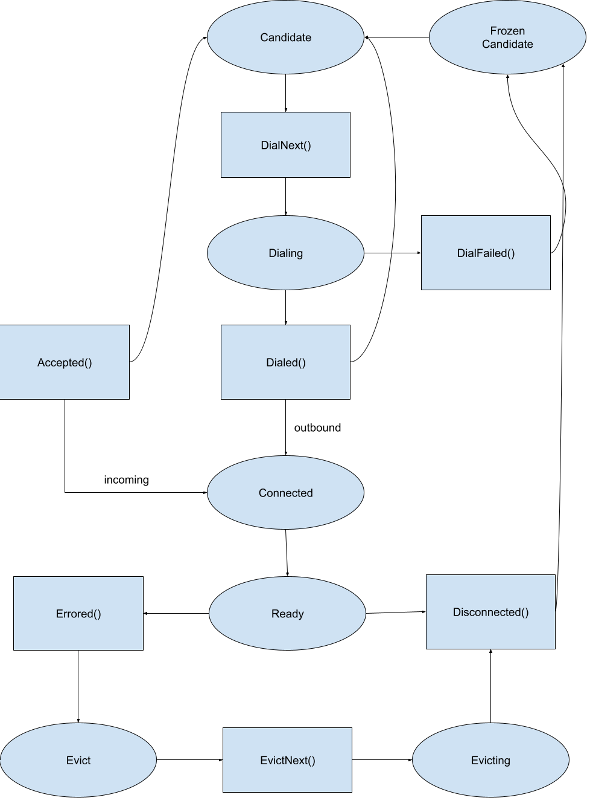

# Peer manager

The peer manager implements the connection policy for the node, based on the
configuration provided by the operators, the current state of the connections
reported by the [`Router`](./router.md), and the set of known candidate peers.

This document uses *candidate peer* to refer to the information about a node in
the network, namely its unique identifier and one or more network addresses.
This information can be manually configured by the node operator (e.g., via
`PersistentPeers` parameter) or can be obtained via the Peer-Exchange Protocol
(PEX), which feeds the peer manager with discovered peers' information.

## Connection policy

The connection policy defines:

1. When the node should establish new connections to peers, and
1. The next peer to which the router should try to establish a connection.

The first definition is made based the concept of [connection slots](#connection-slots).
In short, the peer manager will try to fill every connection slot with a peer.
If all the connection slots are full but there is the possibility to connect to
a peer that is higher-[ranked](#peer-ranking) that one of the connecting peers,
the peer manager may attempt to [upgrade a connection slot](#slot-upgrades).
Details of these operations are provided in the following.

### Connection slots

The number of connection slots is defined by the `MaxConnected` parameter.

While there are available connection slots, the peer manager will provide
candidate peers to the router, which will try to establish
new connections to them.
When the peer manager provides a candidate peer to
the router, a connection slot becomes _virtually_ occupied by the peer, as the
router should be dialing it.

When the router establishes a connection to a peer, either
because it [accepted a connection](#accepted-transition) from a peer,
or because it [successfully dialed](#dialed-transition) a candidate peer,
the peer manager should find a slot for this connection.

If there is an available connection slot, and this is the first connection
established with that peer, the slot is filled by the new connection and
the peer becomes a [connected peer](#connected-peer).
The peer manager does not allow two slots to be filled with connections to the
same peer.

If all `MaxConnected` connection slots are full, the node should _a priori_
reject the connection with the peer.
However, it is possible that the new connection is with a peer whose score is
better than the score of a peer occupying one of the connection slots.
In this case, the peer manager will try to [upgrade the slot](#slot-upgrades)
to make room to the new connection, by evicting the peer currently occupying
this slot.

> Although not advisable, the `MaxConnected` parameter can be set `0`, which
> means no limit.
>
> In this case, the node will accept all connections established by peers, and
> will try to establish connections (dial) to every candidate peer it knows.

### Outgoing connections

The peer manager distinguishes *incoming* from *outgoing* connections.
A connection is *incoming* when the router has [accepted](#accepted-transition)
it from a peer.
A connection is *outgoing* when the router has successfully
[dialed](#dialed-transition) a peer.

If the `MaxOutgoingConnections` parameter is set (it is larger than zero), it
defines the maximum number of *outgoing* connections the node should maintain.
More precisely, it determines that the node should not attempt to dial new
peers when the router already has established outgoing connections to
`MaxOutgoingConnections` peers.

> The previous version of the `p2p` explicitly distinguished incoming and
> outgoing peers. Configuring the `MaxOutgoingConnections` parameters should
> therefore make the connection policy similar to the one adopted in the
> previous version. (TODO: check)

### Slot upgrades

The rationale behind this concept is that the node may try to establish or
accept connections even when all the connection slots are full, provided that
the peer in the other side of the new connection is better-ranked than a peer
that is occupying a connection slot.
A slot can therefore be upgraded, meaning that the lower-ranked peer
occupying the slot will be replaced by a higher-ranked peer.

The upgrading of connection slots is determined by the `MaxConnectedUpgrade`
parameter, which defines the number of connections that the peer manager can
use for upgrading connection slots.

If `MaxConnectedUpgrade` is set to zero, the upgrading of connection slots is
disabled.
This means, in particular, that `MaxConnected` is the hard limit of peers that
can be in the [connected state](#connected-peer).

If `MaxConnectedUpgrade` is larger than zero, the upgrading of connection slots
is enabled.
As a result, the hard limit for the number of peers that can be in the
[connected state](#connected-peer) becomes `MaxConnected + MaxConnectedUpgrade`.
Some of these peers, however, will not remain in this state as they should be
[evicted](#evictnext-transition) by the router.

### Peer ranking

The peer manager should rank peers based on user-provided parameters and on the
current state of the peer.

The ranking is established by ordering all known peers by its score.
This mechanism is currently very basic.

> The code contains a number of potential replacements for this ranking
> mechanism. Therefore, improving this mechanism is a work in progress.

Peers configured as `PersistentPeers` have _always_ `PeerScorePersistent`,
which is the maximum allowed peer score.

The remaining peers have a `MutableScore`, initialized to `0` when the peer is
added to the peer manager.
When the peer is reported as a `PeerStatusGood`, its score is incremented.
When the peer is reported as a `PeerStatusBad`, its score is decremented.

> The mechanisms based on the "reputation" of the peer according to reactors,
> however, appears not to be fully implemented.
> A peer is never `PeerStatusGood`, and is only reported as `PeerStatusBad` a
> reactor interacting with the peer reports an error to the router, and the
> error is not "fatal".
> If the error is fatal, the peer is reported as [errored](#errored-peer).

This score can also be _temporarily_ decremented due to connection errors.
When the router fails to dial to a peer, it increments the peer's
`DialFailures` counter.
This counter is reset when the router successfully dials the peer, establishing
a connection to it.
During this period, between dial failures and succeeding to dial the peer, the
peer score is decremented by the `DialFailures` counter.

> `DialFailures` actually refers to a peer address. A peer may have multiple
> addresses, and all associated counters are considered for decrementing the
> peer's score. Also, all counters are reset when the router succeeds dialing
> the peer.

## Peer life cycle

For implementing the connection policy, the peer manager keeps track of the
state of peers and manages their life-cycle.
The life cycle of a peer is summarized in the picture below.
The circles represent _states_ of a peer and the rectangles represent
_transitions_.
All transitions are performed by the `Router`, by invoking methods of the peer
manager with corresponding names.
Normal transitions are represented by green arrows, while red arrows represent
alternative transitions taken in case of errors.

### Candidate peer

The initial state of a peer in the peer manager.

A `Candidate` peer may become an actual peer, to which the node is connected.
We do not use candidate to refer to a peer to which we are connected, nor to
a peer we are attempting to connect.

Candidate peers from which the router recently disconnected or failed to dial
are, during a certain period, not eligible for establishing connections.
This scenario is represented by the `Frozen Candidate` state.

### DialNext transition

This state transition is performed when the [connection policy](#connection-policy)
determines that the node should try to establish a connection with a peer.

The peer manager selects the [best-ranked](#peer-ranking) peer which is in the
[`Candidate`](#candidate-peer) state and provides it to the router.
As the router is supposed to dial the peer, the peer manager sets the peer to
the [dialing](#dialing-peer) state.

Dialing a candidate peer may have become possible because the peer manager
has found a connection slot to [upgrade](#slots-upgrades) for given room to the
selected candidate peer.
If this is the case, the peer occupying this connection slot is set to the
[upgrading state](#upgrading-peer), so that it will be evicted once the
connection to the candidate peer is successfully established.

### Dialing peer

A peer that has been returned to the router as the next peer to dial.
The router should be attempting to connect to this peer.

A peer in `Dialing` state it is not considered as a candidate peer.

### Dialed transition

This transition is performed when the node establishes an outgoing connection
with a peer.
This means that the peer manager has provided this peer to the router as the
[next peer to dial](#dialnext-transition), and the router has dialed and
successfully established a connection with the peer.
The peer is thus expected to be in the [`Dialing`](#dialing-peer) state.

It may occur, however, that when this transition is invoked the peer is already
in the [`Connected`](#connected-peer) state.
The most likely reason is that the router, while dialing this peer, has also
accepted an incoming connection from the same peer.
In this case, the transition fails, indicating to the router that is should
close the newly established connection.

> Question: is it possible to have multiple routines dialing to the same peer?
> This could be another reason for this transition to fail.

It may also occur that the node is already connected to `MaxConnected` peers,
which means that all connection slots are full.
In this case, the peer manager tries to find a connection slot that can be
[upgraded](#slots-upgrading) to give room for the new established connection.
If no suitable connection slot is found, or the hard limit `MaxConnected +
MaxConnectedUpgrade` of connected peers is reached, the transitions fails.

Notice that, in order to dial this peer, the peer manager may have put another
lower-ranked peer in the [upgrading sub-state](#upgrading-peeer) to give room
to this connection.
In this case, the slot for the established connection was *reserved*, and this
transition will not fail.

If the transition succeeds, the peer is set to the
[`Connected`](#connected-peer) state as an `outgoing` peer.
The peer's `LastConnected` and the dialed address' `LastDialSuccess` times are
set, and dialed address' `DialFailures` counter is reset.

> If the peer is `Inactive`, it is set as active.
> This action has no effect apart from producing metrics.

If a connection slot was upgraded to give room for the established connection, the
peer on that slot transitions to the [evict sub-state](#evict-peer).

#### Errors

The transition fails if:

- the node dialed itself
- the peer is already in the `Connected` state
- the node is connected to `MaxConnected` peers, and no slot is suitable for upgrading

Errors are also returned if:

- the dialed peer was removed from the peer store
- the updated peer information is invalid
- there is an error when saving the peer state to the peer store

### DialFailed transition

This transition informs a failure when establishing an `outgoing` connection to
a peer.

The dialed address's `LastDialFailure` time is set, and its `DialFailures`
counter is increased.
This information is used to compute the [retry delay](#retry-delay) for the
dialed address.

The peer manager then spawns a routine that after the computed retry delay
notifies the next peer to dial routine about the availability of this peer.
Until then, the peer is the `Frozen Candidate` state.

#### Retry delay

The retry dial is the minimum time, from the latest failed dialing attempt, we
should wait until dialing a peer address again.

The default delay is defined by `MinRetryTime` parameter.
If it is set to zero, we *never* retry dialing a peer address.

Upon each failed dial attempt, we increase the delay by `MinRetryTime`, plus an
optional random jitter of up to `RetryTimeJitter`.

The retry delay should not be longer than the `MaxRetryTime` parameter,
or `MaxRetryTimePersistent` parameter in the case of persistent peers.

#### Errors

Errors are also returned if:

- the updated peer information is invalid
- there is an error when saving the peer state to the peer store

### Accepted transition

This transition is performed when the node establishes an *incoming* connection
with a peer.
This means that the router has received a connection attempt from this peer and
successfully established a connection with it.

It may occur, however, that when this transition is invoked the peer is already
in the [`Connected`](#connected-peer) state.
The most likely reason is that the router was simultaneously dialing the same
peer, and has successfully [established a connection](#dialed-transition) with
it.
In this case, the transition fails, indicating to the router that is should
close the accepted connection.

It may also occur that the node is already connected to `MaxConnected` peers,
which means that all connection slots are full.
In this case, the peer manager tries to find a connection slot that can be
[upgraded](#slots-upgrading) to give room for the accepted connection.
If no suitable connection slot is found, or the hard limit `MaxConnected +
MaxConnectedUpgrade` of connected peers is reached, the transitions fails.

If the transition succeeds, the peer is set to the
[`Connected`](#connected-peer) state as an `incoming` peer.

The accepted peer might not be known by the peer manager.
In this case the peer is registered in the peer store, without any associated
address.
The peer `LastConnected` time is set and the `DialFailures` counter is reset
for all addresses associated to the peer.

> If the peer is `Inactive`, it is set as active.
> This action has not effect apart from producing metrics.

If a connection slot was upgraded to give room for the accepted connection, the
peer on that slot transitions to the [evict sub-state](#evict-peer).

#### Errors

The transition fails if:

- the node accepted itself
- the peer is already in the `Connected` state
- the node is connected to `MaxConnected` peers, and no slot is suitable for upgrading

Errors are also returned if:

- the updated peer information is invalid
- there is an error when saving the peer state to the peer store

### Connected peer

A peer to which the node is connected.
A peer in this state is not considered a candidate peer.

The peer manager distinguishes *incoming* from *outgoing* connections.
Incoming connections are established through the [`Accepted`](#accepted-transition) transition.
Outgoing connections are established through the [`Dialed`](#dialed-transition) transition.

### Ready transition

By invoking this transition, the router notifies the peer manager that it is
ready to exchange messages with a peer.

The router invokes this transition just after successfully performing the
[`Dialed`](#dialed-transition) or [`Accepted`](#accepted-transition) transitions,
providing to the peer manager a list of channels supported by the peer.
This information is broadcast to all reactors in a `PeerUpdate` message that
informs the new state (up) of the peer.

This transition is not represented in the picture because it does not change
the state of the peer, which should be in the [`Connected`](#connected-peer) state.

### Disconnected transition

This transition is performed when the node disconnects from a peer.
It is invoked by the router when an error is returned by the routines used to
exchange messages with the peer.

The peer is expected to be in the [`Connected`](#connected-peer) state.
If the [`Ready`](#ready-transition) transition has been performed, the peer manager broadcast a
`PeerUpdate` to all reactors notifying the new status (down) of this peer.

If the peer is still present in the peer store, its `LastDisconnected` time is
set and the peer manager spawns a routine that after `DisconnectCooldownPeriod`
notifies the next peer to dial routine about the availability of this peer.
Until then, the peer is the `Frozen Candidate` state.

### Errored transition

This transition is performed when a reactor interacting with the peer reports
an error to the router.

The peer is expected to be in the [`Connected`](#connected-peer) state.
If so, the peer transitions to the [`Evict`](#evict-peer) sub-state, which
should lead the router to disconnect from the peer, and the next peer to evict
routine is notified.

### Upgrading peer

A [connected peer](#connected-peer) which should be evicted to given room to a
higher-ranked peer the router is dialing to.

The `Upgrading` sub-state is part of the procedure to [upgrade connection slots](#slots-upgrade).
When a connection with the higher-ranker peer that should take the connection
slot from this peer is [established](#dialed-transition), the
[eviction](#evict-peer) of this peer is scheduled.

### Evict peer

A peer whose eviction was scheduled, for either of the following reasons:

1. to given room to a higher-ranked peer the router is connected to, as part of
   the procedure to [upgrade connection slots](#slots-upgrade),
2. or because this peer was reported as [errored](#errored-transition) by a
   reactor interacting with this peer.

This peer is a [connected peer](#connected-peer).
`Evict` is the first sub-state of the procedure that should lead the node to
[disconnect](#disconnected-transition) from a peer.

### EvictNext transition

This transition returns a peer to the router to evict.

The state transition is performed whenever the peer manager has scheduled the
eviction of a peer, i.e., whenever there is a peer on `Evict` sub-state.
The peer to evict must be a peer in the `Connected` state.

The peer to evict is randomly picked from the possible multiple peers with
eviction scheduled.

> This transition is invoked when the next to evict routine is notified by
> another routine.
> In some cases, the transition is processed when no peer should be evicted. In
> this case, if the connections slots are not full, or there are enough peers
> in the `Evicting` state so to respect the `MaxConnected` parameter, the
> transition is not taken.
> Otherwise, the peer with the lowest rank is evicted. This should not occur,
> from comments in the code, but this is something to check.

### Evicting peer

A peer whose eviction is in progress.
A peer transitions to this sub-state when it is returned to the router by the
[next peer to evict](#evictnext-transition) transition.

This peer is still a [connected peer](#connected-peer).
`Evicting` is the second and last sub-state of the procedure for
[disconnecting](#disconnected-transition) from a peer.

[peermanager.go]: https://github.com/tendermint/tendermint/blob/v0.35.x/internal/p2p/peermanager.go
