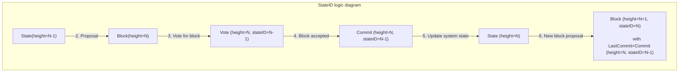

# State ID

## State ID definition

`StateID` is a unique identifier of the most recent state validated in consensus at the time of block generation.

## State ID logic

Let's define the following:

* `State(height=N)`  - State where `LastBlockHeight == N`
* `StateID(height=N)` - State ID generated for `State(height=N)`
* `Block(height=N)` - Block at `height == N`
* `Vote(height=B, stateID=S)` - Vote for `Block(height=B)`, with state ID generated from `State(height=S)`
* `Commit(height=B, stateID=S)` - Commit for `Block(height=B)`, with state ID generated from `State(height=S)`
 
StateID logic works as follows:

1. System is in `State(height=N-1)`
2. New block `Block(height=N)` is proposed.
3. Validators vote for `Block(height=N)` by creating `Vote(height=N, stateID=N-1)`; note that this vote contains state ID for `State(height=N-1)`, as this is the most recent confirmed state
4. Block is accepted and `Commit(height=N, stateID=N-1)` is generated
5. System state is updated to `State(height=N)`
6. New block `Block(height=N+1)` is proposed that contains last commit  `Commit(height=N, stateID=N-1)`

As a result:

 * verification of a vote for the block at height `N` requires information about the state at height `N-1`
 * block at height `N` contains a commit referring to state ID at height `N-2`
 
 ## Initial state ID

 Initial state ID inside first block contains:
 
 * height: 0
 * LastAppHash equal to genesis doc AppHash
