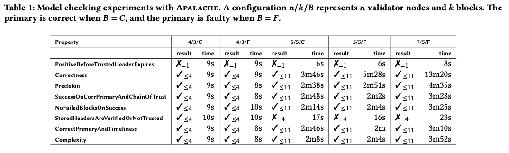

# Light Client Specification

This directory contains work-in-progress English and TLA+ specifications for the Light Client
protocol. Implementations of the light client can be found in
[Rust](https://github.com/informalsystems/tendermint-rs/tree/master/light-client) and
[Go](https://github.com/tendermint/tendermint/tree/master/light).

Light clients are assumed to be initialized once from a trusted source
with a trusted header and validator set. The light client
protocol allows a client to then securely update its trusted state by requesting and
verifying a minimal set of data from a network of full nodes (at least one of which is correct).

The light client is decomposed into three components:

- Commit Verification - verify signed headers and associated validator set changes from a single full node
- Fork Detection -  verify commits across multiple full nodes and detect conflicts (ie. the existence of forks)
- Fork Accountability - given a fork, which validators are responsible for it.

## Commit Verification

The [English specification](verification/verification_001_published.md) describes the light client
commit verification problem in terms of the temporal properties
[LCV-DIST-SAFE.1](https://github.com/informalsystems/tendermint-rs/blob/master/docs/spec/lightclient/verification/verification_001_published.md#lcv-dist-safe1) and
[LCV-DIST-LIVE.1](https://github.com/informalsystems/tendermint-rs/blob/master/docs/spec/lightclient/verification/verification_001_published.md#lcv-dist-live1).
Commit verification is assumed to operate within the Tendermint Failure Model, where +2/3 of validators are correct for some time period and
validator sets can change arbitrarily at each height.

A light client protocol is also provided, including all checks that
need to be performed on headers, commits, and validator sets
to satisfy the temporal properties - so a light client can continuously
synchronize with a blockchain. Clients can skip possibly
many intermediate headers by exploiting overlap in trusted and untrusted validator sets.
When there is not enough overlap, a bisection routine can be used to find a
minimal set of headers that do provide the required overlap.

The [TLA+ specification](verification/Lightclient_A_1.tla) is a formal description of the
commit verification protocol executed by a client, including the safety and
liveness properties, which can be model checked with Apalache.

The `MC*.tla` files contain concrete parameters for the
[TLA+ specification](verification/Lightclient_A_1.tla), in order to do model checking.
For instance, [MC4_3_faulty.tla](verification/MC4_3_faulty.tla) contains the following parameters
for the nodes, heights, the trusting period, and correctness of the primary node:

```tla
AllNodes == {"n1", "n2", "n3", "n4"}
TRUSTED_HEIGHT == 1
TARGET_HEIGHT == 3
TRUSTING_PERIOD == 1400 \* two weeks, one day is 100 time units :-)
IS_PRIMARY_CORRECT == FALSE
```

To run a complete set of experiments, clone [apalache](https://github.com/informalsystems/apalache) and [apalache-tests](https://github.com/informalsystems/apalache-tests) into a directory `$DIR` and run the following commands:

```sh
$DIR/apalache-tests/scripts/mk-run.py --memlimit 28 001bmc-apalache.csv $DIR/apalache . out
./out/run-all.sh
```

After the experiments have finished, you can collect the logs by executing the following command:

```sh
cd ./out
$DIR/apalache-tests/scripts/parse-logs.py --human .
```

The following table summarizes the experimental results. The TLA+ properties can be found in the
[TLA+ specification](verification/Lightclient_A_1.tla).
 The experiments were run in an AWS instance equipped with 32GB
RAM and a 4-core Intel® Xeon® CPU E5-2686 v4 @ 2.30GHz CPU.
We write “✗=k” when a bug is reported at depth k, and “✓<=k” when
no bug is reported up to depth k.



## Attack Detection

This is a work-in-progress draft.

The [English specification](detection/detection_001_reviewed.md)
defines blockchain forks and light client attacks, and describes
the problem of a light client detecting them from communication with a network
of full nodes, where at least one is correct.

There is no TLA+ yet.

## Fork Accountability

There is no English specification yet. TODO: Jovan's work?

TODO: there is a WIP [TLA+
specification](https://github.com/informalsystems/verification/pull/13) in the
verification repo that should be moved over here.
