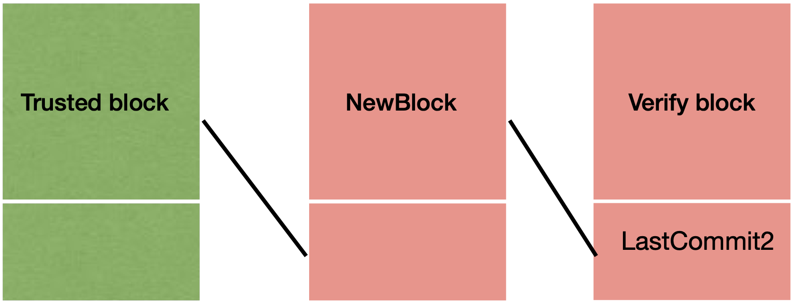

## Block verification

When blocksyncing, a node is not participating in conensus. It is receiving blocks that have already been decided and committed. To avoid being fooled by malicious peers, the node has to verify the received blocks before executing the transactions and storing the block in its store. 

The verification in blocksync aims to apply the same logic as the [light client verification](../light-client/verification/README.md). The safety guarantees of the light client model are provided by verifiying blocks starting from an **initial trusted state** and using validators who were bonded within a **trusting period**. Once this period expires, the validators could have unbonded, and we cannot rely on them being hoenst anymore. In blocksync, we can be **outside** the trusting period. Therefore, the guarantees provided by blocksync verification can be divided in two groups: 

- The block is within the trusting period, we can punish validators, and provide guarantees that if a block is signed by trusted validators, they are indeed correct. 
- The block is outside the trusting period and we cannot guarantee that the validators are still honest. We can however make a potential attack by those validators more complicated by additionally verifying the block using other peers as *witnesses*.

A state becomes trusted once it passes the validation. The section below discusses this state in more details.

### Trusted state

Currently there are two possible ways to obtain a trusted state :
 1. If the node is blocksync-ing from genesis, we have to verify the very first block and mark it as the initial trusted state.
 
 [//]: # (trust the validators provided in the initial state and use them to verify the initial block received from peers.)

 2. The node loads the last block stored in its local block store. 

**Case 1 - blocksync from genesis**

In this case we only verify that the validator hash of the block matches the validator set of the initial state. We will use the initially provided validator set for verification and further verify the block against witnisses. In this scenario, this state is very likely to be outside the trusting period. We will accept this block as a trusted state and store it inside the node's block store. 

It is worth noting that, running block sync from the first height is significantly slower than running statesync first. However, statesync does not keep the entire blockchain history and some operators might opt not to state sync. The reason is that, if sufficiently many nodes state sync and other nodes who have historical data fail or leave the network, we have no history.

**Case 2 - blocksync starting from pre-existing state**

If the node is not starting from gensis, there will be pre-existing state in its local block store. 

This can happen in the following two cases:

- The node is blocksyncing after completing state sync.

- The node has crashed and is now recovering.

In both of these cases, we can trust the state in the store. State sync runs the light client verification protocol. If the crash happened during consensus or sync-ing, the only blocks in the store are blocks that are verified or decided. 

If we can trust this initial state at height H, we can use this fact to eliminate faulty blocks whose `lastCommit` at height H+1 does not verify the trusted block. Additionally, we can double check the validator sets that signed the block at H + 1 against the expected validator sets for this height. The expected validator sets are stored within the trusted state and returned to us upon applying the block and executing it against the application.

**Switching from statesync to blocksync**

If we switch from statesync to blocksync, the last item in the block store is not the entire block. The store holds only the verified header and the commit that verified it. Therefore, we do need to fetch the corresponding block from our peers, verify it against data stored in the store and set the `last trusted block` to this block. 

To enable this, upon switching from statesync, we do not instruct the block pool to fetch blocks at height `H + 1` (where height `H` corresponds to the height of the header last verified with statesync). Instead we let it fetch the block at height H, but do not execute this block against the application (as this would fail - state is already updated to height H + 1. )

### Verifying blocks past the trusted state

The diagram above shows all blocks at play when verifying block at height ` H + 1` - `newBlock`, where at height `H` we have the trusted block. 

At a high level, the verification algorithm is represented by the code below. 

~~~golang
if LastCommit.verify(trustedBlock) {
        // NewBlock is invalid, request new
            request_newBlock_from_other_peer(height: h + 1)
} else { 
    if NewBlock.validatorSet == trustedState.validatorSet {		     
        if  LastCommit2.validatorSetHash == trustedState.validatorSetHash && 
		verifyBlock.validatorSetHash == trustedState.nextValidatorSetHash {
			if LastCommit2.verify(NewBlock) {
                        if verify_block_with_peers(NewBlock) {
								ApplyBlock(NewBlock) 
                        }
            }|
        } else
			find_new_verifyBlock(height: h + 2)
    }
}

~~~

We try to increase the trust in the NewBlock by first confirming that  it's `lastCommit` field indeed verifies the trusted block. We then confirm that the validator hash matches the expected hash. But to fully verify the block we need to check it against the signatures that signed it. They are stored within the `lastCommit2` of `verifyBlock` at height `H+2`. As we have no gurantees on this block, we again increase our trust in it by confirming that the validators whose signatures are in `lastCommit2` are a match for the expected validator set.

#### *Witness verification*

**Note**. This is not implemented yet. 

If all these checks pass, the reactor verifies that other peers have the same block at the particular height. 

In order to reduce traffic, we do not ask the peers to provide the whole block to us, rather only the header. If crosschecking the headers fails then the node requests the remainder of the block to decide on whether this peer is faulty or not.

If the block received does not verify using the same verification logic, the peer is faulty. In case the verification passes, but headers mismatch, the node will not know who to trust.

**Performance improvement** Instead of downloading blocks before we verify them, download only headers. Once we verify those, we can download the whole block. As the headers do not contain signatures so we would need to add commits form blocks at subsequent heights as well. 

**Different proposal** Instead of witness verification, verify against a light client and use backwards verification when applicable. 

**Verification failed**

In the light client verification model, the client requests from both peers a trace of blocks in order to determine the block where the divergence happened. As the blocks being verified are within the trusted period, the light client can generate evidence and send it to full nodes to vote for it and determine which peer is faulty. 

But in the block sync reactor, if verification fails, there are multiple possible scenarios:

- Abort blocksync and switch to consensus.
- Request data from more peers.  

Both cases can be a potential attack on the joining node. We discuss these different attack possibilities and design shortcomings in the section below.

## Problems with current verification and reactor design

The crux of many concerns with regards to the correctness and safety of the block sync reactor lies in the fact a node connects to peers. 

Currently, the only constraint a node has is that it has to connect to **a** peer. An improved design should require a node to connect to at least two peers. 

We have no guarantees on the correctness of this peer. 
- Once we replace a peer due to it having timed out or not reporting a correct block, nothing prevents a node from reconnecting to it - *there is no notion of blacklisted peers*.
- If we connect to subset of peers, they could feed the node faulty data. Eventually, when the node switches to consensus, it would realize there is something wrong, but then the node itself might be blacklisted..
- There is no check whether the maximum height reported by peers is true or not. A slow node could report a very distant height to the node - for example 2000, when the blockchain is at height 1000 in fact. This would lead to one part of the condition to switch to consensus never being true. To prevent the node switching due to not advancing, the malicious node sends a new block very slowly. Thus the node progresses but can never participate in consensus. This issue could potentially be mitigated if, instead of taking the maximum height reported by peers, we report the lowest of their maximums. The idea is that peers should be close enought to the top of the chain in any case. 
- A blocksyncing node can flood peers with requests - constantly reporting that it has not synced up. At the moment the maximum amount of requests received is limited and protects peers to some extend against this attack. 