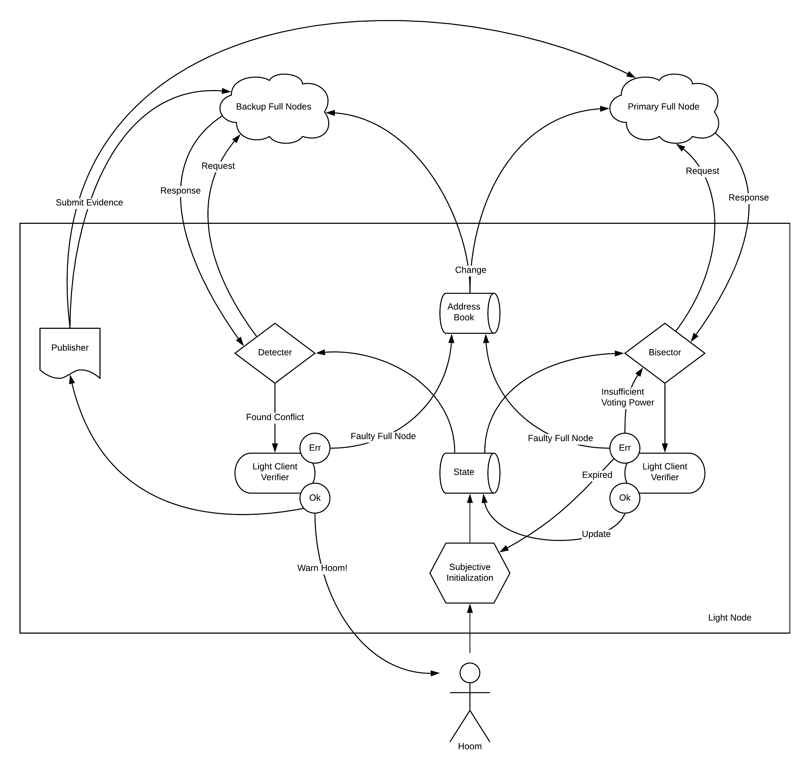

# Tendermint Light Client Protocol

NOTE: This specification is under heavy development and is not yet complete nor
accurate. 

## Contents

- [Motivation](#motivation)
- [Structure](#structure)
- [Core Verification](./verification.md)
- [Fork Detection](./detection.md)
- [Fork Accountability](./accountability.md)

## Motivation

The Tendermint Light Client is motivated by the need for a light weight protocol
to sync with a Tendermint blockchain, with the least processing necessary to
securely verify a recent state. The protocol consists of managing trusted validator
sets and trusted block headers, and is based primarily on checking hashes
and verifying Tendermint commit signatures.

Motivating use cases include:

- Light Node: a daemon that syncs a blockchain to the latest committed header by making RPC requests to full nodes.
- State Sync: a reactor that syncs a blockchain to a recent committed state by making P2P requests to full nodes.
- IBC Client: an ABCI application library that syncs a blockchain to a recent committed header by receiving proof-carrying
transactions from "IBC relayers", who make RPC requests to full nodes on behalf of the IBC clients.

## Structure

### Components

The Tendermint Light Client consists of three primary components:  

- [Core Verification](./verification.md): verifying hashes, signatures, and validator set changes
- [Fork Detection](./detection.md): talking to multiple peers to detect Byzantine behaviour
- [Fork Accountability](./accountability.md): analyzing Byzantine behaviour to hold validators accountable.

While every light client must perform core verification and fork detection
to achieve their prescribed security level, fork accountability is expected to
be done by full nodes and validators, and is thus more accurately a component of
the full node consensus protocol, though it is included here since it is
primarily concerned with providing security to light clients.

A schematic of the core verification and fork detection components in
a Light Node are depicted below. The schematic is quite similar for other use cases.
Note that fork accountability is not depicted, as it is the responsibility of the
full nodes.

.

### Synchrony

Light clients are fundamentally synchronous protocols, 
where security is restricted by the interval during which a validator can be punished
for Byzantine behaviour. We assume here that such intervals have fixed and known minimal duration
referred to commonly as a blockchain's Unbonding Period.

A secure light client must guarantee that all three components - 
core verification, fork detection, and fork accountability - 
each with their own synchrony assumptions and fault model, can execute
sequentially and to completion within the given Unbonding Period.

TODO: define all the synchrony parameters used in the protocol and their
relation to the Unbonding Period.

