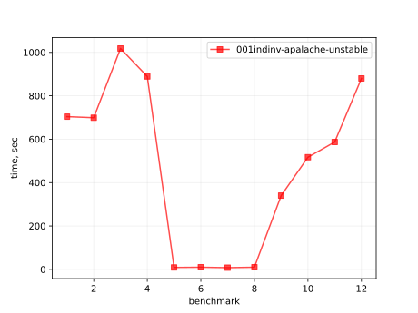
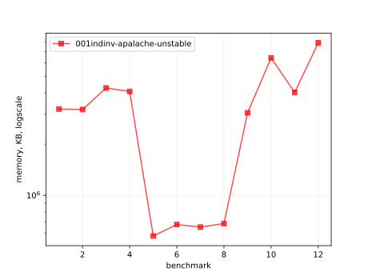
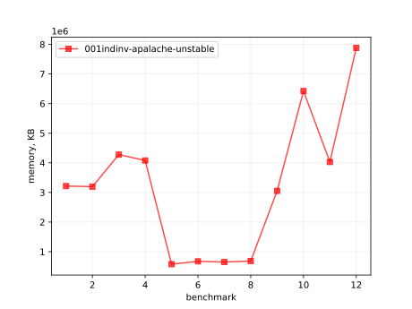
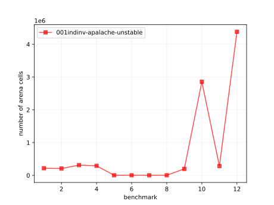
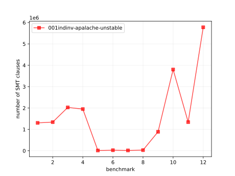

# Results of 001indinv-apalache

## 1. Awesome plots

### 1.1. Time (logarithmic scale)

### 1.2. Time (linear)

### 1.3. Memory (logarithmic scale)

### 1.4. Memory (linear)

### 1.5. Number of arena cells (linear)

### 1.6. Number of SMT clauses (linear)

## 2. Input parameters

no  |  filename      |  tool      |  timeout  |  init      |  inv             |  next  |  args
----|----------------|------------|-----------|------------|------------------|--------|------------------------------
1   |  MC_n4_f1.tla  |  apalache  |  10h      |  TypedInv  |  TypedInv        |        |  --length=1 --cinit=ConstInit
2   |  MC_n4_f2.tla  |  apalache  |  10h      |  TypedInv  |  TypedInv        |        |  --length=1 --cinit=ConstInit
3   |  MC_n5_f1.tla  |  apalache  |  10h      |  TypedInv  |  TypedInv        |        |  --length=1 --cinit=ConstInit
4   |  MC_n5_f2.tla  |  apalache  |  10h      |  TypedInv  |  TypedInv        |        |  --length=1 --cinit=ConstInit
5   |  MC_n4_f1.tla  |  apalache  |  20h      |  Init      |  TypedInv        |        |  --length=0 --cinit=ConstInit
6   |  MC_n4_f2.tla  |  apalache  |  20h      |  Init      |  TypedInv        |        |  --length=0 --cinit=ConstInit
7   |  MC_n5_f1.tla  |  apalache  |  20h      |  Init      |  TypedInv        |        |  --length=0 --cinit=ConstInit
8   |  MC_n5_f2.tla  |  apalache  |  20h      |  Init      |  TypedInv        |        |  --length=0 --cinit=ConstInit
9   |  MC_n4_f1.tla  |  apalache  |  20h      |  TypedInv  |  Agreement       |        |  --length=0 --cinit=ConstInit
10  |  MC_n4_f2.tla  |  apalache  |  20h      |  TypedInv  |  Accountability  |        |  --length=0 --cinit=ConstInit
11  |  MC_n5_f1.tla  |  apalache  |  20h      |  TypedInv  |  Agreement       |        |  --length=0 --cinit=ConstInit
12  |  MC_n5_f2.tla  |  apalache  |  20h      |  TypedInv  |  Accountability  |        |  --length=0 --cinit=ConstInit

## 3. Detailed results: 001indinv-apalache-unstable.csv

01:no  |  02:tool   |  03:status  |  04:time_sec  |  05:depth  |  05:mem_kb  |  10:ninit_trans  |  11:ninit_trans  |  12:ncells  |  13:nclauses  |  14:navg_clause_len
-------|------------|-------------|---------------|------------|-------------|------------------|------------------|-------------|---------------|--------------------
1      |  apalache  |  NoError    |  11m          |  1         |  3.0GB      |  0               |  0               |  217K       |  1.0M         |  89
2      |  apalache  |  NoError    |  11m          |  1         |  3.0GB      |  0               |  0               |  207K       |  1.0M         |  88
3      |  apalache  |  NoError    |  16m          |  1         |  4.0GB      |  0               |  0               |  311K       |  2.0M         |  101
4      |  apalache  |  NoError    |  14m          |  1         |  3.0GB      |  0               |  0               |  290K       |  1.0M         |  103
5      |  apalache  |  NoError    |  9s           |  0         |  563MB      |  0               |  0               |  2.0K       |  14K          |  42
6      |  apalache  |  NoError    |  10s          |  0         |  657MB      |  0               |  0               |  2.0K       |  28K          |  43
7      |  apalache  |  NoError    |  8s           |  0         |  635MB      |  0               |  0               |  2.0K       |  17K          |  44
8      |  apalache  |  NoError    |  10s          |  0         |  667MB      |  0               |  0               |  3.0K       |  32K          |  45
9      |  apalache  |  NoError    |  5m05s        |  0         |  2.0GB      |  0               |  0               |  196K       |  889K         |  108
10     |  apalache  |  NoError    |  8m08s        |  0         |  6.0GB      |  0               |  0               |  2.0M       |  3.0M         |  34
11     |  apalache  |  NoError    |  9m09s        |  0         |  3.0GB      |  0               |  0               |  284K       |  1.0M         |  128
12     |  apalache  |  NoError    |  14m          |  0         |  7.0GB      |  0               |  0               |  4.0M       |  5.0M         |  38
