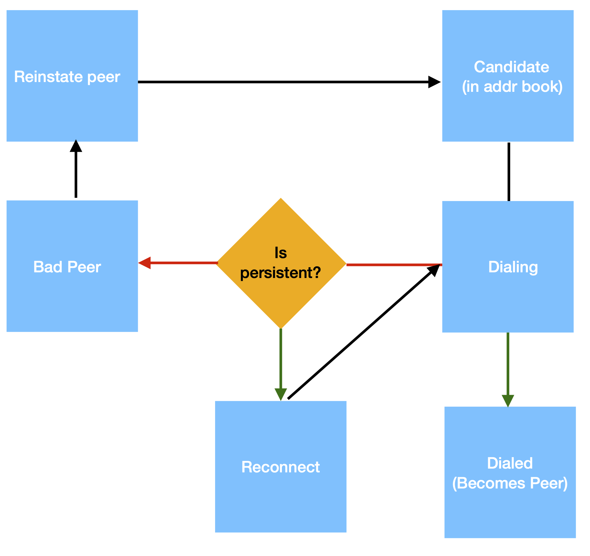

# Peer Manager

The peer manager is responsible for establishing connections with peers.
It defines when a node should dial peers and which peers it should dial.
The peer manager is not an implementation abstraction of the p2p layer,
but a role that is played by the [PEX reactor](./pex.md).

## Outbound peers

The `ensurePeersRoutine` is a persistent routine intended to ensure that a node
is connected to `MaxNumOutboundPeers` outbound peers.
This routine is continuously executed by regular nodes, i.e. nodes not
operating in seed mode, as part of the PEX reactor implementation.

The logic defining when the node should dial peers, for selecting peers to dial
and for actually dialing them is implemented in the `ensurePeers` method.
This method is periodically invoked -- every `ensurePeersPeriod`, with default
value to 30 seconds -- by the `ensurePeersRoutine`.

A node is expected to dial peers whenever the number of outbound peers is lower
than the configured `MaxNumOutboundPeers` parameter.
The current number of outbound peers is retrieved from the switch, using the
`NumPeers` method, which also reports the number of nodes to which the switch
is currently dialing.
If the number of outbound peers plus the number of dialing routines equals to
`MaxNumOutboundPeers`, nothing is done.
Otherwise, the `ensurePeers` method will attempt to dial node addresses in
order to reach the target number of outbound peers.

Once defined that the node needs additional outbound peers, the node queries
the address book for candidate addresses.
This is done using the [`PickAddress`](./addressbook.md#pick-address) method,
which returns an address selected at random on the address book, with some bias
towards new or old addresses.
When the node has up to 3 outbound peers, the adopted bias is towards old
addresses, i.e., addresses of peers that are believed to be "good".
When the node has from 5 outbound peers, the adopted bias is towards new
addresses, i.e., addresses of peers about which the node has not yet collected
much information.
So, the more outbound peers a node has, the less conservative it will be when
selecting new peers.

The selected peer addresses are then dialed in parallel, by starting a dialing
routine per peer address.
Dialing a peer address can fail for multiple reasons.
The node might have attempted to dial the peer too many times.
In this case, the peer address is marked as bad and removed from the address book.
The node might have attempted and failed to dial the peer recently
and the exponential `backoffDuration` has not yet passed.
Or the current connection attempt might fail, which is registered in the address book.
None of these errors are explicitly handled by the `ensurePeers` method, which
also does not wait until the connections are established.

The third step of the `ensurePeers` method is to ensure that the address book
has enough addresses.
This is done, first, by [reinstating banned peers](./addressbook.md#Reinstating-addresses)
whose ban period has expired.
Then, the node randomly selects a connected peer, which can be either an
inbound or outbound peer, to [requests addresses](./pex-protocol.md#Requesting-Addresses)
using the PEX protocol.
Last, and this action is only performed if the node could not retrieve any new
address to dial from the address book, the node dials the configured seed nodes
in order to establish a connection to at least one of them.

### Fast dialing

As above described, seed nodes are actually the last source of peer addresses
for regular nodes.
They are contacted by a node when, after an invocation of the `ensurePeers`
method, no suitable peer address to dial is retrieved from the address book
(e.g., because it is empty).

Once a connection with a seed node is established, the node immediately
[sends a PEX request](./pex-protocol.md#Requesting-Addresses) to it, as it is
added as an outbound peer.
When the corresponding PEX response is received, the addresses provided by the
seed node are added to the address book.
As a result, in the next invocation of the `ensurePeers` method, the node
should be able to dial some of the peer addresses provided by the seed node.

However, as observed in this [issue](https://github.com/tendermint/tendermint/issues/2093),
it can take some time, up to `ensurePeersPeriod` or 30 seconds, from when the
node receives new peer addresses and when it dials the received addresses.
To avoid this delay, which can be particularly relevant when the node has no
peers, a node immediately attempts to dial peer addresses when they are
received from a peer that is locally configured as a seed node.

> FIXME: The current logic was introduced in [#3762](https://github.com/tendermint/tendermint/pull/3762).
> Although it fix the issue, the delay between receiving an address and dialing
> the peer, it does not impose and limit on how many addresses are dialed in this
> scenario.
> So, all addresses received from a seed node are dialed, regardless of the
> current number of outbound peers, the number of dialing routines, or the
> `MaxNumOutboundPeers` parameter.
>
> Issue [#9548](https://github.com/tendermint/tendermint/issues/9548) was
> created to handle this situation.

### First round

When the PEX reactor is started, the `ensurePeersRoutine` is created and it
runs thorough the operation of a node, periodically invoking the `ensurePeers`
method.
However, if when the persistent routine is started the node already has some
peers, either inbound or outbound peers, or is dialing some addresses, the
first invocation of `ensurePeers` is delayed by a random amount of time from 0
to `ensurePeersPeriod`.

### Persistent peers

The node configuration can contain a list of *persistent peers*.
Those peers have preferential treatment compared to regular peers and the node
is always trying to connect to them.
Moreover, these peers are not removed from the address book in the case of
multiple failed dial attempts.

On startup, the node immediately tries to dial the configured persistent peers
by calling the switch's [`DialPeersAsync`](./switch.md#manual-operation) method.
This is not done in the p2p package, but it is part of the procedure to set up a node.

> TODO: the handling of persistent peers should be described in more detail.

### Life cycle

The picture below is a first attempt of illustrating the life cycle of an outbound peer:

A peer can be in the following states:

- Candidate peers: peer addresses stored in the address boook, that can be
  retrieved via the [`PickAddress`](./addressbook.md#pick-address) method
- [Dialing](switch.md#dialing-peers): peer addresses that are currently being
  dialed. This state exists to ensure that a single dialing routine exist per peer.
- [Reconnecting](switch.md#reconnect-to-peer): persistent peers to which a node
  is currently reconnecting, as a previous connection attempt has failed.
- Connected peers: peers that a node has successfully dialed, added as outbound peers.
- [Bad peers](addressbook.md#bad-peers): peers marked as bad in the address
  book due to exhibited [misbehavior](pex-protocol.md#misbehavior).
  Peers can be reinstated after being marked as bad.

## Pending of documentation

The `dialSeeds` method of the PEX reactor.

The `dialPeer` method of the PEX reactor.
This includes `dialAttemptsInfo`, `maxBackoffDurationForPeer` methods.
