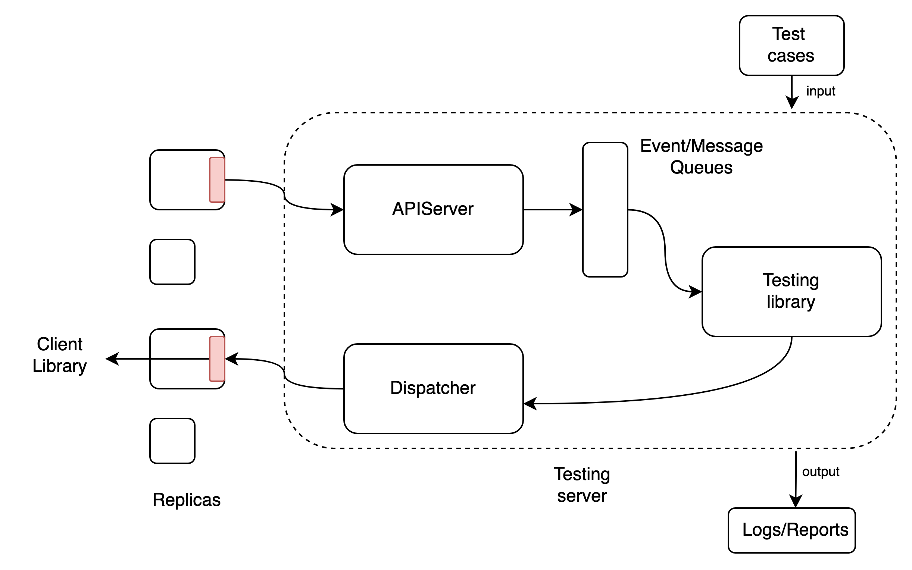
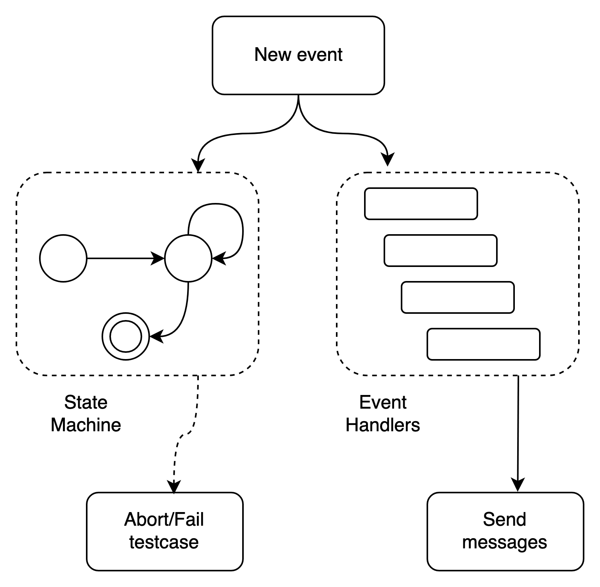

# Mid term report

### Automated testing of distributed systems against functional specifications

The goal of the research is to provide tools for automated testing of distributed systems. We will be testing an implementation of a message-passing distributed algorithm. We explore the space of `executions` (with some randomness) that may result in bugs, `execution` here is a particular ordering or `message send` and `message receive` events on the replicas.

The report is structured as follows. First, we describe the milestones and our progress. We then describe the outcomes and future directions.

# Milestones

- [x] **Understanding existing testing frameworks and algorithm implementations.**
We used the existing testing tools on Raft, Epaxos and played with the algorithm implementations.
- [x] **A unit test framework to better understand test scenarios.**
Testing raft and understanding existing testing frameworks allowed us to conceptualize "unit tests" as particular scenarios. The shortcomings of existing implementations motivated us to build a better unit testing framework with fine-grained control over the network of the replicas.
- [ ] **Unit testing Tendermint** (in-progress).
Creating test cases for tendermint to test the existing implementation.
- [ ] **Improving the tool.**
We will add additional interfaces to the framework to improve ease of use. We define the concept of event handlers to help create test cases. A good set of initial event handlers can help ease the process of creating test cases. The tool will provide a base set of handlers out of the box.
- [ ] **Documentation and examples**
Completing tool documentation and a set of examples is the next step. We will also improve the reporting and logging structure. This will make it easy to understand any bugs that we might find.

# Outcomes

## Tool description

### Scheduler

We developed a tool, [**Scheduler**](https://github.com/ds-test-framework/scheduler/) which facilitates testing distributed systems.  **Scheduler** runs a server that acts as a central monitor to all replicas in the distributed system. All messages pass through the monitor. The monitor exposes an interface to accept messages and will deliver the messages that have been scheduled.

**Scheduler** allows us to choose arbitrary message orderings based on our requirements. This allows us to pursue three broader goals, the first of which we have been able to achieve,
1. Create fine-grained orderings to test specific aspects of the implementation. Describe unit tests that test coverage. (`testlib` module)
2. Explore executions using a randomized testing algorithm. (`strategies` module)
3. Visualize and interactively create message orderings to better understand the implementation. (`visualization` module)

To incorporate the tool, an implementation will have to be modified to make use of the **Scheduler** API. We help ease this process by providing a library, [**clientlibrary**](https://github.com/ds-test-framework/go-clientcontroller) (currently for golang), which is programmed to use the API. The implementation will have to use the library to send messages to other replicas.

Replicas register with the **Scheduler** at initialization. They use the API to send messages and emit events. Events can be `message send`, `message receive`, `timeout start`, `timeout end`, etc. The messages are collected in a pool and Events are stored in a queue. **Scheduler** feeds the events/messages to the respective module (`testlib` in the case of running unit tests).

The `APIServer` receives messages (or events) from the replicas who can make use of the **clientlibrary** and stores them in a message pool (or event queue). The `testlib` module runs the test as specified and uses the `Dispatcher` module to send messages to the replicas.

### Unit testing

**Scheduler** provides a library, **testlib** to create and specify unit tests. A unit test takes as input a _handler_ function and proceeds in steps. At every step, the handler will receive an _event_ from the event queue as input and outputs which messages from the pool need to be delivered. The `Context` object wraps the input _event_ object.  The `Context` object provides methods to access the message pool, fetch information about the replicas and traverse the history of events recorded as a directed acyclic graph.

To better understand a unit test, let us consider a generic example. Consider a consensus algorithm that proceeds in rounds. Each replica either, decides a value at the end of a round or decides `bottom` and proceeds to the next round. A test case here would be to deliver the messages in a particular order such that replicas will necessarily decide on nothing. If they do not, then the testcase fails.

#### Event handlers

As the testcases get more descriptive, it is harder to specify a single handler to deal with all possible events. The natural intuition is to think of one _handler_  as a cascade of middleware _handler_s where each middleware _handler_ deals with specific events.

For example, we would like to force the replicas to decide `bottom` in two consecutive rounds (round 0 and round 1) and do it differently at each round. Here, each middleware could deal with events of a particular round.

#### State machines

The handlers also can get more expressive and harder to describe. Consider the scenario where, based on some _state_ of the distributed system, we decide to deal with the same event in a different manner.

For example, if the replicas have received enough `votes` then we don't deliver further `votes`. Here `vote` is a particular message type. Here the same event - message send (`vote`) - is handled differently by the handler.

The _state_ here is some property that should be satisfied by the history of events. We provide the data structures needed to keep track of this state as a state machine. The state machine takes a step for each new event, similar to the event handlers. The event handlers can read this _state_ to decide which messages can be delivered.

Additionally, the state can be a property that we expect to be true for all executions that we explore. Consider the example we described earlier, the test case necessarily expects that replicas decide on `bottom` in round 0. If not, the test case fails. The state machine can be used to assert properties during the execution.

At each step, the event is passed to the cascade of _handlers_ and to the state machine. The _handlers_ decide which messages to be delivered and the state machine asserts properties. The state machine can also abort the testcase.

## Testcases

Along with the tool, we were able to write test scenarios to test the tendermint implementation. The tendermint team helped us with the direction of the test scenarios. This exercise of describing the test cases helped us in improving the structure of the testing framework.

As a prerequisite to writing the testcases, we have to modify parts of the tendermint implementation to integrate it with the tool. We then proceeded to formalize the test cases. Testcase descriptions and changes done can be found [here](./Tendermint.md).

# Future work

Further work includes,
- Complete more testcases to help test the `tendermint` implementation.
- We would like to improve visualization and testcase reports to compare and differentiate multiple runs of the testcase.
- Understanding coverage of the algorithm and measure it.
- Define the formal syntax and semantics of the language that is used to describe the testcases
